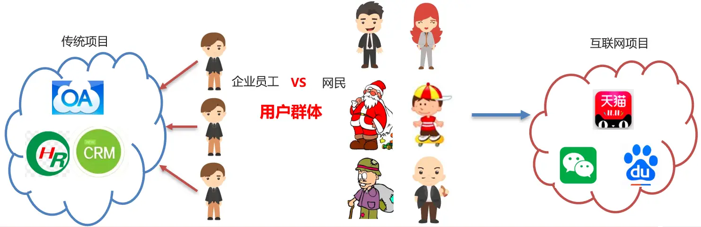
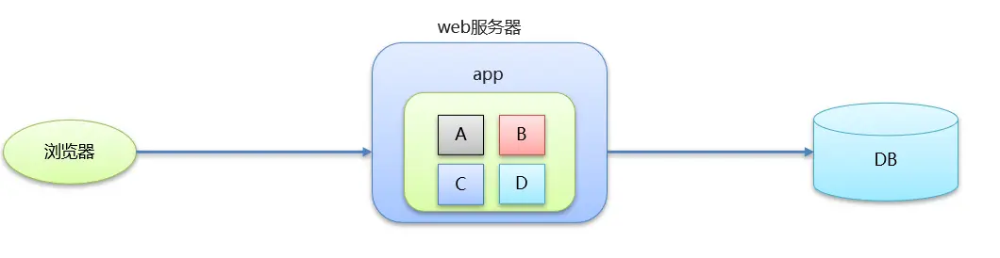
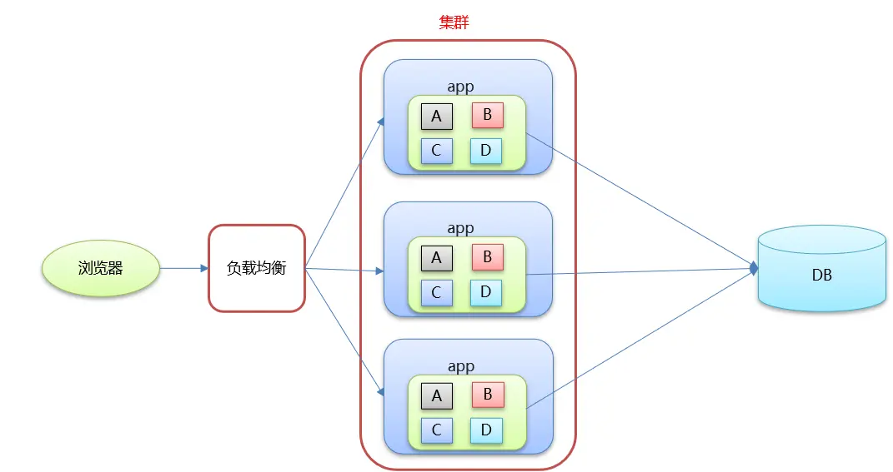
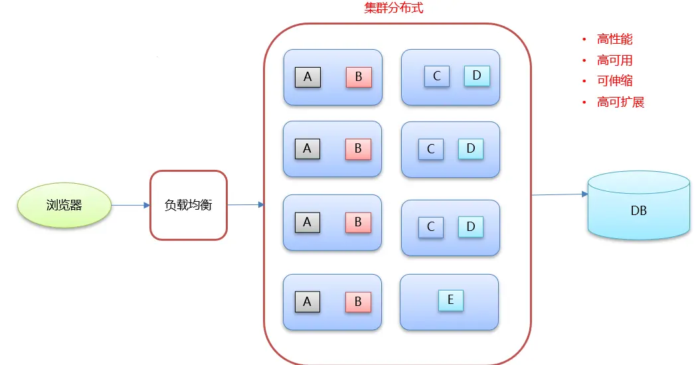
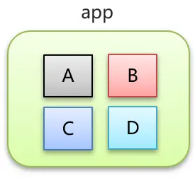
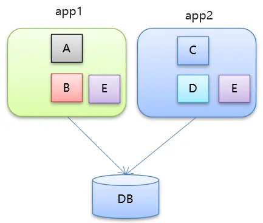
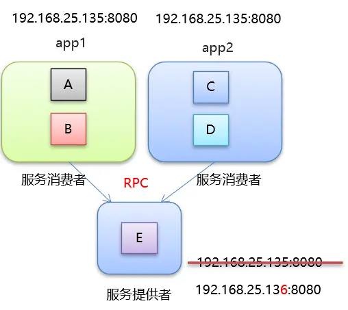
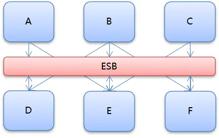
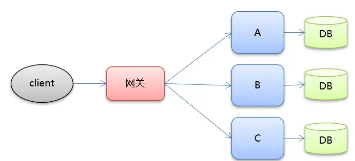
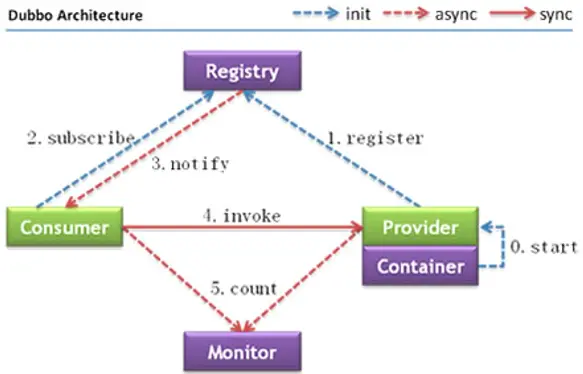

# Dubbo 概述

## 分布式系统中相关的概念

### [#](https://frxcat.fun/pages/48771f/#%E5%A4%A7%E5%9E%8B%E4%BA%92%E8%81%94%E7%BD%91%E9%A1%B9%E7%9B%AE%E6%9E%B6%E6%9E%84%E7%9B%AE%E6%A0%87)大型互联网项目架构目标

**用户体验**

* 美观、功能、速度、稳定性

衡量一个网站速度是否快：

* 打开一个新页面一瞬间完成；页面内跳转，一刹那间完成。
* 根据佛经《僧祇律》记载：一刹那者为一念，二十念为一瞬，二十瞬为一弹指，二十弹指为一罗预，二十罗预为一须臾，一日一夜有三十须臾。
* 经过周密的计算，一瞬间为0.36 秒,一刹那有 0.018 秒
* 传统项目与互联网项目

互联网项目特点：

* 用户多
* 流量大，并发高
* 海量数据
* 易受攻击
* 功能繁琐
* 变更快

**衡量网站的性能指标：**

* **响应时间** ：指执行一个请求从开始到最后收到响应数据所花费的总体时间。
* **并发数** ：指系统同时能处理的请求数量。
* **并发连接数** ：指的是客户端向服务器发起请求，并建立了TCP连接。每秒钟服务器连接的总TCP数量
* **请求数** ：也称为QPS(Query Per Second) 指每秒多少请求.
* **并发用户数** ：单位时间内有多少用户
* **吞吐量** ：指单位时间内系统能处理的请求数量。
* **QPS** ：Query Per Second 每秒查询数。
* **TPS** ：Transactions Per Second 每秒事务数。
* 一个事务是指一个客户机向服务器发送请求然后服务器做出反应的过程。客户机在发送请求时开始计时，收到服务器响应后结束计时，以此来计算使用的时间和完成的事务个数。
* 一个页面的一次访问，只会形成一个TPS；但一次页面请求，可能产生多次对服务器的请求，就会有多个QPS

QPS >= 并发连接数 >= TPS

 **目标** :

* **高性能** ：提供快速的访问体验。
* **高可用** ：网站服务一直可以正常访问。
* **可伸缩** ：通过硬件增加/减少，提高/降低处理能力。
* **高可扩展** ：系统间耦合低，方便的通过新增/移除方式，增加/减少新的功能/模块。
* **安全性** ：提供网站安全访问和数据加密，安全存储等策略。
* **敏捷性** ：随需应变，快速响应。

### [#](https://frxcat.fun/pages/48771f/#%E9%9B%86%E7%BE%A4%E5%92%8C%E5%88%86%E5%B8%83%E5%BC%8F)集群和分布式

* 集群：很多“人”一起 ，干一样的事。
  * 一个业务模块，部署在多台服务器上。
* 分布式：很多“人”一起，干不一样的事。这些不一样的事，合起来是一件大事。
  * 一个大的业务系统，拆分为小的业务模块，分别部署在不同的机器上。

### [#](https://frxcat.fun/pages/48771f/#%E6%9E%B6%E6%9E%84%E6%BC%94%E8%BF%9B)架构演进

#### [#](https://frxcat.fun/pages/48771f/#%E5%8D%95%E4%BD%93%E6%9E%B6%E6%9E%84)单体架构

优点：

* 简单：开发部署都很方便，小型项目首选

缺点：

* 项目启动慢
* 可靠性差
* 可伸缩性差
* 扩展性和可维护性差
* 性能低

#### [#](https://frxcat.fun/pages/48771f/#%E5%9E%82%E7%9B%B4%E6%9E%B6%E6%9E%84)垂直架构

* 垂直架构是指将单体架构中的多个模块拆分为多个独立的项目。形成多个独立的单体架构。

单体架构存在的问题：

* 项目启动慢
* 可靠性差
* 可伸缩性差
* 扩展性和可维护性差
* 性能低

垂直架构存在的问题：

* 重复功能太多

#### [#](https://frxcat.fun/pages/48771f/#%E5%88%86%E5%B8%83%E5%BC%8F%E6%9E%B6%E6%9E%84)分布式架构

* 分布式架构是指在垂直架构的基础上，将公共业务模块抽取出来，作为独立的服务，供其他调用者消费，以实现服务的共享和重用。
* RPC： Remote Procedure Call 远程过程调用。有非常多的协议和技术来都实现了RPC的过程。比如：HTTP REST风格，Java RMI规范、WebService SOAP协议、Hession等等。

垂直架构存在的问题：

* 重复功能太多

分布式架构存在的问题：

* 服务提供方一旦产生变更，所有消费方都需要变更。

#### [#](https://frxcat.fun/pages/48771f/#soa%E6%9E%B6%E6%9E%84)SOA架构

* SOA：（Service-Oriented Architecture，面向服务的架构）是一个组件模型，它将应用程序的不同功能单元（称为服务）进行拆分，并通过这些服务之间定义良好的接口和契约联系起来。
* ESB：(Enterparise Servce Bus) 企业服务总线，服务中介。主要是提供了一个服务于服务之间的交互。ESB 包含的功能如：负载均衡，流量控制，加密处理，服务的监控，异常处理，监控告急等等。
* 分布式架构存在的问题：
  * 服务提供方一旦产生变更，所有消费方都需要变更

#### [#](https://frxcat.fun/pages/48771f/#%E5%BE%AE%E6%9C%8D%E5%8A%A1%E6%9E%B6%E6%9E%84)微服务架构

* 微服务架构是在 SOA 上做的升华，微服务架构强调的一个重点是“业务需要彻底的组件化和服务化”，原有的单个业务系统会拆分为多个可以独立开发、设计、运行的小应用。这些小应用之间通过服务完成交互和集成。
* 微服务架构 = 80%的SOA服务架构思想 + 100%的组件化架构思想 + 80%的领域建模思想
* 特点：
* 服务实现组件化：开发者可以自由选择开发技术。也不需要协调其他团队
* 服务之间交互一般使用REST API
* 去中心化：每个微服务有自己私有的数据库持久化业务数据
* 自动化部署：把应用拆分成为一个一个独立的单个服务，方便自动化部署、测试、运维

## [#](https://frxcat.fun/pages/48771f/#dubbo-%E6%A6%82%E8%BF%B0-2)Dubbo 概述

* Dubbo是阿里巴巴公司开源的一个高性能、轻量级的 Java RPC 框架。
* 致力于提供高性能和透明化的 RPC 远程服务调用方案，以及 SOA 服务治理方案。
* 官网：[http://dubbo.apache.org(opens new window)](http://dubbo.apache.org/)

#### [#](https://frxcat.fun/pages/48771f/#dubbo-%E6%9E%B6%E6%9E%84)Dubbo 架构

**节点角色说明：**

* **Provider** ：暴露服务的服务提供方
* **Container** ：服务运行容器
* **Consumer** ：调用远程服务的服务消费方
* **Registry** ：服务注册与发现的注册中心
* **Monitor** ：统计服务的调用次数和调用时间的监控中心
