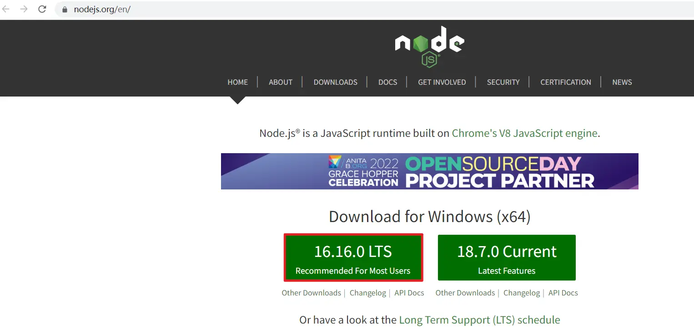
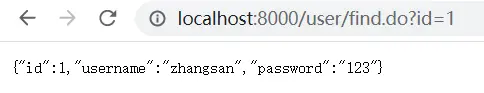

# Dubbo 高级特性

## dubbo-admin

* dubbo-admin管理平台，是图形化的服务管理页面
* 从注册中心中获取到所有的提供者 / 消费者进行配置管理
* 路由规则、动态配置、服务降级、访问控制、权重调整、负载均衡等管理功能
* dubbo-admin 是一个前后端分离的项目。前端使用vue，后端使用springboot
* 安装dubbo-admin 其实就是部署该项目


### [#](https://frxcat.fun/middleware/Dubbo/Dubbo_Advanced_features/#dubbo-admin-%E5%AE%89%E8%A3%85)dubbo-admin 安装

**环境准备**

dubbo-admin 是一个前后端分离的项目。前端使用vue，后端使用springboot，安装 dubbo-admin 其实就是部署该项目。我们将dubbo-admin安装到开发环境上。要保证开发环境有jdk，maven，node.js

安装node**(如果当前机器已经安装请忽略)**

因为前端工程是用vue开发的，所以需要安装node.js，node.js中自带了npm，后面我们会通过npm启动

* [下载地址(opens new window)](https://nodejs.org/en/)



**下载 Dubbo-Admin**

进入github，搜索dubbo-admin

* [下载地址(opens new window)](https://github.com/apache/dubbo-admin)


* 可以通过下载ZIP包的方式。如果安装的有git,也可以使用git命令

```sh
git clone git@github.com:apache/dubbo-admin.git
```

* 把下载的zip包解压到指定文件夹(解压到那个文件夹随意)


* 修改配置文件,解压后我们进入…\dubbo-admin-develop\dubbo-admin-server\src\main\resources目录
  找到 **application.properties** 配置文件 进行配置修改


* 修改zookeeper地址


```properties
# centers in dubbo2.7
admin.registry.address=zookeeper://192.168.91.200:2181
admin.config-center=zookeeper://192.168.91.200:2181
admin.metadata-report.address=zookeeper://192.168.91.200:2181
```

 admin.registry.address注册中心 admin.config-center 配置中心 admin.metadata-report.address元数据中心

* 打包项目

在 dubbo-admin-develop 目录执行打包命令

```sh
mvn  clean package
```


* 启动后端

切换到目录

```sh
dubbo-Admin-develop\dubbo-admin-distribution\target>
```

执行下面的命令启动 dubbo-admin，dubbo-admin后台由SpringBoot构建。

```sh
java -jar .\dubbo-admin-0.1.jar
```


**前台后端**

dubbo-admin-ui 目录下执行命令

```sh
npm run dev
```


### docker版

查看[dubbo](https://so.csdn.net/so/search?q=dubbo&spm=1001.2101.3001.7020)-admin镜像

```bash
docker search dubbo-admin
```


```bash
docker pull cao2068959/dubbo-admin:2.7
```


查看镜像

```java
docker images
```


创建目录

```bash
mkdir -p /user/dubbo-admin
cd /user/dubbo-admin
```

编写[properties](https://so.csdn.net/so/search?q=properties&spm=1001.2101.3001.7020)文件

```bash
vi myapplication.properties
```

配置文件内容

```text
admin.registry.address=zookeeper://192.168.130.128:2181
admin.config-center=zookeeper://192.168.130.128:2181
admin.metadata-report.address=zookeeper://192.168.130.128:2181
admin.registry.group=dubbo
admin.apollo.token=e16e5cd903fd0c97a116c873b448544b9d086de9
admin.apollo.appId=test
admin.apollo.env=dev
admin.apollo.cluster=default
admin.apollo.namespace=dubbo
```

启动容器

```java
docker run -d -p 8080:8080 -v /usr/dubbo-admin/myapplication.properties:/dubbo-admin/myapplication.properties cao2068959/dubbo-admin:2.7
```

查看是否启动成功

```bash
docker ps
```


浏览器访问http://192.168.130.128:8080/(我的虚拟机ip地址，admin端口号为8080)


### [#](https://frxcat.fun/middleware/Dubbo/Dubbo_Advanced_features/#%E8%AE%BF%E9%97%AE%E6%B5%8B%E8%AF%95)访问测试

* [http://localhost:8081/(opens new window)](http://localhost:8081/)


### [#](https://frxcat.fun/middleware/Dubbo/Dubbo_Advanced_features/#dubbo-admin%E7%AE%80%E5%8D%95%E4%BD%BF%E7%94%A8)dubbo-admin简单使用

注意:Dubbo Admin【服务Mock】【服务统计】将在后续版本发布....

在上面的步骤中，我们已经进入了Dubbo-Admin的主界面，在【快速入门】章节中，我们定义了服务生产者、和服务消费者，下面我们从Dubbo-Admin管理界面找到这个两个服务

#### [#](https://frxcat.fun/middleware/Dubbo/Dubbo_Advanced_features/#%E7%82%B9%E5%87%BB%E6%9C%8D%E5%8A%A1%E6%9F%A5%E8%AF%A2)点击服务查询


#### [#](https://frxcat.fun/middleware/Dubbo/Dubbo_Advanced_features/#%E6%9F%A5%E7%9C%8B%E8%AF%A6%E6%83%85)查看详情

我们查看com.frx01.service.UserService （服务提供者）的具体详细信息，包含【元数据信息】


从【详情】界面查看，主要分为3个区域

A区域：主要包含服务端 基础信息比如服务名称、应用名称等

B区域：主要包含了生产者、消费者一些基本信息

**C区域：是元数据信息，注意看上面的图,元数据信息是空的**

我们需要打开我们的生产者配置文件加入下面配置

```xml
<!-- 元数据配置 -->
<dubbo:metadata-report address="zookeeper://192.168.91.200:2181" />
```

#### [#](https://frxcat.fun/middleware/Dubbo/Dubbo_Advanced_features/#%E6%9C%8D%E5%8A%A1%E6%B5%8B%E8%AF%95)服务测试


## [#](https://frxcat.fun/middleware/Dubbo/Dubbo_Advanced_features/#dubbo-%E5%B8%B8%E7%94%A8%E9%AB%98%E7%BA%A7%E9%85%8D%E7%BD%AE)dubbo 常用高级配置

### [#](https://frxcat.fun/middleware/Dubbo/Dubbo_Advanced_features/#%E5%BA%8F%E5%88%97%E5%8C%96)序列化

**两个机器传输数据，如何传输Java对象?**


* dubbo 内部已经将序列化和反序列化的过程内部封装了
* 我们只需要在定义pojo类时实现Serializable接口即可
* 一般会定义一个公共的pojo模块，让生产者和消费者都依赖该模块。

#### [#](https://frxcat.fun/middleware/Dubbo/Dubbo_Advanced_features/#%E6%96%B0%E5%BB%BAdubbo-pojo%E6%A8%A1%E5%9D%97)新建dubbo-pojo模块

* 创建User类

```java
//注意：将来所有的pojo都需要实现Serializable接口
public class User implements Serializable {
    private int id;
    private String username;
    private String password;
	//+set()与get()方法，和AllArgsConstructor
}
```

#### [#](https://frxcat.fun/middleware/Dubbo/Dubbo_Advanced_features/#%E5%9C%A8%E6%A8%A1%E5%9D%97dubbo-interface%E4%B8%AD%E6%B7%BB%E5%8A%A0dubbo-pojo%E6%A8%A1%E5%9D%97%E7%9A%84%E4%BE%9D%E8%B5%96)在模块dubbo-interface中添加dubbo-pojo模块的依赖

```xml
    <dependencies>
        <dependency>
            <groupId>com.frx01</groupId>
            <artifactId>dubbo-pojo</artifactId>
            <version>1.0-SNAPSHOT</version>
        </dependency>
    </dependencies>
```

* 在dubbo-interface模块中添加方法

```java
    //查询用户
    public User findUserById(int id);
```

* 在dubbo-service模块中重写方法

```java
    @Override
    public User findUserById(int id) {
        //查询User对象
        User user = new User(1, "zhangsan", "123");
        return user;
    }
```

### [#](https://frxcat.fun/middleware/Dubbo/Dubbo_Advanced_features/#%E6%B5%8B%E8%AF%95)测试

* 访问[http://localhost:8000/user/find.do?id=1(opens new window)](http://localhost:8000/user/find.do?id=1)



## [#](https://frxcat.fun/middleware/Dubbo/Dubbo_Advanced_features/#%E5%9C%B0%E5%9D%80%E7%BC%93%E5%AD%98)地址缓存

> **注册中心挂了，服务是否可以正常访问？**

* 可以，因为dubbo服务消费者在第一次调用时，会将服务提供方地址缓存到本地，以后在调用则不会访问注册中心。
* 当服务提供者地址发生变化时，注册中心会通知服务消费者。


## [#](https://frxcat.fun/middleware/Dubbo/Dubbo_Advanced_features/#%E8%B6%85%E6%97%B6%E4%B8%8E%E9%87%8D%E8%AF%95)超时与重试

* 服务消费者在调用服务提供者的时候发生了阻塞、等待的情形，这个时候，服务消费者会一直等待下去。
* 在某个峰值时刻，大量的请求都在同时请求服务消费者，会造成线程的大量堆积，势必会造成雪崩。


* dubbo 利用超时机制来解决这个问题，设置一个超时时间，在这个时间段内，无法完成服务访问，则自动断开连接。
* 使用timeout属性配置超时时间，默认值1000，单位毫秒。

### [#](https://frxcat.fun/middleware/Dubbo/Dubbo_Advanced_features/#%E4%BF%AE%E6%94%B9userserviceimpl)修改UserServiceImpl

```java
//将这这类提供的方法(服务)对外发布，将访问的地址,ip,端口,路径注册到注册中心中
@Service(timeout = 3000)//当前服务3秒超时
public class UserServiceImpl implements UserService {

    @Override
    public String sayHello() {
        return "hello,dubbo~";
    }

    @Override
    public User findUserById(int id) {
        //查询User对象
        User user = new User(1, "zhangsan", "123");
        //假如数据库查询很慢，查了5秒
        try {
            Thread.sleep(5000);
        } catch (InterruptedException e) {
            e.printStackTrace();
        }
        return user;
    }
}
```

* 测试，报超时异常

```java
org.apache.dubbo.remoting.TimeoutException: Waiting server-side response timeout by scan timer. start time: 2022-08-11 00:18:54.577, end time: 2022-08-11 00:18:57.606, client elapsed: 0 ms, server elapsed: 3029 ms, timeout: 3000 ms, request: Request [id=2, version=2.0.2, twoway=true, event=false, broken=false, data=RpcInvocation [methodName=findUserById, parameterTypes=[int], arguments=[1], attachments={path=com.frx01.service.UserService, remote.application=dubbo-web, interface=com.frx01.service.UserService, version=0.0.0, timeout=3000}]], channel: /10.19.242.91:56864 -> /10.19.242.91:20880
	at org.apache.dubbo.remoting.exchange.support.DefaultFuture.doReceived(DefaultFuture.java:189)
	at org.apache.dubbo.remoting.exchange.support.DefaultFuture.received(DefaultFuture.java:153)
	at org.apache.dubbo.remoting.exchange.support.DefaultFuture$TimeoutCheckTask.run(DefaultFuture.java:258)
	at org.apache.dubbo.common.timer.HashedWheelTimer$HashedWheelTimeout.expire(HashedWheelTimer.java:648)
	at org.apache.dubbo.common.timer.HashedWheelTimer$HashedWheelBucket.expireTimeouts(HashedWheelTimer.java:727)
	at org.apache.dubbo.common.timer.HashedWheelTimer$Worker.run(HashedWheelTimer.java:449)
	at java.lang.Thread.run(Thread.java:748)
```

注意

```java
@Reference//远程注入，也有超时属性
@Reference(timeout = 1) //远程注入
```

### [#](https://frxcat.fun/middleware/Dubbo/Dubbo_Advanced_features/#%E4%BF%AE%E6%94%B9usercontroller)修改UserController

```java
@RestController
@RequestMapping("/user")
public class UserController {

    /**
     * 1.从zookeeper注册中心获取userService的访问url
     * 2.远程的调用RPC
     * 3.将结果封装为代理的对象，给变量赋值
     */
    @Reference(timeout = 1000) //远程注入，当前服务一秒超时
    private UserService userService;

    @RequestMapping("/sayHello")
    public String sayHello(){
        return userService.sayHello();
    }

    /**
     * 根据id查询用户信息
     * @param id
     * @return
     */
    @RequestMapping("/find")
    public User findUserById(int id){
        return userService.findUserById(id);
    }
}
```

 问题

可以发现，出现了个问题，究竟是@Service注解超时3秒生效，还是@Reference注解超时1秒生效。

> 经过测试，服务生产方的超时时间覆盖了消费方的超时时间，但是超时时间在服务的生产方或者消费方单独地都生效，建议把超时时间配置在服务的生产方

### [#](https://frxcat.fun/middleware/Dubbo/Dubbo_Advanced_features/#%E9%87%8D%E8%AF%95)重试


* 设置了超时时间，在这个时间段内，无法完成服务访问，则自动断开连接。
* 如果出现网络抖动，则这一次请求就会失败。
* Dubbo 提供重试机制来避免类似问题的发生。
* 通过 retries 属性来设置重试次数。默认为 2 次。

### [#](https://frxcat.fun/middleware/Dubbo/Dubbo_Advanced_features/#%E4%BF%AE%E6%94%B9userserviceimpl-2)修改UserServiceImpl

```java
//将这这类提供的方法(服务)对外发布，将访问的地址,ip,端口,路径注册到注册中心中
@Service(timeout = 3,retries = 2)//当前服务3秒超时,重试两次，一共三次
public class UserServiceImpl implements UserService {

    @Override
    public String sayHello() {
        return "hello,dubbo~";
    }

    int i =1;
    @Override
    public User findUserById(int id) {

        System.out.println("服务被调用了:"+i+++"次");
        //查询User对象
        User user = new User(1, "zhangsan", "123");
        //假如数据库查询很慢，查了5秒
        try {
            Thread.sleep(5000);
        } catch (InterruptedException e) {
            e.printStackTrace();
        }
        return user;
    }
}
```

* 测试后报错

```java
服务被调用了:1
服务被调用了:2
服务被调用了:3
 WARN 2022-08-11 00:20:22,923 org.apache.dubbo.rpc.filter.TimeoutFilter$TimeoutListener:  [DUBBO] invoke time out. method: findUserById arguments: [1] , url is dubbo://10.19.242.91:20880/com.frx01.service.UserService?anyhost=true&application=dubbo-service&bean.name=ServiceBean:com.frx01.service.UserService&bind.ip=10.19.242.91&bind.port=20880&deprecated=false&dubbo=2.0.2&dynamic=true&generic=false&interface=com.frx01.service.UserService&methods=sayHello,findUserById&pid=22460&release=2.7.4.1&revision=1.0-SNAPSHOT&side=provider&timeout=3000&timestamp=1660148406833, invoke elapsed 5009 ms., dubbo version: 2.7.4.1, current host: 10.19.242.91
```

## [#](https://frxcat.fun/middleware/Dubbo/Dubbo_Advanced_features/#%E5%A4%9A%E7%89%88%E6%9C%AC)多版本


* 灰度发布：当出现新功能时，会让一部分用户先使用新功能，用户反馈没问题时，再将所有用户迁移到新功能。
* dubbo 中使用version 属性来设置和调用同一个接口的不同版本

### [#](https://frxcat.fun/middleware/Dubbo/Dubbo_Advanced_features/#%E4%BF%AE%E6%94%B9userserviceimpl-3)修改UserServiceImpl

```java
@Service(version = "v1.0")
public class UserServiceImpl implements UserService {

    @Override
    public String sayHello() {
        return "hello,dubbo~";
    }
  
    @Override
    public User findUserById(int id) {

        System.out.println("old...");

        //查询User对象
        User user = new User(1, "zhangsan", "123");

        return user;
    }
}
```

### [#](https://frxcat.fun/middleware/Dubbo/Dubbo_Advanced_features/#%E6%96%B0%E5%A2%9Euserserviceimpl2)新增UserServiceImpl2

```java
@Service(version = "v2.0")
public class UserServiceImpl2 implements UserService {

    @Override
    public String sayHello() {
        return "hello,dubbo~";
    }

    @Override
    public User findUserById(int id) {

        System.out.println("new...");

        //查询User对象
        User user = new User(1, "zhangsan", "123");

        return user;
    }
}
```

### [#](https://frxcat.fun/middleware/Dubbo/Dubbo_Advanced_features/#%E4%BF%AE%E6%94%B9usercontroller-2)修改UserController

```java
@RestController
@RequestMapping("/user")
public class UserController {

    /**
     * 1.从zookeeper注册中心获取userService的访问url
     * 2.远程的调用RPC
     * 3.将结果封装为代理的对象，给变量赋值
     */
    @Reference(version = "v1.0") //远程注入
    private UserService userService;

    @RequestMapping("/sayHello")
    public String sayHello(){
        return userService.sayHello();
    }

    /**
     * 根据id查询用户信息
     * @param id
     * @return
     */
    @RequestMapping("/find")
    public User findUserById(int id){
        return userService.findUserById(id);
    }
}
```

* 测试

```java
old...
```

* 将@Reference的version属性修改为v2.0，dubbo-web重新启动，测试

```java
new...
```

## [#](https://frxcat.fun/middleware/Dubbo/Dubbo_Advanced_features/#%E8%B4%9F%E8%BD%BD%E5%9D%87%E8%A1%A1)负载均衡


* Random ：按权重随机，默认值。按权重设置随机概率。
* RoundRobin ：按权重轮询


* LeastActive：最少活跃调用数，相同活跃数的随机。


* ConsistentHash：一致性 Hash，相同参数的请求总是发到同一提供者。

### [#](https://frxcat.fun/middleware/Dubbo/Dubbo_Advanced_features/#%E4%BF%AE%E6%94%B9userserviceimpl-4)修改UserServiceImpl

```java
@Service(weight = 100)
public class UserServiceImpl implements UserService {

    @Override
    public String sayHello() {
        return "1.......";
    }

    @Override
    public User findUserById(int id) {

        //查询User对象
        User user = new User(1, "zhangsan", "123");
        return user;
    }
}
```

### [#](https://frxcat.fun/middleware/Dubbo/Dubbo_Advanced_features/#%E5%90%AF%E5%8A%A8%E7%AC%AC%E4%B8%80%E5%8F%B0%E6%9C%BA%E5%99%A8)启动第一台机器

### [#](https://frxcat.fun/middleware/Dubbo/Dubbo_Advanced_features/#%E4%BF%AE%E6%94%B9userserviceimpl-5)修改UserServiceImpl

```java
@Service(weight = 200)
public class UserServiceImpl implements UserService {

    @Override
    public String sayHello() {
        return "2......";
    }

    @Override
    public User findUserById(int id) {

        //查询User对象
        User user = new User(1, "zhangsan", "123");
        return user;
    }
}
```

### [#](https://frxcat.fun/middleware/Dubbo/Dubbo_Advanced_features/#%E4%BF%AE%E6%94%B9applicationcontext-xml)修改applicationContext.xml

```xml
	<!--<context:component-scan base-package="com.frx01.service"/>-->
	<!--dubbo的配置-->
	<dubbo:protocol port="20882"/>
	<!--1.项目的名称-->
	<dubbo:application name="dubbo-service">
		<dubbo:parameter key="qos.port" value="4444"/>
	</dubbo:application>
	<!--2.配置一下注册中心的地址-->
	<dubbo:registry address="zookeeper://192.168.91.200:2181"/>
	<!--3.配置dubbo包扫描-->
	<dubbo:annotation package="com.frx01.service.impl"/>
	<dubbo:metadata-report address="zookeeper://192.168.91.200:2181" />
```

* 修改pom.xml文件中tomcat启动端口为9002

### [#](https://frxcat.fun/middleware/Dubbo/Dubbo_Advanced_features/#%E5%90%AF%E5%8A%A8%E7%AC%AC%E4%BA%8C%E5%8F%B0%E6%9C%BA%E5%99%A8)启动第二台机器

* 使用dubbo-admin查看服务


### [#](https://frxcat.fun/middleware/Dubbo/Dubbo_Advanced_features/#%E4%BF%AE%E6%94%B9usercontroller-3)修改UserController

```java
@RestController
@RequestMapping("/user")
public class UserController {

    /**
     * 1.从zookeeper注册中心获取userService的访问url
     * 2.远程的调用RPC
     * 3.将结果封装为代理的对象，给变量赋值
     */
    @Reference(loadbalance = "random") //远程注入 //random:按权重随机
    private UserService userService;

    @RequestMapping("/sayHello")
    public String sayHello(){
        return userService.sayHello();
    }

    /**
     * 根据id查询用户信息
     * @param id
     * @return
     */
    @RequestMapping("/find")
    public User findUserById(int id){
        return userService.findUserById(id);
    }
}
```

* 经过测试，发现第二台的机器服务生成的概率更高些

## [#](https://frxcat.fun/middleware/Dubbo/Dubbo_Advanced_features/#%E9%9B%86%E7%BE%A4%E5%AE%B9%E9%94%99)集群容错


集群容错模式：

* Failover Cluster：失败重试。默认值。当出现失败，重试其它服务器 ，默认重试2次，使用 retries 配置。一般用于读操作
* Failfast Cluster ：快速失败，只发起一次调用，失败立即报错。通常用于写操作。
* Failsafe Cluster ：失败安全，出现异常时，直接忽略。返回一个空结果。
* Failback Cluster ：失败自动恢复，后台记录失败请求，定时重发。通常用于消息通知操作。
* Forking Cluster ：并行调用多个服务器，只要一个成功即返回。
* Broadcast Cluster ：广播调用所有提供者，逐个调用，任意一台报错则报错。（测试？）

### [#](https://frxcat.fun/middleware/Dubbo/Dubbo_Advanced_features/#%E7%AC%AC%E4%B8%80%E5%8F%B0%E6%9C%BA%E5%99%A8)第一台机器

```java
@Service
public class UserServiceImpl implements UserService {

    @Override
    public String sayHello() {
        return "hello dubbo Test~";
    }

    @Override
    public User findUserById(int id)  {
        System.out.println("1...");
        //查询User对象
        User user = new User(1, "zhangsan", "123");
        try {
            Thread.sleep(3000);
        } catch (InterruptedException e) {
            e.printStackTrace();
        }
        return user;
    }
}
```

* 启动此机器

### [#](https://frxcat.fun/middleware/Dubbo/Dubbo_Advanced_features/#%E7%AC%AC%E4%BA%8C%E5%8F%B0%E6%9C%BA%E5%99%A8)第二台机器

```java
@Service
public class UserServiceImpl implements UserService {

    @Override
    public String sayHello() {
        return "hello dubbo Test~";
    }

    @Override
    public User findUserById(int id)  {
        System.out.println("2...");
        //查询User对象
        User user = new User(1, "zhangsan", "123");
        try {
            Thread.sleep(3000);
        } catch (InterruptedException e) {
            e.printStackTrace();
        }
        return user;
    }
}
```

```xml
	<!--dubbo的配置-->
	<dubbo:protocol port="20882"/>
	<!--<!–1.项目的名称–>-->
	<dubbo:application name="dubbo-service">
		<dubbo:parameter key="qos.port" value="4445"/>
	</dubbo:application>
	<!--2.配置一下注册中心的地址-->
	<dubbo:registry address="zookeeper://192.168.91.200:2181"/>
	<!--3.配置dubbo包扫描-->
	<dubbo:annotation package="com.frx01.service.impl"/>
	<dubbo:metadata-report address="zookeeper://192.168.91.200:2181" />
```

* 修改tomcat端口为9002
* 启动此机器

### [#](https://frxcat.fun/middleware/Dubbo/Dubbo_Advanced_features/#%E7%AC%AC%E4%B8%89%E5%8F%B0%E6%9C%BA%E5%99%A8)第三台机器

```java
@Service
public class UserServiceImpl implements UserService {

    @Override
    public String sayHello() {
        return "hello dubbo Test~";
    }

    @Override
    public User findUserById(int id)  {
        System.out.println("3...");
        //查询User对象
        User user = new User(1, "zhangsan", "123");
        return user;
    }
}
```

```xml
	<dubbo:protocol port="20888"/>
	<!--<!–1.项目的名称–>-->
	<dubbo:application name="dubbo-service">
		<dubbo:parameter key="qos.port" value="4446"/>
	</dubbo:application>
	<!--2.配置一下注册中心的地址-->
	<dubbo:registry address="zookeeper://192.168.91.200:2181"/>
	<!--3.配置dubbo包扫描-->
	<dubbo:annotation package="com.frx01.service.impl"/>
	<dubbo:metadata-report address="zookeeper://192.168.91.200:2181" />
```

* 修改tomcat端口号为9003
* 启动此机器

### [#](https://frxcat.fun/middleware/Dubbo/Dubbo_Advanced_features/#%E4%BD%BF%E7%94%A8dubbo-admin%E6%9F%A5%E7%9C%8B%E6%9C%8D%E5%8A%A1)使用dubbo-admin查看服务


### [#](https://frxcat.fun/middleware/Dubbo/Dubbo_Advanced_features/#%E8%AE%BE%E7%BD%AE%E9%9B%86%E7%BE%A4%E5%AE%B9%E9%94%99%E7%AD%96%E7%95%A5)设置集群容错策略

* 修改UserController

```java
@RestController
@RequestMapping("/user")
public class UserController {

    /**
     * 1.从zookeeper注册中心获取userService的访问url
     * 2.远程的调用RPC
     * 3.将结果封装为代理的对象，给变量赋值
     */
    @Reference(cluster = "failover") //重试 并且重试两次
    private UserService userService;

    @RequestMapping("/sayHello")
    public String sayHello(){
        return userService.sayHello();
    }

    /**
     * 根据id查询用户信息
     * @param id
     * @return
     */
    @RequestMapping("/find")
    public User findUserById(int id){
        return userService.findUserById(id);
    }
}
```

* 启动dubbo-web,并访问[http://localhost:8000/user/find.do?id=1(opens new window)](http://localhost:8000/user/find.do?id=1)


* 中间dubbo-web报超时错误，超时只是中间错误，依然能返回正确结果

## [#](https://frxcat.fun/middleware/Dubbo/Dubbo_Advanced_features/#%E6%9C%8D%E5%8A%A1%E9%99%8D%E7%BA%A7)服务降级


服务降级方式:

* mock=force:return null 表示消费方对该服务的方法调用都直接返回null值，不发起远程调用。用来屏蔽不重要服务不可用时对调用方的影响。
* mock=fail:return null 表示消费方应对该服务的方法调用在失败后，再返回null值，不抛异常。用来容忍不重要服务不稳定时对调用方的影响。

### [#](https://frxcat.fun/middleware/Dubbo/Dubbo_Advanced_features/#%E5%90%AF%E5%8A%A8dubbo-service)启动dubbo-service

### [#](https://frxcat.fun/middleware/Dubbo/Dubbo_Advanced_features/#%E4%BF%AE%E6%94%B9userserviceimpl-6)修改UserServiceImpl

```java
@RestController
@RequestMapping("/user")
public class UserController {

    /**
     * 1.从zookeeper注册中心获取userService的访问url
     * 2.远程的调用RPC
     * 3.将结果封装为代理的对象，给变量赋值
     */
    @Reference(mock = "force:return null")//不再去调用userService的服务了
    private UserService userService;

    @RequestMapping("/sayHello")
    public String sayHello(){
        return userService.sayHello();
    }

    /**
     * 根据id查询用户信息
     * @param id
     * @return
     */
    @RequestMapping("/find")
    public User findUserById(int id){
        return userService.findUserById(id);
    }
}
```

* 访问测试:[http://localhost:8000/user/find.do?id=1(opens new window)](http://localhost:8000/user/find.do?id=1)


返回为null,也不报错，一个空白的页面

* 将@Reference(mock = "force:return null")改为@Reference(mock = "fail:return null"),再次访问
* 控制台报错，超时，但是仍然是空白的页面
