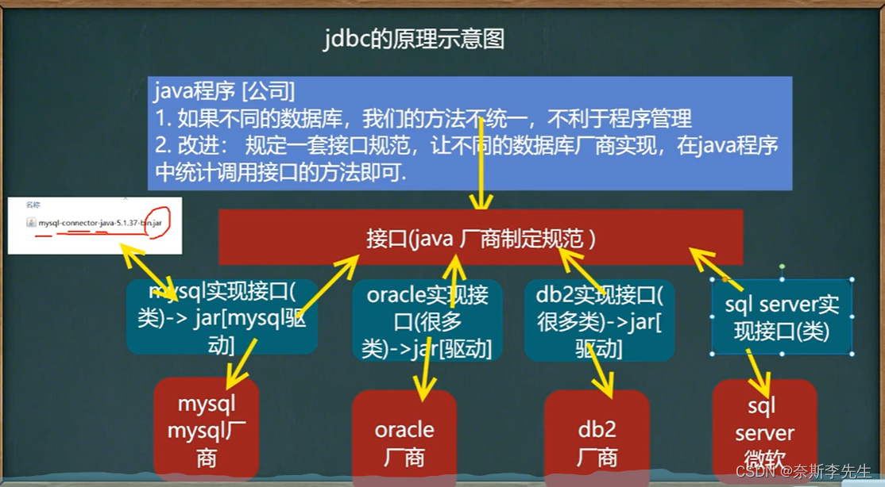
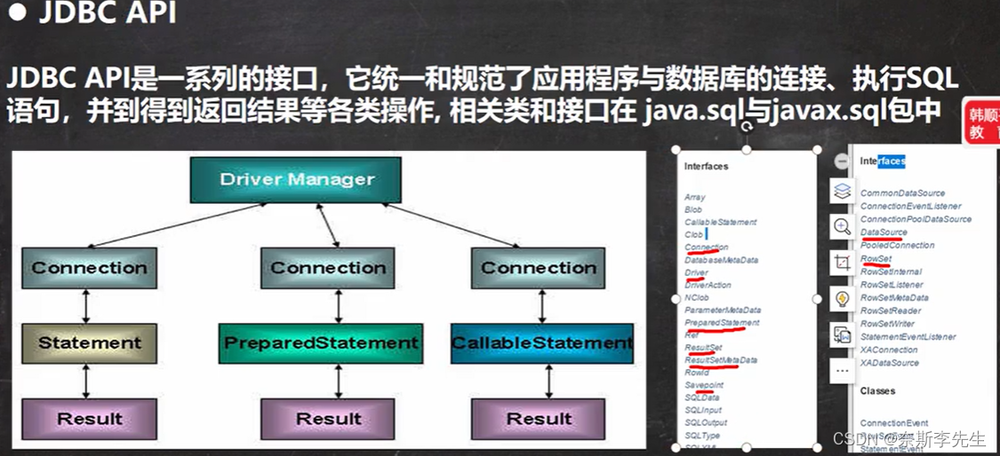
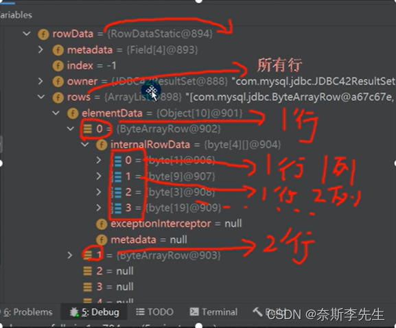
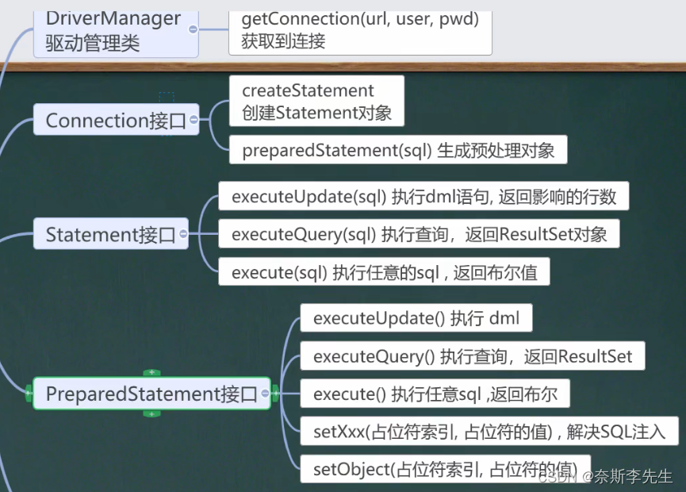
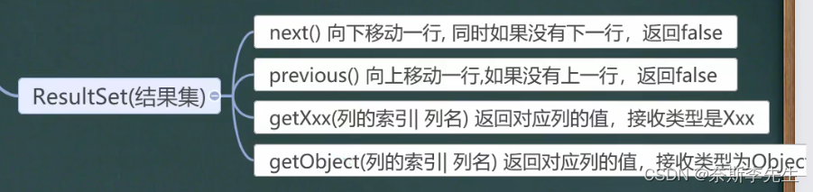
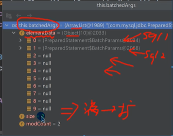
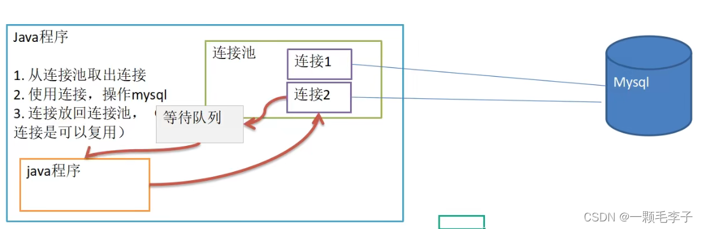
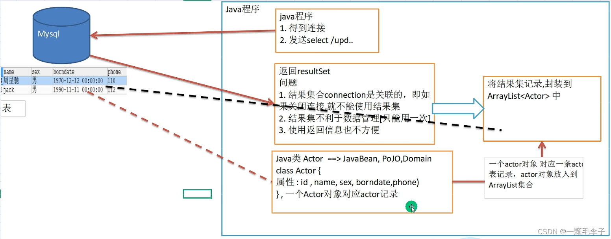
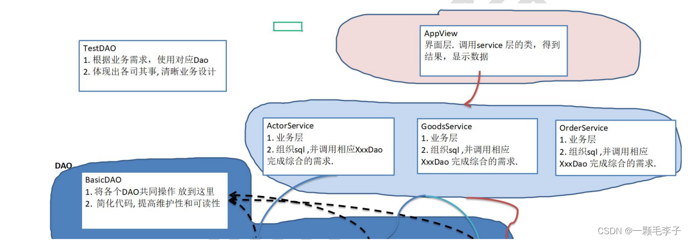
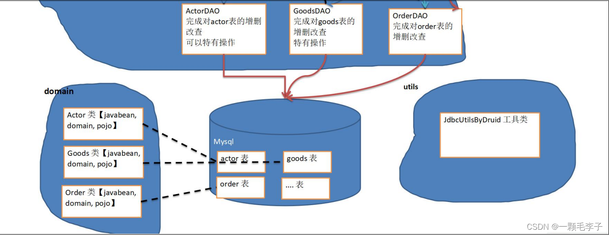

# JDBC

1. JDBC为访问不同的数据库提供了统一的接口，为使用者屏蔽了细节问题。
2. Java程序员使用JDBC，可以连接任何提供了JDBC驱动程序的数据库系统，从而完成对数据库的各种操作。
3. JDBC的基本原理



## JDBC  快速入门

### JDBC  API



### JDBC程序编写步骤

1. 注册驱动 - 加载Driver类
2. 获取连接 - 获得Connection
3. 执行增删改查 - 发送sql给数据库
4. 释放资源 - 关闭相关连接

## 简单实现

```java
package com.bobo.study.demo.jdbc_;

import java.sql.Connection;
import java.sql.SQLException;
import java.sql.Statement;
import java.util.Properties;

import com.mysql.jdbc.Driver;

public class Jdbc01 {
  public static void main(String[] args) throws SQLException {
    // 1.注册驱动
    Driver driver = new Driver();
    // 2.得到连接
    // 老师解读
    // (1) jdbc:mysql:// 规定好表示协议，通过jdbc的方式连接mysql
    // (2) localhost 主机，可以是ip地址
    // (3) 3306 表示mysql监听的端口
    // (4) hsp_db02 连接到mysql dbms 的哪个数据库
    // (5) test_db的连接本质就是前面学过的socket连接
    String url = "jdbc:mysql://localhost:3306/test_db";
    // 将 用户名和密码放入到Properties 对象
    Properties properties = new Properties();
    // 说明 user 和 password 是规定好，后面的值根据实际情况写
    properties.setProperty("user", "root");// 用户
    properties.setProperty("password", "qq2194296863"); // 密码
    Connection connect = driver.connect(url, properties);

    // 3.执行sql
    // String sql = "insert into actor values(null, '刘德华', '男', '1970-11-11',
    // '110')";
    // String sql = "update actor set name='周星驰' where id = 1";
    String sql = "update table_name set name = '123'";
    // statement 用于执行静态SQL语句并返回其生成的结果的对象
    Statement statement = connect.createStatement();
    int rows = statement.executeUpdate(sql); // 如果是 dml语句，返回的就是影响行数

    System.out.println(rows > 0 ? "成功" : "失败");
    // 4.关闭连接
    statement.close();
    connect.close();
  }
}

```

## 数据库的五种连接方式

```java
package com.bobo.study.demo.jdbc_;

import java.io.FileInputStream;
import java.io.IOException;
import java.sql.Connection;
import java.sql.DriverManager;
import java.sql.SQLException;
import java.util.Properties;

import com.mysql.jdbc.Driver;

public class Jdbc01 {
  // 方式1 属于静态加载，灵活性差，依赖性强。
  

  public void connect01() throws SQLException {
    Driver driver = new Driver(); // 创建driver对象
    String url = "jdbc:mysql://localhost:3306/hsp_db02";
    // 将 用户名和密码放入到Properties 对象
    Properties properties = new Properties();
    // 说明 user 和 password 是规定好，后面的值根据实际情况写
    properties.setProperty("user", "root");// 用户
    properties.setProperty("password", "qq2194296863"); // 密码
    Connection connect = driver.connect(url, properties);
    System.out.println(connect);
  }

  // 方式2
  public void connect02() throws ClassNotFoundException, IllegalAccessException, InstantiationException, SQLException {
    // 使用反射加载Driver类 , 动态加载，更加的灵活，减少依赖性
    Class<?> aClass = Class.forName("com.mysql.jdbc.Driver");
    Driver driver;
    try {
      driver = (Driver) aClass.getConstructor().newInstance();
      String url = "jdbc:mysql://localhost:3306/hsp_db02";
      // 将 用户名和密码放入到Properties 对象
      Properties properties = new Properties();
      // 说明 user 和 password 是规定好，后面的值根据实际情况写
      properties.setProperty("user", "root");// 用户
      properties.setProperty("password", "qq2194296863"); // 密码

      Connection connect = driver.connect(url, properties);
      System.out.println("方式2=" + connect);
    } catch (Exception e) {
      e.printStackTrace();
    }
  }

  // 方式3 使用DriverManager 替代 driver 进行统一管理
  public void connect03() throws IllegalAccessException, InstantiationException, ClassNotFoundException, SQLException {

    // 使用反射加载Driver
    Class<?> aClass = Class.forName("com.mysql.jdbc.Driver");
    Driver driver;
    try {
      driver = (Driver) aClass.getConstructor().newInstance();
      // 创建url 和 user 和 password
      String url = "jdbc:mysql://localhost:3306/hsp_db02";
      String user = "root";
      String password = "qq2194296863";

      DriverManager.registerDriver(driver);// 注册Driver驱动

      Connection connection = DriverManager.getConnection(url, user, password);
      System.out.println("第三种方式=" + connection);
    } catch (Exception e) {
      // TODO Auto-generated catch block
      e.printStackTrace();
    }

  
  }

  // 方式4: 使用Class.forName 自动完成注册驱动，简化代码
  // 这种方式获取连接是使用的最多，推荐使用
  public void connect04() throws ClassNotFoundException, SQLException {
    // 使用反射加载了 Driver类
    // 在加载 Driver类时，完成注册
    /*
     * 源码: 1. 静态代码块，在类加载时，会执行一次.
     * 2. DriverManager.registerDriver(new Driver());
     * 3. 因此注册driver的工作已经完成
     * static {
     * try {
     * DriverManager.registerDriver(new Driver());
     * } catch (SQLException var1) {
     * throw new RuntimeException("Can't register driver!");
     * }
     * }
     */
    Class.forName("com.mysql.jdbc.Driver");

    // 创建url 和 user 和 password
    String url = "jdbc:mysql://localhost:3306/hsp_db02";
    String user = "root";
    String password = "hsp";
    Connection connection = DriverManager.getConnection(url, user, password);

    System.out.println("第4种方式~ " + connection);

  }

  // 方式5 , 在方式4的基础上改进，增加配置文件，让连接mysql更加灵活
  public void connect05() throws IOException, ClassNotFoundException, SQLException {

    // 通过Properties对象获取配置文件的信息
    Properties properties = new Properties();
    properties.load(new FileInputStream("src\\mysql.properties"));
    // 获取相关的值
    String user = properties.getProperty("user");
    String password = properties.getProperty("password");
    String driver = properties.getProperty("driver");
    String url = properties.getProperty("url");

    Class.forName(driver);// 建议写上 mysql5.1.6可以无需Class.forName

    Connection connection = DriverManager.getConnection(url, user, password);

    System.out.println("方式5 " + connection);

  }

}

```

## 使用示例

```java
    // ResultSet
    // 通过Properties对象获取配置文件的信息

    Properties properties = new Properties();
    properties.load(new FileInputStream("work\\src\\mysql.properties"));
    // 获取相关的值
    String user = properties.getProperty("user");
    String password = properties.getProperty("password");
    String driver = properties.getProperty("driver");
    String url = properties.getProperty("url");

    // 1. 注册驱动
    Class.forName(driver);// 建议写上

    // 2. 得到连接
    Connection connection = DriverManager.getConnection(url, user, password);

    // 3. 得到Statement
    Statement statement = connection.createStatement();
    // 4. 组织SqL
    String sql = "select * from table_name";
    ResultSet resultSet = statement.executeQuery(sql);

    // 5. 使用while取出数据
    while (resultSet.next()) { // 让光标向后移动，如果没有更多行，则返回false
      String id = resultSet.getString(1); // 获取该行的第1列
      // int id1 = resultSet.getInt("id"); 通过列名来获取值, 推荐
      String name = resultSet.getString(2);// 获取该行的第2列
      String sex = resultSet.getString(3);
      String date = resultSet.getString(4);

      System.out.println(id + "\t" + name + "\t" + sex + "\t" + date);
    }

    // 6. 关闭连接
    resultSet.close();
    statement.close();
    connection.close();
```

## ResultSet接口

### ResultSet介绍

1. 表示数据库结果集的数据表，通常通过执行查询数据库的语句生成
2. ResultSet对象保持一个光标指向其当前的数据行。最初，光标位于第一行之前
3. next方法将光标移动到下一行，并且由于在ResultSet对象中没有更多行时返回false，因此可以在while循环中使用循环来遍历结果集

### ResultSet的底层结构

ResultSet的底层结构其实是其实现类JDBC42ResultSet

rowData，也就是行数据。

rowData里面有个rows，它由很多行数据构成，是个ArrayList



## Statement接口

### Statement介绍

1. Statement对象用于执行静态SQL语句并返回其生成的结果的对象
2. 在连接建立后，需要对数据库进行访问，执行命名或是SQL语句，可以通过
   Statement[存在SQL注入]。实际开发不可以使用
   PreparedStatement[预处理]
   CallableStatement[存储过程]
3. Statement对象执行SQL语句，存在SQL注入风险
4. SQL注入是利用某些系统没有对用户输入的数据进行充分的检查，而在用户输入数据中注入非法的SQL语句段或命令，恶意攻击数据库。
5. 要防范SQL注入，只要用PreparedStatement(从Statement扩展而来)取代Statement就可以了

### sql风险注入

```sql
select * from admin_table where name = '?' and pwd = '?'

输入name = 1' or
输入pwd = or '1' = '1

select * from admin_table where name = '1' or' and pwd = 'or '1' = '1'
```

### Statement应用注入案例

```java
    Scanner scanner = new Scanner(System.in);

    // 让用户输入管理员名和密码
    System.out.print("请输入管理员的名字: "); // next(): 当接收到 空格或者 '就是表示结束
    String admin_name = scanner.nextLine(); // 老师说明，如果希望看到SQL注入，这里需要用nextLine
    System.out.print("请输入管理员的密码: ");
    String admin_pwd = scanner.nextLine();

    // 通过Properties对象获取配置文件的信息

    Properties properties = new Properties();
    properties.load(new FileInputStream("work\\src\\mysql.properties"));
    // 获取相关的值
    String user = properties.getProperty("user");
    String password = properties.getProperty("password");
    String driver = properties.getProperty("driver");
    String url = properties.getProperty("url");

    // 1. 注册驱动
    Class.forName(driver);// 建议写上

    // 2. 得到连接
    Connection connection = DriverManager.getConnection(url, user, password);

    // 3. 得到Statement
    Statement statement = connection.createStatement();
    // 4. 组织SqL
    String sql = "select name , pwd  from admin where name ='"
        + admin_name + "' and pwd = '" + admin_pwd + "'";
    ResultSet resultSet = statement.executeQuery(sql);
    if (resultSet.next()) { // 如果查询到一条记录，则说明该管理存在
      System.out.println("恭喜， 登录成功");
    } else {
      System.out.println("对不起，登录失败");
    }

    // 关闭连接
    resultSet.close();
    statement.close();
    connection.close(); 

```

## PreparedStatement接口

### PreparedStatement介绍

1. PreparedStatement执行的SQL语句中的参数用问号?来表示，调用PreparedStatement对象的setxxx()方法来设置这些参数。setxxx()方法有两个参数，第一个参数是要设置的SQL语句中的参数的索引(从1开始)，第二个是设置的SQL语句中的参数的值
2. 调用executeQuery()：返回ResultSet对象
3. 调用executeUpdate()：执行更新，包括增、删、修改，返回受影响的行数

### PreparedStatement优点

1. 不再使用+拼接sq语句，减少语法错误
2. 有效的解决了sql注入问题!
3. 大大减少了编译次数，效率较高

### PreparedStatement处理SQL注入的问题

```java
    Scanner scanner = new Scanner(System.in);

    // 让用户输入管理员名和密码
    System.out.print("请输入管理员的名字: "); // next(): 当接收到 空格或者 '就是表示结束
    String admin_name = scanner.nextLine(); // 老师说明，如果希望看到SQL注入，这里需要用nextLine
    System.out.print("请输入管理员的密码: ");
    String admin_pwd = scanner.nextLine();

    // 通过Properties对象获取配置文件的信息

    Properties properties = new Properties();
    properties.load(new FileInputStream("src\\mysql.properties"));
    // 获取相关的值
    String user = properties.getProperty("user");
    String password = properties.getProperty("password");
    String driver = properties.getProperty("driver");
    String url = properties.getProperty("url");

    // 1. 注册驱动
    Class.forName(driver);// 建议写上

    // 2. 得到连接
    Connection connection = DriverManager.getConnection(url, user, password);

    // 3. 得到PreparedStatement
    // 3.1 组织SqL , Sql 语句的 ? 就相当于占位符
    String sql = "select name , pwd  from admin where name =? and pwd = ?";
    // 3.2 preparedStatement 对象实现了 PreparedStatement 接口的实现类的对象
    PreparedStatement preparedStatement = connection.prepareStatement(sql);
    // 3.3 给 ? 赋值
    preparedStatement.setString(1, admin_name);
    preparedStatement.setString(2, admin_pwd);

    // 4. 执行 select 语句使用 executeQuery
    // 如果执行的是 dml(update, insert ,delete) executeUpdate()
    // 这里执行 executeQuery ,不要在写 sql

    ResultSet resultSet = preparedStatement.executeQuery();
    if (resultSet.next()) { // 如果查询到一条记录，则说明该管理存在
      System.out.println("恭喜， 登录成功");
    } else {
      System.out.println("对不起，登录失败");
    }

    // 关闭连接
    resultSet.close();
    preparedStatement.close();
    connection.close()

```

### 预处理DML

```java
    Scanner scanner = new Scanner(System.in);

    // 让用户输入管理员名和密码
    System.out.print("请输删除管理员的名字: "); // next(): 当接收到 空格或者 '就是表示结束
    String admin_name = scanner.nextLine(); // 老师说明，如果希望看到SQL注入，这里需要用nextLine
    // System.out.print("请输入管理员的新密码: ");
    // String admin_pwd = scanner.nextLine();

    // 通过Properties对象获取配置文件的信息

    Properties properties = new Properties();
    properties.load(new FileInputStream("src\\mysql.properties"));
    // 获取相关的值
    String user = properties.getProperty("user");
    String password = properties.getProperty("password");
    String driver = properties.getProperty("driver");
    String url = properties.getProperty("url");

    // 1. 注册驱动
    Class.forName(driver);// 建议写上

    // 2. 得到连接
    Connection connection = DriverManager.getConnection(url, user, password);

    // 3. 得到PreparedStatement
    // 3.1 组织SqL , Sql 语句的 ? 就相当于占位符
    // 添加记录
    // String sql = "insert into admin values(?, ?)";
    // String sql = "update admin set pwd = ? where name = ?";
    String sql = "delete from  admin where name = ?";
    // 3.2 preparedStatement 对象实现了 PreparedStatement 接口的实现类的对象
    PreparedStatement preparedStatement = connection.prepareStatement(sql);
    // 3.3 给 ? 赋值
    preparedStatement.setString(1, admin_name);

    // preparedStatement.setString(2, admin_name);

    // 4. 执行 dml 语句使用 executeUpdate
    int rows = preparedStatement.executeUpdate();
    System.out.println(rows > 0 ? "执行成功" : "执行失败");
    // 关闭连接
    preparedStatement.close();
    connection.close();
```

## JDBC API梳理





## 封装JDBCUtils

```java
package com.bobo.study.work.work01;

import java.sql.Connection;
import java.sql.DriverManager;
import java.sql.PreparedStatement;
import java.sql.ResultSet;
import java.sql.SQLException;
import java.sql.Statement;
import java.util.ResourceBundle;

public class JdbcUtil {
  private static final String DRIVER = getValue("driver");
  private static final String URL = getValue("url");
  private static final String USERNAME = getValue("username");
  private static final String PASSWORD = getValue("password");

  static {
    try {
      // 注册数据库驱动程序
      Class.forName(DRIVER);
    } catch (ClassNotFoundException e) {
      System.err.println("注册数据库驱动程序失败。" + e.getMessage());
    }
  }

  // 连接数据库
  public static Connection getConnection() {
    try {
      Connection conn = DriverManager.getConnection(URL, USERNAME, PASSWORD);
      return conn;
    } catch (SQLException e) {
      System.err.println("a获得数据连接失败。" + e.getMessage());
    }
    return null;
  }

  // 关闭连接
  public static void close(Connection conn, Statement stmt, ResultSet rs) {
    try {
      // 关闭数据库的资源的顺序最好与使用的顺序相反
      if (rs != null) {
        rs.close();
      }
      if (stmt != null) {
        stmt.close();
      }
      if (conn != null) {
        conn.close();
      }
    } catch (SQLException e) {
      e.printStackTrace();
    }
  }

  /**
   * 读取属性文件中的信息
   *
   * @param key
   * @return
   */
  private static String getValue(String key) {
    // 资源包绑定
    // ResourceBundle与Properties的区别在于
    // ResourceBundle通常是用于国际化的属性配置文件读取，Properties则是一般的属性配置文件读取。
    ResourceBundle bundle = ResourceBundle.getBundle("db");
    return bundle.getString(key);
  }

  public static void main(String[] args) {
    // System.out.println(getValue("driver"));
    // System.out.println(getConnection());

  }
}

```

## JDBCUtils的测试使用

```java
package com.bobo.study.demo.jdbc_;

import java.sql.Connection;
import java.sql.PreparedStatement;
import java.sql.ResultSet;
import java.sql.SQLException;

public class Jdbc06 {
  public void testDML() {
    Connection connection = null;
    PreparedStatement preparedStatement = null;
    try {
      connection = JdbcUtil.getConnection();

      String sql = "update actor1 set name = ? where number = ?";

      preparedStatement = connection.prepareStatement(sql);

      preparedStatement.setString(1, "小红");
      preparedStatement.setString(2, "2020200");

      int rows = preparedStatement.executeUpdate();
      System.out.println(rows > 0 ? "成功" : "失败");
    } catch (Exception e) {
      // TODO: handle exception
    } finally {
      JdbcUtil.close(connection, preparedStatement, null);
    }
  }

  // 查询
  public void testQuery() {
    Connection connection = null;
    PreparedStatement preparedStatement = null;
    ResultSet resultSet = null;
    try {
      connection = JdbcUtil.getConnection();
      String sql = "select name , sex from actor1 where number = ?";
      preparedStatement = connection.prepareStatement(sql);
      preparedStatement.setString(1, "2020200");
      resultSet = preparedStatement.executeQuery();
      while (resultSet.next()) {
        String name = resultSet.getString(1);
        String sex = resultSet.getString(2);
        System.out.println(name + "\t" + sex);
      }
    } catch (SQLException e) {
      e.printStackTrace();
    } finally {
      JdbcUtil.close(connection, preparedStatement, resultSet);
    }

  }
}

```

## jdbc事务

1. JDBC程序中当一个Connection对象创建时，默认情况下是自动提交事务:每次执行一个SQL语句时，如果执行成功，就会向数据库自动提交，而不能回滚。
2. JDBC程序中为了让多个SQL语句作为一个整体执行，需要使用事务
3. 调用Connection的setAutoCommit(false)可以取消自动提交事务
4. 在所有的SQL语句都成功执行后,调用commit();方法提交事务
5. 在其中某个操作失败或出现异常时，调用rollback();方法回滚事务

### 事务处理

```java
package com.hspedu.jdbc.transaction_;
 
import com.hspedu.jdbc.utils.JDBCUtils;
import org.junit.jupiter.api.Test;
 
import java.sql.Connection;
import java.sql.PreparedStatement;
import java.sql.SQLException;
 
/**
 * 演示jdbc 中如何使用事务
 */
public class Transaction_ {
 
    //没有使用事务.
    @Test
    public void noTransaction() {
 
        //操作转账的业务
        //1. 得到连接
        Connection connection = null;
        //2. 组织一个sql
        String sql = "update account set balance = balance - 100 where id = 1";
        String sql2 = "update account set balance = balance + 100 where id = 2";
        PreparedStatement preparedStatement = null;
        //3. 创建PreparedStatement 对象
        try {
            connection = JDBCUtils.getConnection(); // 在默认情况下，connection是默认自动提交
            preparedStatement = connection.prepareStatement(sql);
            preparedStatement.executeUpdate(); // 执行第1条sql
 
            int i = 1 / 0; //模拟异常
            preparedStatement = connection.prepareStatement(sql2);
            preparedStatement.executeUpdate(); // 执行第3条sql
 
 
        } catch (SQLException e) {
            e.printStackTrace();
        } finally {
            //关闭资源
            JDBCUtils.close(null, preparedStatement, connection);
        }
    }
 
    //事务来解决
    @Test
    public void useTransaction() {
 
        //操作转账的业务
        //1. 得到连接
        Connection connection = null;
        //2. 组织一个sql
        String sql = "update account set balance = balance - 100 where id = 1";
        String sql2 = "update account set balance = balance + 100 where id = 2";
        PreparedStatement preparedStatement = null;
        //3. 创建PreparedStatement 对象
        try {
            connection = JDBCUtils.getConnection(); // 在默认情况下，connection是默认自动提交
            //将 connection 设置为不自动提交
            connection.setAutoCommit(false); //开启了事务
            preparedStatement = connection.prepareStatement(sql);
            preparedStatement.executeUpdate(); // 执行第1条sql
 
            int i = 1 / 0; //模拟异常
            preparedStatement = connection.prepareStatement(sql2);
            preparedStatement.executeUpdate(); // 执行第3条sql
 
            //这里提交事务
            connection.commit();
 
        } catch (Exception e) {
            //这里我们可以进行回滚，即撤销执行的SQL
            //默认回滚到事务开始的状态.
            System.out.println("执行发生了异常，撤销执行的sql");
            try {
                connection.rollback();
            } catch (SQLException throwables) {
                throwables.printStackTrace();
            }
            e.printStackTrace();
        } finally {
            //关闭资源
            JDBCUtils.close(null, preparedStatement, connection);
        }
    }
}
```

## 批处理

1. 当需要成批插入或者更新记录时。可以采用Java的批量更新机制，这一机制允许多条语句一次性提交给数据库批量处理。通常情况下比单独提交处理更有效率。
2. JDBC的批量处理语句包括下面方法：
   addBatch()：添加需要批量处理的SQL语句或参数
   executeBatch()：执行批量处理语句;
   clearBatch()：清空批处理包的语句
3. JDBC连接MySQL时，如果要使用批处理功能,请再url中加参数rewriteBatchedStatements=true
4. 批处理往往和PreparedStatement一起搭配使用，可以既减少编译次数，又减少运行次数，效率大大提高
5. 底层是ArrayList

```java
package com.hspedu.jdbc.batch_;
 
import com.hspedu.jdbc.utils.JDBCUtils;
import org.junit.jupiter.api.Test;
 
import java.sql.Connection;
import java.sql.PreparedStatement;
import java.sql.SQLException;
 
/**
 * 演示java的批处理
 */
public class Batch_ {
 
    //传统方法，添加5000条数据到admin2
 
    @Test
    public void noBatch() throws Exception {
 
        Connection connection = JDBCUtils.getConnection();
        String sql = "insert into admin2 values(null, ?, ?)";
        PreparedStatement preparedStatement = connection.prepareStatement(sql);
        System.out.println("开始执行");
        long start = System.currentTimeMillis();//开始时间
        for (int i = 0; i < 5000; i++) {//5000执行
            preparedStatement.setString(1, "jack" + i);
            preparedStatement.setString(2, "666");
            preparedStatement.executeUpdate();
        }
        long end = System.currentTimeMillis();
        System.out.println("传统的方式 耗时=" + (end - start));//传统的方式 耗时=10702
        //关闭连接
        JDBCUtils.close(null, preparedStatement, connection);
    }
 
    //使用批量方式添加数据
    @Test
    public void batch() throws Exception {
 
        Connection connection = JDBCUtils.getConnection();
        String sql = "insert into admin2 values(null, ?, ?)";
        PreparedStatement preparedStatement = connection.prepareStatement(sql);
        System.out.println("开始执行");
        long start = System.currentTimeMillis();//开始时间
        for (int i = 0; i < 5000; i++) {//5000执行
            preparedStatement.setString(1, "jack" + i);
            preparedStatement.setString(2, "666");
            //将sql 语句加入到批处理包中 -> 看源码
            /*
            //1. //第一就创建 ArrayList - elementData => Object[]
            //2. elementData => Object[] 就会存放我们预处理的sql语句
            //3. 当elementData满后,就按照1.5扩容
            //4. 当添加到指定的值后，就executeBatch
            //5. 批量处理会减少我们发送sql语句的网络开销，而且减少编译次数，因此效率提高
            public void addBatch() throws SQLException {
                synchronized(this.checkClosed().getConnectionMutex()) {
                    if (this.batchedArgs == null) {
                        this.batchedArgs = new ArrayList();
                    }
                    for(int i = 0; i < this.parameterValues.length; ++i) {
                        this.checkAllParametersSet(this.parameterValues[i], this.parameterStreams[i], i);
                    }
                    this.batchedArgs.add(new PreparedStatement.BatchParams(this.parameterValues, this.parameterStreams, this.isStream, this.streamLengths, this.isNull));
                }
            }
             */
            preparedStatement.addBatch();
            //当有1000条记录时，在批量执行
            if((i + 1) % 1000 == 0) {//满1000条sql
                preparedStatement.executeBatch();
                //清空一把
                preparedStatement.clearBatch();
            }
        }
        long end = System.currentTimeMillis();
        System.out.println("批量方式 耗时=" + (end - start));//批量方式 耗时=108
        //关闭连接
        JDBCUtils.close(null, preparedStatement, connection);
    }
}
```



## 数据库连接池

### 传统获取Connection问题分析

1. 传统的JDBC数据库连接使用DriverManager 来获取，每次向数据库建立连接的时候都要将Connection 加载到内存中，再验证IP地址，用户名和密码(0.05s~1s时间)。需要数据库连接的时候，就向数据库要求一个，频繁的进行数据库连接操作将占用很多的系统资源，容易造成服务器崩溃。
2. 每一次数据库连接，使用完后都得断开，如果程序出现异常而未能关闭，将导致数据库内存泄漏，最终将导致重启数据库。
3. 传统获取连接的方式，不能控制创建的连接数量，如连接过多，也可能导致内存泄漏，MySQL崩溃。
4. 解决传统开发中的数据库连接问题，可以采用数据库连接池技术

### 数据库连接池基本介绍

1. 预先在缓冲池中放入一定数量的连接，当需要建立数据库连接时，只需从“缓冲池”中取出一个，使用完毕之后再放回去。
2. 数据库连接池负责分配、管理和释放数据库连接，它允许应用程序重复使用一个现有的数据库连接，而不是重新建立一个。
3. 当应用程序向连接池请求的连接数超过最大连接数量时，这些请求将被加入到等待队列中



### 数据库连接池种类

1. JDBC的数据库连接池使用javax.sql.DataSource来表示，DataSource只是一个接口，该接口通常由第三方提供实现
2. **C3P0** 数据库连接池，速度相对较慢，稳定性不错 (hibernate, spring)
3. DBCP数据库连接池，速度相对C3P0较快，但不稳定
4. Proxool数据库连接池，有监控连接池状态的功能，稳定性较C3P0差一点
5. BoneCP数据库连接池，速度快
6. **Druid**(德鲁伊)是阿里提供的数据库连接池，集DBCP、C3P0、Proxool优点于一身的数据库连接池，开发中优先使用

#### C3PO

##### 使用C3PO的两种方式进行链接的案例

```java
// 方式1： 相关参数，在程序中指定user, url , password等
  public void testC3P0_01() throws Exception {

    // 1. 创建一个数据源对象
    ComboPooledDataSource comboPooledDataSource = new ComboPooledDataSource();
    // 2. 通过配置文件mysql.properties 获取相关连接的信息
    Properties properties = new Properties();
    properties.load(new FileInputStream("src\\mysql.properties"));
    // 读取相关的属性值
    String user = properties.getProperty("user");
    String password = properties.getProperty("password");
    String url = properties.getProperty("url");
    String driver = properties.getProperty("driver");

    // 给数据源 comboPooledDataSource 设置相关的参数
    // 注意：连接管理是由 comboPooledDataSource 来管理
    comboPooledDataSource.setDriverClass(driver);
    comboPooledDataSource.setJdbcUrl(url);
    comboPooledDataSource.setUser(user);
    comboPooledDataSource.setPassword(password);

    // 设置初始化连接数
    comboPooledDataSource.setInitialPoolSize(10);
    // 最大连接数
    comboPooledDataSource.setMaxPoolSize(50);
    // 测试连接池的效率, 测试对mysql 5000次操作
    long start = System.currentTimeMillis();
    for (int i = 0; i < 5000; i++) {
      Connection connection = comboPooledDataSource.getConnection(); // 这个方法就是从 DataSource 接口实现的
      // System.out.println("连接OK");
      connection.close();
    }
    long end = System.currentTimeMillis();
    System.out.println("c3p0 5000连接mysql 耗时=" + (end - start));

  }

  // 第二种方式 使用配置文件模板来完成

  // 1. 将c3p0 提供的 c3p0.config.xml 拷贝到 src目录下
  // 2. 该文件指定了连接数据库和连接池的相关参数
  public void testC3P0_02() throws SQLException {

    //与配置文件的name对应
    ComboPooledDataSource comboPooledDataSource = new ComboPooledDataSource("mysql");

    // 测试5000次连接mysql
    long start = System.currentTimeMillis();
    System.out.println("开始执行....");
    for (int i = 0; i < 5000; i++) {
      Connection connection = comboPooledDataSource.getConnection();
      // System.out.println("连接OK~");
      connection.close();
    }
    long end = System.currentTimeMillis();
    System.out.println("c3p0的第二种方式(500000) 耗时=" + (end - start));// 1917

  }
```

##### 在resources下创建c3p0-config.xml

```xml
<?xml version="1.0" encoding="UTF-8"?>
<c3p0-config>
   <!--默认配置。详细配置可查阅在线文档：https://tool.oschina.net/apidocs/apidoc?api=c3p0 -->
    <default-config>  
      <property name="initialPoolSize">10</property>  
      <property name="maxIdleTime">30</property>  
      <property name="maxPoolSize">100</property>  
      <property name="minPoolSize">10</property>  
      <property name="maxStatements">200</property>  
    </default-config>  
  
   <!--配置连接池mysql-->
    <named-config name="mysql">  
      <property name="driverClass">com.mysql.jdbc.Driver</property>  
      <property name="jdbcUrl">jdbc:mysql://localhost:3306/test_db</property>  
      <property name="user">root</property>  
      <property name="password">qq2194296863</property>  
      <!-- 每次增长的连接数 -->
      <property name="acquireIncrement">5</property>  
      <!-- 初始连接数 -->
      <property name="initialPoolSize">10</property>  
      <!-- 连接因在多少秒内未被使用而被连接池剔除的时间 -->
      <property name="maxIdleTime">30</property>  
      <!-- 最大连接数 -->
      <property name="maxPoolSize">100</property>  
      <!-- 最小连接数 -->
      <property name="minPoolSize">10</property>  
      <!-- 可连接的最多的命令对象数 -->
      <property name="maxStatements">200</property>  
      <!-- 每个连接对象可连接的最多的命令对象数 -->
      <property name="maxStatementsPerConnection">2</property>  
    </named-config>  
  
</c3p0-config>
```

##### 封装C3p0Utils

```java
public class C3p0Utils {
  static Logger logger = Logger.getLogger(C3p0Utils.class.getName());

  // 通过标识名来创建相应连接池
  static ComboPooledDataSource dataSource = new ComboPooledDataSource("mysql");

  /**
   * //从连接池中取用一个连接
   * 
   * @return
   */
  public static Connection getConnection() {
    try {
      return dataSource.getConnection();
    } catch (Exception e) {
      logger.error("Exception in C3p0Utils!", e);

    }
    return null;
  }

  /**
   * 释放连接回连接池
   */

  public static void closeAll(Connection conn, PreparedStatement pst, ResultSet rs) {
    if (rs != null) {
      try {
        rs.close();
      } catch (SQLException e) {
        logger.error("Exception in C3p0Utils!", e);

      }
    }
    if (pst != null) {
      try {
        pst.close();
      } catch (SQLException e) {
        logger.error("Exception in C3p0Utils!", e);

      }
    }

    if (conn != null) {
      try {
        conn.close();
      } catch (SQLException e) {
        logger.error("Exception in C3p0Utils!", e);

      }
    }
  }
}

```

#### Druid

##### 使用Druid进行链接的案例

```java
public void testDruid() throws Exception {
    // 1. 加入 Druid jar包
    // 2. 加入 配置文件 druid.properties , 将该文件拷贝项目的src目录
    // 3. 创建Properties对象, 读取配置文件
    Properties properties = new Properties();
    properties.load(new FileInputStream("src\\druid.properties"));

    // 4. 创建一个指定参数的数据库连接池, Druid连接池
    DataSource dataSource = DruidDataSourceFactory.createDataSource(properties);

    long start = System.currentTimeMillis();
    for (int i = 0; i < 5000; i++) {
      Connection connection = dataSource.getConnection();
      // System.out.println("连接成功!");
      connection.close();
    }
    long end = System.currentTimeMillis();
    System.out.println("druid连接池 操作500000 耗时=" + (end - start));// 539

  }
```

##### 在src目录下创建druid.properties

```properties
#数据库连接信息
driverClassName=com.mysql.jdbc.Driver
url=jdbc:mysql://localhost:3306/test_db
username=root
password=qq2194296863
 
#连接池属性
#连接池的初始化连接数<创建数据库连接时默认初始化连接数>
initalSize=10
#连接池的最大连接数
maxActive=50
#最小空闲连接数（当数据库连接使用率很低时，连接池中的连接会被释放一部分）
minIdle=5
#超时等待时间(单位：ms)
maxWait=30000
```

##### 封装DruidUtils

```java
package com.bobo.study.demo.jdbc_;

import java.io.FileInputStream;
import java.sql.Connection;
import java.sql.ResultSet;
import java.sql.SQLException;
import java.sql.Statement;
import java.util.Properties;

import javax.sql.DataSource;

import com.alibaba.druid.pool.DruidDataSourceFactory;

public class DruidUtils {
  private static DataSource ds;

  // 在静态代码块完成 ds初始化
  static {
    Properties properties = new Properties();
    try {
      properties.load(new FileInputStream("src\\druid.properties"));
      ds = DruidDataSourceFactory.createDataSource(properties);
    } catch (Exception e) {
      e.printStackTrace();
    }

  }

  // 编写getConnection方法
  public static Connection getConnection() {
    try {
      return ds.getConnection();
    } catch (SQLException e) {
      // TODO Auto-generated catch block
      e.printStackTrace();
    }
    return null;
  }

  // 关闭连接, 再次强调： 在数据库连接池技术中，close 不是真的断掉连接
  // 而是把使用的Connection对象放回连接池
  public static void close(ResultSet resultSet, Statement statement, Connection connection) {

    try {
      if (resultSet != null) {
        resultSet.close();
      }
      if (statement != null) {
        statement.close();
      }
      if (connection != null) {
        connection.close();
      }
    } catch (SQLException e) {
      throw new RuntimeException(e);
    }
  }
}

```

## Apache-DBUtils

### Apache-DBUtils引出

先分析一个问题，当关闭connection后，resultset结果集就无法使用了，这就使得resultset不利于数据的管理



### 土方法实现

```java
public ArrayList<Actor> testSelectToArrayList() {

    System.out.println("使用 druid方式完成");
    // 1. 得到连接
    Connection connection = null;
    // 2. 组织一个sql
    String sql = "select * from actor where id >= ?";
    PreparedStatement preparedStatement = null;
    ResultSet set = null;
    ArrayList<Actor> list = new ArrayList<>();// 创建ArrayList对象,存放actor对象
    // 3. 创建PreparedStatement 对象
    try {
      connection = DruidUtils.getConnection();
      System.out.println(connection.getClass());// 运行类型 com.alibaba.druid.pool.DruidPooledConnection
      preparedStatement = connection.prepareStatement(sql);
      preparedStatement.setInt(1, 1);// 给?号赋值
      // 执行, 得到结果集
      set = preparedStatement.executeQuery();

      // 遍历该结果集
      while (set.next()) {
        int id = set.getInt("id");
        String name = set.getString("name");// getName()
        String sex = set.getString("sex");// getSex()
        Date borndate = set.getDate("borndate");
        String phone = set.getString("phone");
        // 把得到的resultset 的记录，封装到 Actor对象，放入到list集合
        list.add(new Actor(id, name, sex, borndate, phone));
      }

      System.out.println("list集合数据=" + list);
      for (Actor actor : list) {
        System.out.println("id=" + actor.getId() + "\t" + actor.getName());
      }

    } catch (SQLException e) {
      e.printStackTrace();
    } finally {
      // 关闭资源
      DruidUtils.close(set, preparedStatement, connection);
    }
    // 因为ArrayList 和 connection 没有任何关联，所以该集合可以复用.
    return list;
  }
```

### Apache-DBUtils基本介绍

1. commons-dbutils是Apache组织提供的一个开源JDBC工具类库，它是对JDBC的封装，使用dbutils能极大简化jdbc编码的工作量。

DbUtils类

1. QueryRunner类:该类封装了SQL的执行，是线程安全的。可以实现增、删、改、查、批处理
2. 使用QueryRunner类实现查询
3. ResultSetHandler接口：该接口用于处理java.sqI.ResultSet，将数据按要求转换为另一种形式

ResultSetHandler接口

1. ArrayHandler:把结果集中的第一行数据转成对象数组。
2. ArrayListHandler:把结果集中的每一行数据都转成一个数组，再存放到List中
3. BeanHandler:将结果集中的第一行数据封装到一个对应的JavaBean实例中。
4. BeanListHandler:将结果集中的每一行数据都封装到一个对应的JavaBean实例中，存放到List里。
5. ColumnListHandler:将结果集中某一列的数据存放到List中。
6. KeyedHandler(name):将结果集中的每行数据都封装到Map里，再把这些map再存到一个map里，其key为指定的key.
7. MapHandler:将结果集中的第一行数据封装到一个Map里，key是列名，value就是对应的值。
8. MapListHandler:将结果集中的每一行数据都封装到一个Map里，然后再存放到List

### DbUtils的使用

```java
 public void BeanList() throws SQLException {
    // 1. 得到 连接 (druid)
    Connection connection = DruidUtils.getConnection();
    // 2. 使用 DBUtils 类和接口 , 先引入DBUtils 相关的jar , 加入到本Project
    // 3. 创建 QueryRunner
    QueryRunner queryRunner = new QueryRunner();
    // 4. 就可以执行相关的方法，返回ArrayList 结果集
    // String sql = "select * from actor where id >= ?";
    // 注意: sql 语句也可以查询部分列
    String sql = "select id, name from actor where id >= ?";
    // 老韩解读
    // (1) query 方法就是执行sql 语句，得到resultset ---封装到 --> ArrayList 集合中
    // (2) 返回集合
    // (3) connection: 连接
    // (4) sql : 执行的sql语句
    // (5) new BeanListHandler<>(Actor.class): 在将resultset -> Actor 对象 -> 封装到
    // ArrayList
    // 底层使用反射机制 去获取Actor 类的属性，然后进行封装
    // (6) 1 就是给 sql 语句中的? 赋值，可以有多个值，因为是可变参数Object... params
    // (7) 底层得到的resultset ,会在query 关闭, 关闭PreparedStatment
    /**
     * 分析 queryRunner.query方法:
     * public <T> T query(Connection conn, String sql, ResultSetHandler<T> rsh,
     * Object... params) throws SQLException {
     * PreparedStatement stmt = null;//定义PreparedStatement
     * ResultSet rs = null;//接收返回的 ResultSet
     * Object result = null;//返回ArrayList
     *
     * try {
     * stmt = this.prepareStatement(conn, sql);//创建PreparedStatement
     * this.fillStatement(stmt, params);//对sql 进行 ? 赋值
     * rs = this.wrap(stmt.executeQuery());//执行sql,返回resultset
     * result = rsh.handle(rs);//返回的resultset --> arrayList[result]
     * [使用到反射，对传入class对象处理]
     * } catch (SQLException var33) {
     * this.rethrow(var33, sql, params);
     * } finally {
     * try {
     * this.close(rs);//关闭resultset
     * } finally {
     * this.close((Statement)stmt);//关闭preparedstatement对象
     * }
     * }
     *
     * return result;
     * }
     */
    List<Actor> list = queryRunner.query(connection, sql, new BeanListHandler<>(Actor.class), 1);
    System.out.println("输出集合的信息");
    for (Actor actor : list) {
      System.out.print(actor);
    }

    // 释放资源
    DruidUtils.close(null, null, connection);

  }

  // 演示 apache-dbutils + druid 完成 返回的结果是单行记录(单个对象)
  public void testQuerySingle() throws SQLException {

    // 1. 得到 连接 (druid)
    Connection connection = DruidUtils.getConnection();
    // 2. 使用 DBUtils 类和接口 , 先引入DBUtils 相关的jar , 加入到本Project
    // 3. 创建 QueryRunner
    QueryRunner queryRunner = new QueryRunner();
    // 4. 就可以执行相关的方法，返回单个对象
    String sql = "select * from actor where id = ?";
    // 老韩解读
    // 因为我们返回的单行记录<--->单个对象 , 使用的Hander 是 BeanHandler
    Actor actor = queryRunner.query(connection, sql, new BeanHandler<>(Actor.class), 10);
    System.out.println(actor);

    // 释放资源
    DruidUtils.close(null, null, connection);

  }

  // 演示apache-dbutils + druid 完成查询结果是单行单列-返回的就是object
  public void testScalar() throws SQLException {

    // 1. 得到 连接 (druid)
    Connection connection = DruidUtils.getConnection();
    // 2. 使用 DBUtils 类和接口 , 先引入DBUtils 相关的jar , 加入到本Project
    // 3. 创建 QueryRunner
    QueryRunner queryRunner = new QueryRunner();

    // 4. 就可以执行相关的方法，返回单行单列 , 返回的就是Object
    String sql = "select name from actor where id = ?";
    // 老师解读： 因为返回的是一个对象, 使用的handler 就是 ScalarHandler
    Object obj = queryRunner.query(connection, sql, new ScalarHandler(), 4);
    System.out.println(obj);

    // 释放资源
    DruidUtils.close(null, null, connection);
  }
```

### ApDBUtilsDML

```java
public void testDML() throws SQLException {

    // 1. 得到 连接 (druid)
    Connection connection = DruidUtils.getConnection();
    // 2. 使用 DBUtils 类和接口 , 先引入DBUtils 相关的jar , 加入到本Project
    // 3. 创建 QueryRunner
    QueryRunner queryRunner = new QueryRunner();

    // 4. 这里组织sql 完成 update, insert delete
    // String sql = "update actor set name = ? where id = ?";
    // String sql = "insert into actor values(null, ?, ?, ?, ?)";
    String sql = "delete from actor where id = ?";

    // 老韩解读
    // (1) 执行dml 操作是 queryRunner.update()
    // (2) 返回的值是受影响的行数 (affected: 受影响)
    // int affectedRow = queryRunner.update(connection, sql, "林青霞", "女",
    // "1966-10-10", "116");
    int affectedRow = queryRunner.update(connection, sql, 1000);
    System.out.println(affectedRow > 0 ? "执行成功" : "执行没有影响到表");

    // 释放资源
    DruidUtils.close(null, null, connection);

  }
```

## BasicDao增删改查

### 分析问题

1. SQL语句是固定，不能通过参数传入，通用性不好，需要进行改进，更方便执行增删改查
2. 对于select 操作，如果有返回值,返回类型不能固定，需要使用泛型
3. 将来的表很多，业务需求复杂,不可能只靠一个Java类完成
4. 引出=> BasicDAO画出示意图





### 结构设计

1. utils //工具类
2. domain //javabean
3. dao //存放XxxDAO和BasicDAO
4. test //写测试类

### 应用实例
