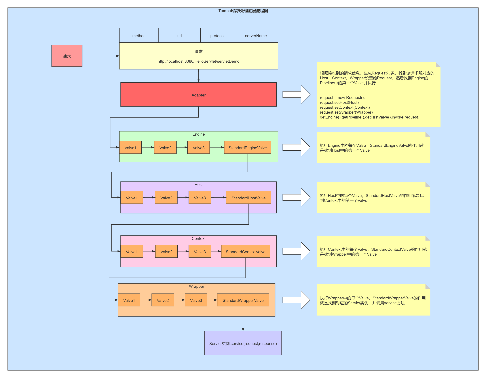
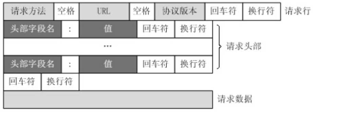
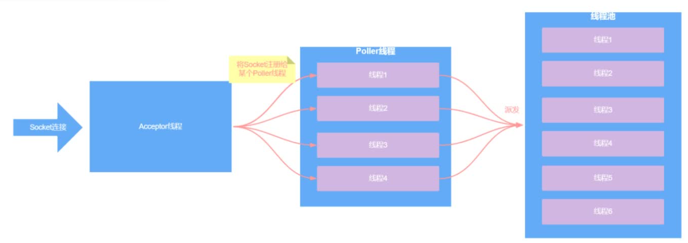

# tomcat

tomcat-->serlvet容器

## tomcat四大容器、五大核心组件

Engine-->一个tomcat就是一个Engine，
	List <Host>
	PipeLine line
		Valve

Host-->虚拟主机（不同域名），
	List<Context>

Context-->上下文-->应用 ，
	List <Wrapper>

Wrapper-->Servlet类型 AServlet，BServlet，
	List <Servlet>

Servlet：代表一个servlet对象

## 配置文件

```xml
<?xml version="1.0" encoding="UTF-8"?>
<Server port="8005" shutdown="SHUTDOWN">
  <Listener className="org.apache.catalina.startup.VersionLoggerListener" />
  <Listener className="org.apache.catalina.core.AprLifecycleListener" SSLEngine="on" />
  <Listener className="org.apache.catalina.core.JreMemoryLeakPreventionListener" />
  <Listener className="org.apache.catalina.mbeans.GlobalResourcesLifecycleListener" />
  <Listener className="org.apache.catalina.core.ThreadLocalLeakPreventionListener" />

  <GlobalNamingResources>

    <Resource name="UserDatabase" auth="Container"
              type="org.apache.catalina.UserDatabase"
              description="User database that can be updated and saved"
              factory="org.apache.catalina.users.MemoryUserDatabaseFactory"
              pathname="conf/tomcat-users.xml" />
  </GlobalNamingResources>

  <Service name="Catalina">
    <!--多个端口，都可以访问服务器-->
    <Connector port="8080" protocol="HTTP/1.1"
               connectionTimeout="20000"
               redirectPort="8443" />
    <Connector port="8081" protocol="HTTP/1.1"
               connectionTimeout="20000"
               redirectPort="8443" />

    <!--一般一个tomcat就是一个Engine ，如果通过ip来访问服务器，则设置一个默认Host-->
    <Engine name="Catalina" defaultHost="localhost">
      <!-- 自定义阀门 -->
      <!-- 需要继承RequestFilterValue，重写invoke，最后还要链接到下一个阀门，getNext().invoke(req,res) -->

      <Valve className="com.bobo.TestValue">

      <Realm className="org.apache.catalina.realm.LockOutRealm">
        <Realm className="org.apache.catalina.realm.UserDatabaseRealm"
               resourceName="UserDatabase"/>
      </Realm>

      <!--每个虚拟主机有不同的应用，比如手机端和电脑端访问不同域名,unpackWARs默认是否解压war包，autoDeploy是否自动部署，类似反向代理-->
      <Host name="www.sj.com"  appBase="webapps1" unpackWARs="true" autoDeploy="true">
      </Host>
      <Host name="localhost"  appBase="webapps" unpackWARs="true" autoDeploy="true">
	<!--阀门，保存位置，日志格式-->
        <Valve className="org.apache.catalina.valves.AccessLogValve" directory="logs"
               prefix="localhost_access_log" suffix=".txt"
               pattern="%h %l %u %t "%r" %s %b" />
      </Host>
    </Engine>
  </Service>
</Server>

```

## tomcat请求处理底层流程图



## tomcat是如何处理请求的

### http协议格式



### 解析字节流逻辑

1. 从获得的第⼀个字节开始，遍历每个字节，当遇到空格时，那么之前所遍历到的字节数据就是请求⽅法
2. 然后继续遍历每个字节，当遇到空格时，那么之前遍历到的字节数据就是URL
3. 然后继续遍历每个字节，当遇到回⻋、换⾏符时，那么之前遍历到的字节数据就是协议版本，并且表示请求⾏遍历结束
4. 然后继续遍历当遇到⼀个回⻋符和换⾏符时，那么所遍历的数据就是⼀个请求头
5. 继续遍历当遍历到两个回⻋符和换⾏符时，那么所遍历的数据就是⼀个请求头，并且表示请求头全部遍历完毕
6. 剩下的字节流数据就表示请求体

## IO模型

BIO：线程池，如果到达最大线程，则无法接收其他请求

NIO：非阻塞的，socket就绪后注册到线程数组，类似线程池



## 线程模型
