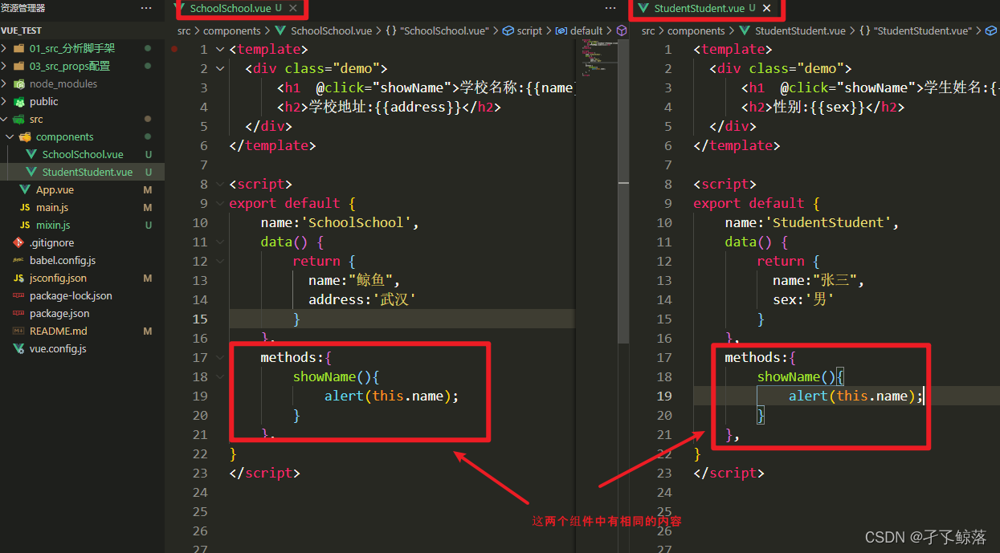
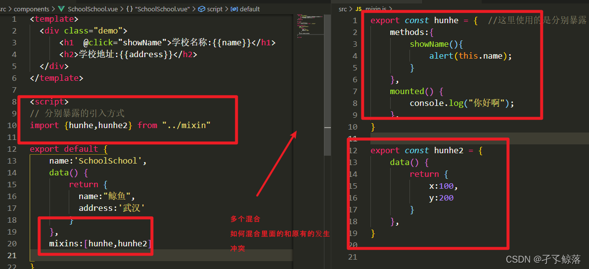

### mixin混入(合)

为什么要引入混合(解决重复)，如下图代码



处理




总结:

1. 功能：可以把多个组件共用的配置提取成一个混入对象
2. 使用方式：
   第一步定义混合：

   ```js
   {
       data(){....},
       methods:{....}
       ....
   }
   ```
   第二步使用混入：

   全局混入：`Vue.mixin(xxx)`
   局部混入：`mixins:['xxx']`
