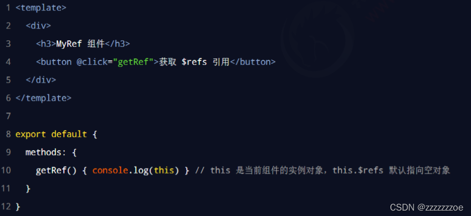
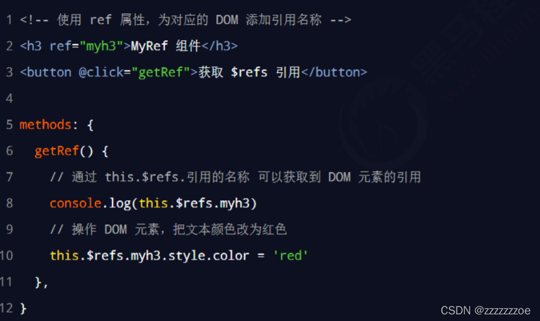
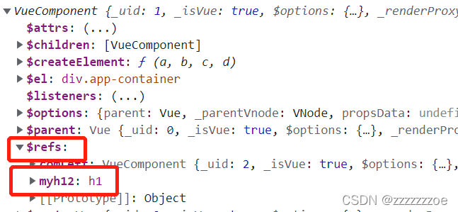
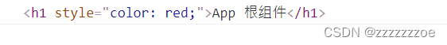
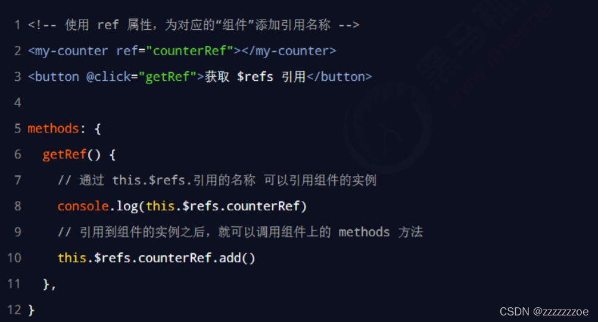
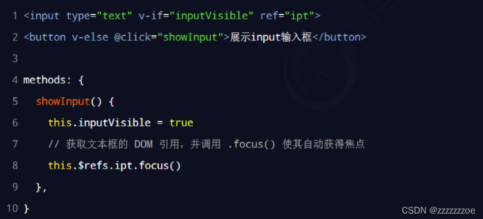
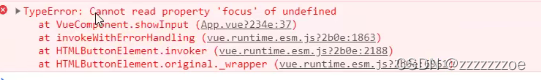
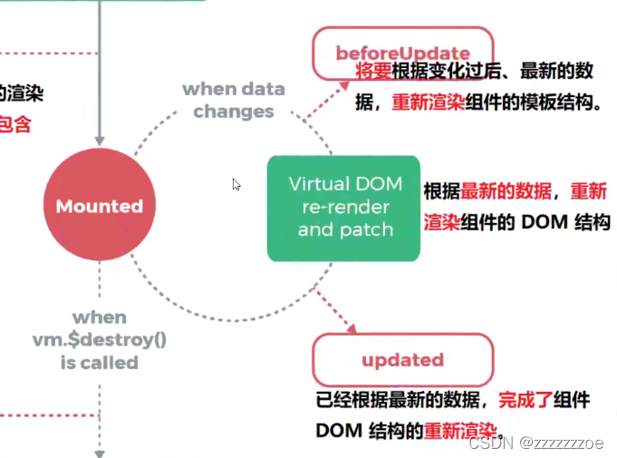
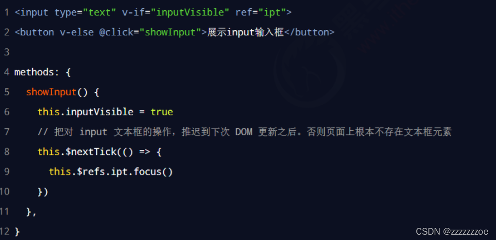

# ref引用

## 什么是 ref 引用

ref 用来辅助开发者在不依赖于 jQuery 的情况下，获取 DOM 元素或组件的引用。

每个 vue 的组件实例上，都包含一个 $refs 对象，里面存储着对应的 DOM 元素或组件的引用。默认情况下， 组件的￥refs 指向一个空对象。



**补充** ：前面带$的对象是Vue的内置成员。

## 使用 ref 引用 DOM 元素

如果想要使用 ref 引用页面上的 DOM 元素，则可以按照如下的方式进行操作：





单独打印 this.$refs.myh12看看

```javascript
console.log(this.$refs.myh12)
```



即想要拿到DOM元素可以给元素加一个ref属性（属性值不能冲突），通过this.$refs.属性名可以拿到。

## 使用 ref 引用组件实例

如果想要使用 ref 引用页面上的组件实例，则可以按照如下的方式进行操作：



即在父组件中引用子组件时给子组件添加ref属性，再通过this.$refs.属性值调用子组件中的方法。

即ref能够获得组件的引用，从而能够调用子组件的方法，从而可以操作子组件中的数据。

这是在父组件中直接去调子组件中的方法最常用的方式。

## 让文本框自动获得焦点

当文本框展示出来之后，如果希望它立即获得焦点，则可以为其添加 ref 引用，并调用原生 DOM 对象的 .focus() 方法即可。示例代码如下：



补充：



常见报错，这个报错表示，‘focus’这个属性前面的引用未定义

为什么会报错？看下生命周期：



当数据更新时，页面还没有渲染DOM结构。即当this.inputVisible=true执行完，页面上还是button而不是文本框，立即执行DOM操作拿不到。所以拿DOM元素的操作应该放在页面更新完之后进行。对此Vue提供了this.$nextTick(cb)方法

## this.$nextTick(cb) 方法

组件的 $nextTick(cb) 方法，会把 cb （callback）回调推迟到下一个 DOM 更新周期之后执行。通俗的理解是：等组件的 DOM 更新完成之后，再执行 cb 回调函数。从而能保证 cb 回调函数可以操作到最新的 DOM 元素。



所以当需要将操作滞后至DOM更新后，可以使用该方法。
