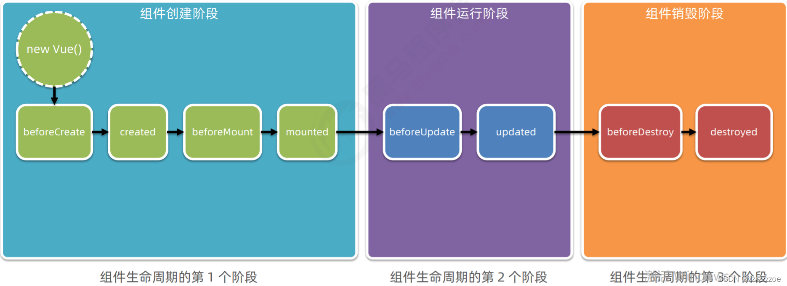
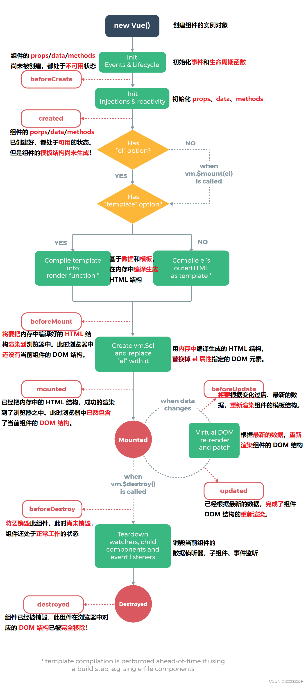

# 组件的生命周期

## 生命周期 & 生命周期函数

生命周期（Life Cycle）是指一个组件从创建 -> 运行 -> 销毁的整个阶段，强调的是一个时间段。

生命周期函数：是由 vue 框架提供的内置函数，会伴随着组件的生命周期，自动按次序执行。

注意：生命周期强调的是时间段，生命周期函数强调的是时间点。

## 组件生命周期函数的分类

## 生命周期图示

可以参考 vue 官方文档给出的“生命周期图示”，进一步理解组件生命周期执行的过程：

🔗：[Vue 实例 — Vue.js](https://cn.vuejs.org/v2/guide/instance.html#%E7%94%9F%E5%91%BD%E5%91%A8%E6%9C%9F%E5%9B%BE%E7%A4%BA "Vue 实例 — Vue.js")

webpack从main.js开始执行，遇到App根组件，vue-tamplate-compiler解析渲染App根组件，以及根组件中的被使用的子组件（如上例中的Left和Right组件），和子组件中被使用的子组件（如上例中的MyCount组件）——形成一个实例组成的嵌套的树，最终webpack将该树解析编译成纯js代码

在实际开发中，created阶段经常调用 methods 中的方法，请求服务器的数据，并把请求到的数据，转存到 data 中，供 template 模板渲染的时候使用；mounted阶段可以用于操作DOM元素；updated阶段完成了$el中的数据与data中的数据的同步。
