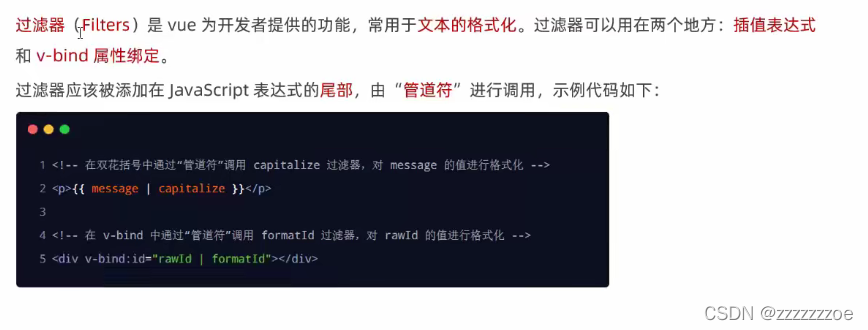
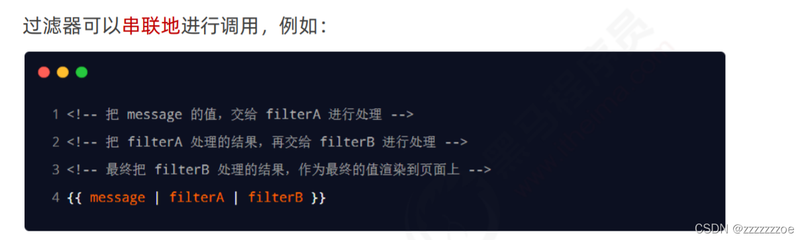
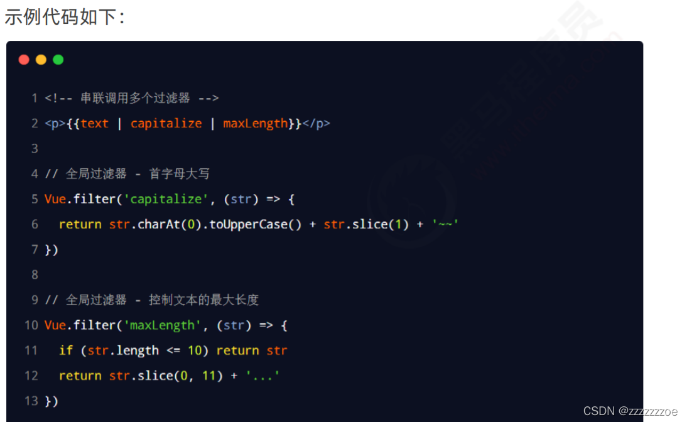
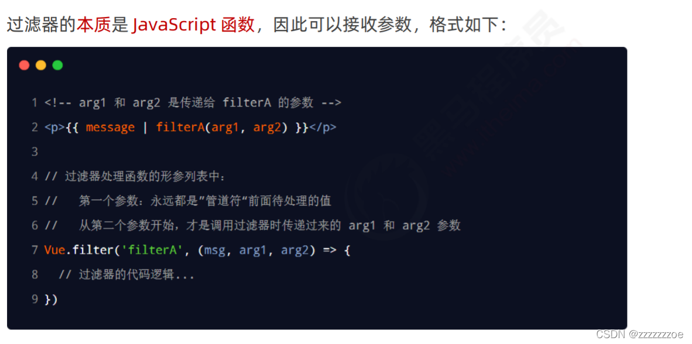
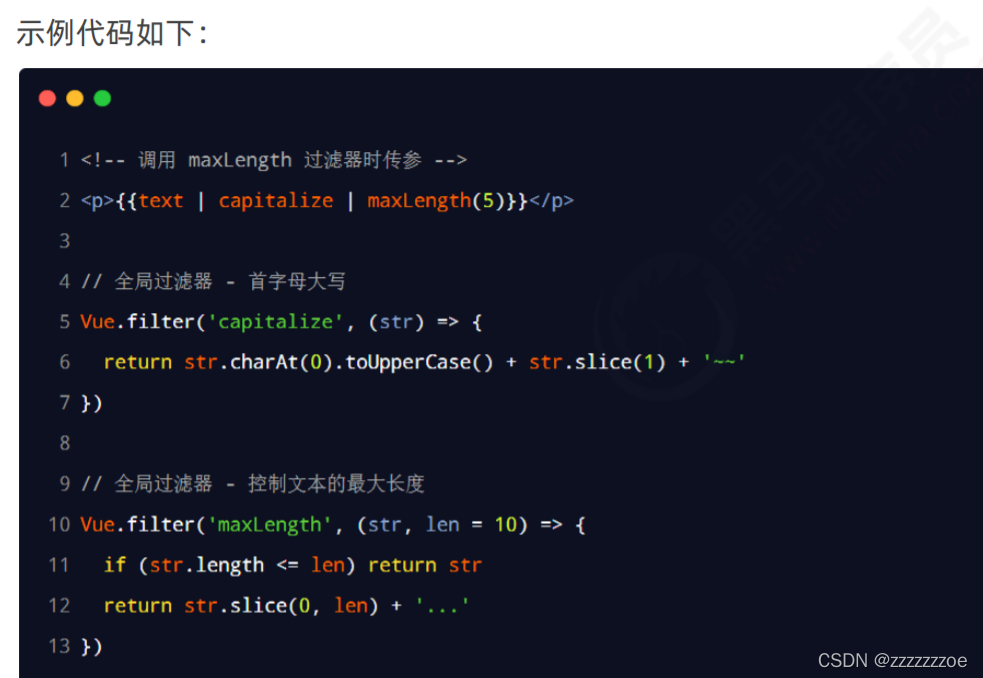
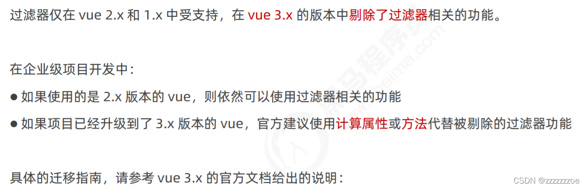

# 过滤器

（Vue3中已砍）

## 定义过滤器



capitalize是自定义的首字母大写的函数，message作为参数传给这个函数，花括号得到的是函数的返回值

过滤器函数必须被定义到filters节点下（与methods平级）

过滤器一定要有return返回值

过滤器的形参中，val代表管道符前面的那个值（不一定要叫val，形参名合法就行，只是可以通过形参获取管道符前面那个待处理的值）

示例代码：

```html
 <div id="app">
    <p>message 的值是：{{ message | capitalize }}</p>
  </div>

  <script src="./lib/vue-2.6.12.js"></script>
  <script>
    const vm = new Vue({
      el: '#app',
      data: {
        message: 'hello vue.js'
      },
      // 过滤器函数，必须被定义到 filters 节点之下
      // 过滤器本质上是函数
      filters: {
        // 注意：过滤器函数形参中的 val，永远都是“管道符”前面的那个值
        capitalize(val) {
          // 字符串有 charAt 方法，这个方法接收索引值，表示从字符串中把索引对应的字符，获取出来
          // val.charAt(0)
          const first = val.charAt(0).toUpperCase()
          // 字符串的 slice 方法，可以截取字符串，从指定索引往后截取
          const other = val.slice(1)
          // 强调：过滤器中，一定要有一个返回值
          return first + other
        }
      }
    })
  </script>
```

## 私有过滤器和全局过滤器


实际开发中更多的是定义全局过滤器

如果全局过滤器和私有过滤器名字一致，会根据就近原则调用私有过滤器

**品牌列表案例时间格式优化：**

引入dayjs （官网说明文档🔗：[解析 | Day.js中文网](https://dayjs.fenxianglu.cn/category/parse.html#%E5%AD%97%E7%AC%A6%E4%B8%B2 "解析 | Day.js中文网")）

代码：

```html
<td>{{ item.time | dateFormat }}</td>
...
<!-- 只要导入了 dayjs 的库文件，在 window 全局，就可以使用 dayjs() 方法了 -->
  <script src="./lib/dayjs.min.js"></script>
...
<script>
// 声明格式化时间的全局过滤器
    Vue.filter('dateFormat', function (time) {
      // 1. 对 time 进行格式化处理，得到 YYYY-MM-DD HH:mm:ss
      // 2. 把 格式化的结果，return 出去

      // 直接调用 dayjs() 得到的是当前时间
      // dayjs(给定的日期时间) 得到指定的日期
      const dtStr = dayjs(time).format('YYYY-MM-DD HH:mm:ss')
      return dtStr
    })
...
</script>
```

## 连续调用多个过滤器（实际开发中使用较少）





## 过滤器传参





## 过滤器的兼容性



🔗： [Filters | Vue.js](https://v3.vuejs.org/guide/migration/filters.html#migration-strategy "Filters | Vue.js")

# 计算属性

## 什么是计算属性

需求：动态生成rgb字符串

 没使用计算属性时使用模板字符串：

```javascript
<!-- 专门用户呈现颜色的 div 盒子 -->
    <!-- 在属性身上，: 代表  v-bind: 属性绑定 -->
    <!-- :style 代表动态绑定一个样式对象，它的值是一个 {  } 样式对象 -->
    <!-- 当前的样式对象中，只包含 backgroundColor 背景颜色 -->
    <!-- 其中r g b是双向绑定的变量 -->
<div class="box" :style="{ backgroundColor: `rgb(${r}, ${g}, ${b})` }">
      {{ `rgb(${r}, ${g}, ${b})` }}
</div>
```

模板字符串拼接写了很多次，复用性很低。

/1683971444991.png)

所有的计算属性，都要定义到 computed 节点之下。

计算属性在定义的时候，要定义成“方法格式”。

它的值就是计算结果。

在使用的时候当作属性使用。

解决上述问题：把计算好的属性放到相应位置

示例代码：

```javascript
computed: {
        // rgb 作为一个计算属性，被定义成了方法格式，
        // 最终，在这个方法中，要返回一个生成好的 rgb(x,x,x) 的字符串
        rgb() {
          return `rgb(${this.r}, ${this.g}, ${this.b})`
        }
      }
```

/1683971472031.png)

上面所有使用模板字符串拼接的都可以改成“rgb”或“this.rgb”。

好处：

1. 实现了代码复用；
2. 只要计算属性中依赖的数据源变化了，会自动重新求值。

# watch侦听器

## 什么是watch侦听器

/1683970960942.png)

所有的侦听器都必须定义到watch节点下。

侦听器本质是个函数，要监听那个数据，就把它作为方法名，只要它发生了变化就会触发这个函数

注意传参时，新值在前，旧值在后。

## 应用场景：使用watch检测用户名是否可用(防抖)

实例：获取用户输入的用户名，使用axios发Ajax去调接口请求服务器，看该用户名是否被占用。

/1683971617858.png)

补充：下例是使用jquery中的Ajax发请求，判断 newVal 是否被占用。

```javascript
watch: {
        // 侦听器本质上是一个函数，要监视哪个数据的变化，就把数据名作为方法名即可
        // 新值在前，旧值在后
        username(newVal) {
          //传空值会报错，所以判断为空时返回，不会发请求
          if (newVal === '') return
          // 1. 调用 jQuery 中的 Ajax 发起请求，判断 newVal 是否被占用！！！
          $.get('https://www.escook.cn/api/finduser/' + newVal, function (result) {
            console.log(result)
          })
        }
      }
```

/1683971676030.png)

新需求：用户一进该页面就传输入框中原有的值，发送请求。

**侦听器的格式：**

1、方法格式的侦听器

缺点1：无法在刚进入页面的时候自动触发；

缺点2：如果侦听的是一个对象，对象中的属性发生了变化，不会触发侦听器。

2、对象格式的侦听器

好处1：可以通过immediate选项让侦听器自动触发；

好处：可以通过deep选项，让侦听器深度侦听对象中每个属性的变化。

为了方便书写一般建议定义成方法格式，要使用immediate时再使用对象格式。

## immediate 选项

/1683971767418.png)

immediate: true表示一进页面即触发该侦听器。

## deep选项

/1683971794674.png)

## 监听对象单个属性的变化

/1683971814174.png)

示例代码（deep选项和一步到位两种写法）：

```html
<div id="app">
    <input type="text" v-model="info.username">
    <input type="text" v-model="info.address.city">
  </div>

  <script src="./lib/vue-2.6.12.js"></script>
  <script src="./lib/jquery-v3.6.0.js"></script>

  <script>
    const vm = new Vue({
      el: '#app',
      data: {
        // 用户的信息对象
        info: {
          username: 'admin',
          address: {
            city: '北京'
          }
        }
      },
      // 所有的侦听器，都应该被定义到 watch 节点下
      watch: {
        /* info: {
          handler(newVal) {
            console.log(newVal)
          },
          // 开启深度监听，只要对象中任何一个属性变化了，都会触发“对象的侦听器”
          deep: true
        } */
        // 如果要侦听的是对象的子属性的变化，则必须包裹一层单引号
        'info.username'(newVal) {
          console.log(newVal)
        }
      }
    })
  </script>


```

# 总结

本章学习了Vue中的watch和computed两个属性，分别用于侦听数据的变化和计算属性；
