# vue的指令

## 指令

指令（Directives）是vue为开发者提供的模板语法，用于辅助开发者渲染页面的基本结构。

Vue中的指令按照不同的用途可以分为如下6大类：

1. 内容渲染指令
2. 属性绑定指令
3. 事件绑定指令
4. 双向绑定指令
5. 条件渲染指令
6. 列表渲染指令
7. 单次渲染指令
8. 优化渲染指令

指令用于渲染数据

### 内容渲染指令

内容渲染指令用来辅助开发者渲染DOM元素的文本内容，常用的内容渲染指令有以下3个：

（1）v-text

用法实例（作为属性来使用）：

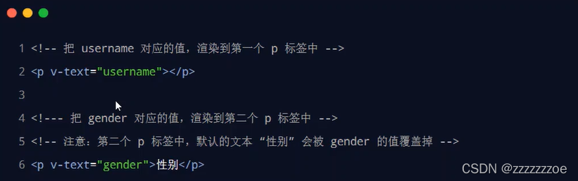

 缺点：会覆盖元素内部原有的内容

（2）{{ }}

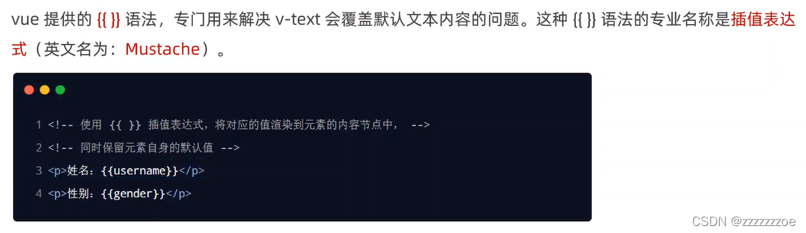

 在实际开发中用的最多，只是内容的占位符，不会覆盖原有的内容

只能写简单的js表达式，不能写if等复杂的js语句

（3）v-html

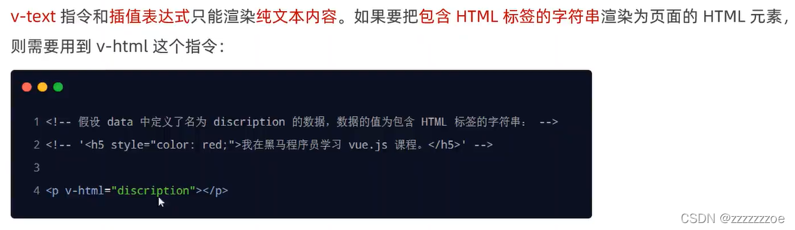

* el属性值只能是一个标签元素，如果存在多个同名标签，只会控制第一个。官方推荐的做法是在所有希望被控的元素外面包裹一个id为app的div，让Vue控制这个div，里面的元素也会被控制。但在实际开发中，往往不需要自己指定控制元素，Vue项目会自动配好。

### 属性绑定指令

注意：插值表达式只能用在元素的内容节点，不能用在属性节点

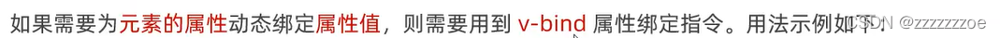

```html
<div id="app">
    <input type="text" :placeholder="tips">
    <hr>
    <!-- vue 规定 v-bind: 指令可以简写为 : -->
    
  </div>

  <!-- 1. 导入 Vue 的库文件，在 window 全局就有了 Vue 这个构造函数 -->
  <script src="./lib/vue-2.6.12.js"></script>
  <!-- 2. 创建 Vue 的实例对象 -->
  <script>
    // 创建 Vue 的实例对象
    const vm = new Vue({
      // el 属性是固定的写法，表示当前 vm 实例要控制页面上的哪个区域，接收的值是一个选择器
      el: '#app',
      // data 对象就是要渲染到页面上的数据
      data: {
        tips: '请输入用户名',
        photo: 'https://cn.vuejs.org/images/logo.svg',
      }
    })
  </script>
```

**使用JavaScript表达式**


如上图最后一个例子，在使用v-bind属性绑定期间，如果绑定内容需要进行动态拼接，则字符串的外面应该包裹单引号。如果没有单引号，不会被认为是字符串而会被认为是变量，数据源中无此变量则会报错。

### 事件绑定指令


```html
<div id="app">
    <p>count 的值是：{{ count }}</p>
    <!-- 在绑定事件处理函数的时候，可以使用 () 传递参数 -->
    <!-- v-on: 指令可以被简写为 @ -->
    <button v-on:click="add(1)">+1</button>
    <button v-on:click="sub">-1</button>
  </div>

  <!-- 1. 导入 Vue 的库文件，在 window 全局就有了 Vue 这个构造函数 -->
  <script src="./lib/vue-2.6.12.js"></script>
  <!-- 2. 创建 Vue 的实例对象 -->
  <script>
    // 创建 Vue 的实例对象
    const vm = new Vue({
      // el 属性是固定的写法，表示当前 vm 实例要控制页面上的哪个区域，接收的值是一个选择器
      el: '#app',
      // data 对象就是要渲染到页面上的数据
      data: {
        count: 0
      },
      // methods 的作用，就是定义事件的处理函数
      methods: {
        add(n) {
          // 在 methods 处理函数中，this 就是 new 出来的 vm 实例对象
          // console.log(vm === this)
          //console.log(vm)
          // vm.count += 1
          this.count += n
        },
        sub() {
          // console.log('触发了 sub 处理函数')
          this.count -= 1
        }
      }
    })
  </script>
```

 给谁绑定事件就给谁加v-on，后面跟事件（如click）和处理函数（如add）。如果传参就在定义处理函数小括号里加形参，绑定事件小括号里加实参。

通过this. 调用数据源中的变量与方法。

v-on:简写为@

如果不传实参，则默认传一个事件对象给处理函数。

```html
<div id="app">
    <p>count 的值是：{{ count }}</p>
    <!-- 如果 count 是偶数，则 按钮背景变成红色，否则，取消背景颜色 -->
    <button @click="add">+N</button>
  </div>

  <!-- 1. 导入 Vue 的库文件，在 window 全局就有了 Vue 这个构造函数 -->
  <script src="./lib/vue-2.6.12.js"></script>
  <!-- 2. 创建 Vue 的实例对象 -->
  <script>
    // 创建 Vue 的实例对象
    const vm = new Vue({
      // el 属性是固定的写法，表示当前 vm 实例要控制页面上的哪个区域，接收的值是一个选择器
      el: '#app',
      // data 对象就是要渲染到页面上的数据
      data: {
        count: 0
      },
      methods: {
        add(e, n) {
          this.count += n
          console.log(e) //打印出来的是一个MouseEvent对象

          // 判断 this.count 的值是否为偶数
          if (this.count % 2 === 0) {
            // 偶数
            e.target.style.backgroundColor = 'red'
          } else {
            // 奇数
            e.target.style.backgroundColor = ''
          }
        }
      },
    })
  </script>
```

如果传了实参，则该事件对象会被覆盖，也就不存在target属性。

target属性：

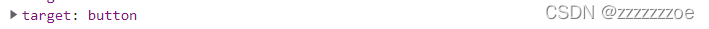

 vue 提供了内置变量，名字叫做 $event，它就是原生 DOM 的事件对象 e，可以用于传实参。

```html
<button @click="add($event, 1)">+N</button>
```

就可以获得事件对象的target了。

实际开发中用的较少。

**事件修饰符**

原生js中常用事件对象的preventDefault()来阻止默认行为，stopPropagation()来阻止事件冒泡

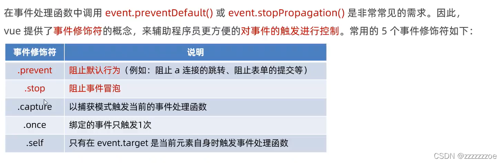

 Vue的简写：在绑定事件的同时加给事件加事件修饰符。语法格式如下：

```html
<div id="app">
    <a href="http://www.baidu.com" @click.prevent="show">跳转到百度首页</a>

    <hr>

    <div style="height: 150px; background-color: orange; padding-left: 100px; line-height: 150px;" @click="divHandler">
      <button @click.stop="btnHandler">按钮</button>
    </div>
  </div>
```

**按键修饰符**

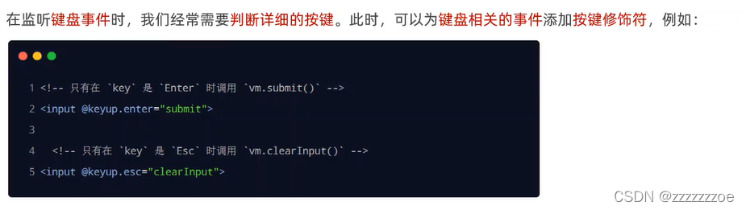

```javascript
clearInput(e) {
  console.log('触发了 clearInput 方法')
  e.target.value = ''
},
commitAjax() {
  console.log('触发了 commitAjax 方法')
}
```

### 双向绑定指令

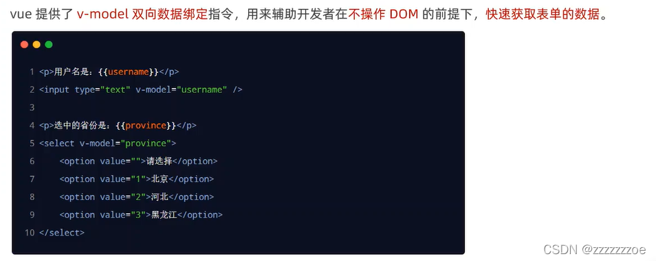

在提交表单或采集数据时，不需要再操作DOM，只要修改了表单文本框，就会修改数据源，直接用this. 就能获得最新的数据源。

* v-bind: value="username" 与 v-model="username"的区别：前者是单向绑定，数据源改变驱动页面数据改变，但页面上的改动不会同步到数据源；后者是双向绑定。
* 只有表单元素使用v-model才有意义。如

（1）input: type="radio"; type="checkbox"; type="xxx"

（2）texytarea

（3）select

vue内部会判断v-model绑定的元素类型，有选择地控制元素的属性（例如input type="checkbox"绑定check属性，input type="text"绑定value属性）

代码示例：

```html
<div id="app">
  <select v-model="city">
      <option value="">请选择城市</option>
      <option value="1">北京</option>
      <option value="2">上海</option>
      <option value="3">广州</option>
  </select>
</div>
<script src="./lib/vue-2.6.12.js"></script>
  <!-- 2. 创建 Vue 的实例对象 -->
  <script>
    // 创建 Vue 的实例对象
    const vm = new Vue({
      // el 属性是固定的写法，表示当前 vm 实例要控制页面上的哪个区域，接收的值是一个选择器
      el: '#app',
      // data 对象就是要渲染到页面上的数据
      data: {
        username: 'zhangsan',
        city: '2'
      }
    })
  </script>
```

**v-model指令的修饰符**

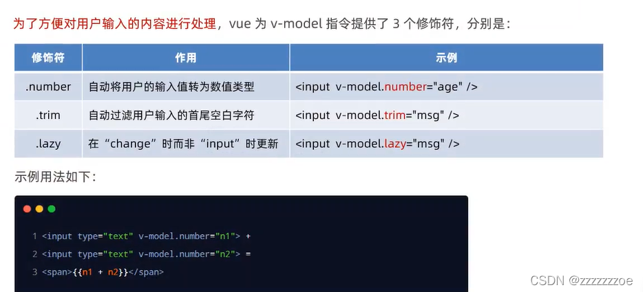

 （1）.number

用户输入表单的是字符串，不能进行数值的计算（只能字符串拼接），可以用.number转换成数值类型再计算

（2）.trim

在例如输入用户名的场景时我们希望去掉用户可能因为误操作在首尾输入的空格，可以使用.trim，它不会处理输入内容中间的空格。

（3）.lazy

因为使用v-model时表单输入框和数据源中的数据是实时更新的，在改变输入框内的内容过程中没有必要更新数据源中的数据，会引起性能上的问题，所以可以使用.lazy，在表单输入内容修改完成（"change"时，如失去焦点）再同步数据源的数据。

示例代码：

```html
<div id="app">
    <input type="text" v-model.number="n1"> + <input type="text" v-model.number="n2"> = <span>{{ n1 + n2 }}</span>
    <hr>
    <input type="text" v-model.trim="username">
    <button @click="showName">获取用户名</button>
    <hr>
    <input type="text" v-model.lazy="username">
  </div>

  <!-- 1. 导入 Vue 的库文件，在 window 全局就有了 Vue 这个构造函数 -->
  <script src="./lib/vue-2.6.12.js"></script>
  <!-- 2. 创建 Vue 的实例对象 -->
  <script>
    // 创建 Vue 的实例对象
    const vm = new Vue({
      // el 属性是固定的写法，表示当前 vm 实例要控制页面上的哪个区域，接收的值是一个选择器
      el: '#app',
      // data 对象就是要渲染到页面上的数据
      data: {
        username: 'zhangsan',
        n1: 1,
        n2: 2
      },
      methods: {
        showName() {
          console.log(`用户名是："${this.username}"`)
        //``是模板字符串，可以括住多行字符串
        //${}是占位符，将数量较多的变量插入字符串的写法，简化 "xxx"+变量+"xxx" 的写法
        }
      },
    })
  </script>
```

### 条件渲染指令


区别：v-if是通过动态添加或移除元素标签达到显示或隐藏的功能，而v-show是给元素标签添加或删除style="display: none" 样式属性达到。

可以看出频繁切换元素显示状态，v-show对性能优化更好；如果刚进入页面时某些元素默认不需要被展示，而且以后也很可能不需要被展示，v-if对性能更好。

实际开发中v-if用的更多，因为性能影响不是很大。

使用脚手架vue-cli时会先将文件编译成js（包括html）再运行，即先执行js逻辑再渲染标签，所以v-if并不是在html时就会被创建后再在script里被false掉。

 **v-else** （v-if配套）

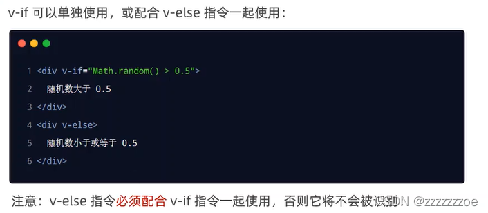

 **v-else-if** （v-if, v-else配套）

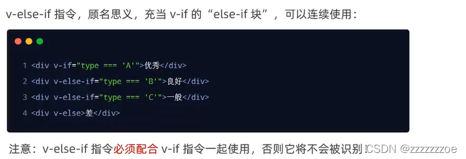

### 列表渲染指令

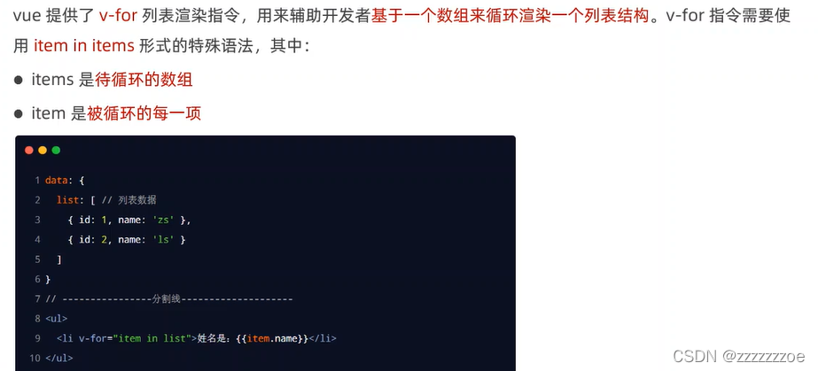

要循环生成什么样的DOM结构，就在这个DOM上加v-for指令

**v-for中的索引**

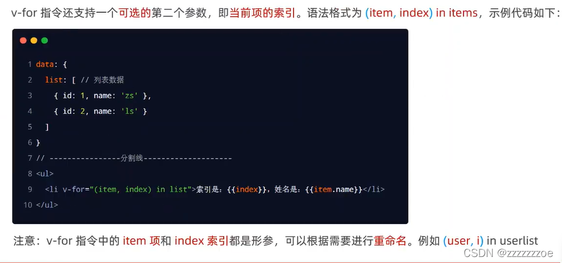

 需要索引再加()

使用v-for的元素本身也可以访问数组的item

```html
<tr v-for="(item, index) in list" :key="item.id">
          <td>{{ index }}</td>
          <td>{{ item.id }}</td>
          <td>{{ item.name }}</td>
</tr>
```

官方建议：只要用到了 v-for 指令，那么一定要绑定一个 :key 属性，而且，尽量把 id 作为 key 的值，官方对 key 的值类型，是有要求的：字符串或数字类型，key 的值是千万不能重复的，否则会终端报错：Duplicate keys detected

**key值的注意事项： **

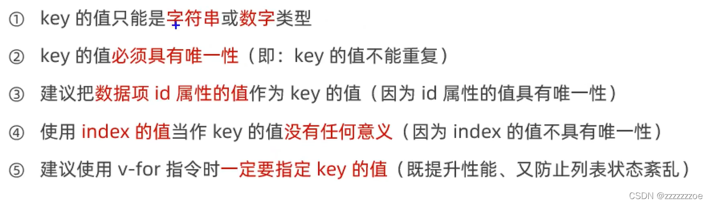

index的非唯一性是指：索引与该项具体数据并没有强烈的绑定关系，它只会绑定第几项数据。

**小案例：品牌列表**

案例效果截图：

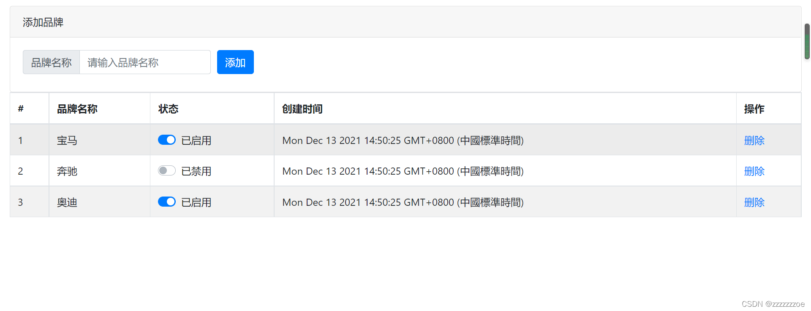

案例源代码：

```html
<!DOCTYPE html>
<html lang="en">
  <head>
    <meta charset="UTF-8" />
    <meta http-equiv="X-UA-Compatible" content="IE=edge" />
    <meta name="viewport" content="width=device-width, initial-scale=1.0" />
    <title>品牌列表案例</title>
    <link rel="stylesheet" href="./lib/bootstrap.css" />
    <link rel="stylesheet" href="./css/brandlist.css" />
  </head>

  <body>
    <div id="app">
      <!-- 卡片区域 -->
      <div class="card">
        <div class="card-header">添加品牌</div>
        <div class="card-body">
          <!-- 添加品牌的表单区域 -->
          <!-- 取消form表单的默认submit会刷新页面的事件 -->
          <form @submit.prevent="add">
            <div class="form-row align-items-center">
              <div class="col-auto">
                <div class="input-group mb-2">
                  <div class="input-group-prepend">
                    <div class="input-group-text">品牌名称</div>
                  </div>
                  <!-- 双向绑定用户输入的品牌名称brand，并修饰符删去首位空格 -->
                  <input
                    type="text"
                    class="form-control"
                    placeholder="请输入品牌名称"
                    v-model.trim="brand"
                  />
                </div>
              </div>
              <div class="col-auto">
                <button type="submit" class="btn btn-primary mb-2">添加</button>
              </div>
            </div>
          </form>
        </div>
      </div>

      <!-- 表格区域 -->
      <table class="table table-bordered table-hover table-striped">
        <thead>
          <tr>
            <th scope="col">#</th>
            <th scope="col">品牌名称</th>
            <th scope="col">状态</th>
            <th scope="col">创建时间</th>
            <th scope="col">操作</th>
          </tr>
        </thead>
        <tbody>
          <!-- 循环列表用v-for -->
          <tr v-for="item in list" :key="item.id">
            <td>{{ item.id }}</td>
            <td>{{ item.name }}</td>
            <td>
              <div class="custom-control custom-switch">
                <!-- 双向绑定启用状态checkbox -->
                <input
                  type="checkbox"
                  class="custom-control-input"
                  id="customSwitch1"
                  v-model="item.status"
                  :id="'cb'+item.id"
                />
                <!-- v-if显示隐藏 -->
                <!-- 动态绑定label中的for属性，指定表单对象 -->
                <label
                  class="custom-control-label"
                  :for="'cb'+item.id"
                  v-if="item.status"
                  >已启用</label
                >
                <label class="custom-control-label" :for="'cb'+item.id" v-else
                  >已禁用</label
                >
              </div>
            </td>
            <td>{{ item.time }}</td>
            <td>
              <a href="javascript:;" @click="remove(item.id)">删除</a>
            </td>
          </tr>
        </tbody>
      </table>
    </div>

    <script src="./lib/vue-2.6.12.js"></script>

    <script>
      const vm = new Vue({
        el: "#app",
        data: {
          // 用户输入的品牌名称
          brand: "",
          // nextId是下一个可用的id
          nextId: 4,
          // 品牌列表数据
          list: [
            { id: 1, name: "宝马", status: true, time: new Date() },
            { id: 2, name: "奔驰", status: false, time: new Date() },
            { id: 3, name: "奥迪", status: true, time: new Date() },
          ],
        },
        methods: {
          /*
           * 点击链接链接，删除对应的品牌信息
           */
          remove(id) {
            // 写一步测一步，减少bug的出现
            // console.log(id);
            this.list = this.list.filter((item) => item.id !== id);
          },
          /*
           *阻止表单的默认提交方法后触发add方法
           */
          add() {
            // 如果填写的brand值为空字符串，应该return出去
            if (this.brand === "") return alert("必须填写品牌名称");
            // 没有被return出去，则执行添加
            // console.log(this.brand);
            // 1、先把要添加的对象整理出来
            const obj = {
              id: this.nextId,
              name: this.brand,
              status: true,
              time: new Date(),
            };
            // 2、往this.list数组中push步骤1得到的对象
            this.list.push(obj);
            // 3、清空this.brand，让this.nextId自增加1
            this.brand = "";
            this.nextId++;
          },
        },
      });
    </script>
  </body>
</html>
```

**案例中的小回顾：**

`<label>`标签中的for属性：指向表单元素id，规定label与哪个表单元素绑定（如：用户点checkbox和checkbox后面的label都会引起checkbox状态改变，提高了用户体验）

可以给案例中的checkbox的label动态绑定一个for（v-bind）

/1683976743840.png)

### 单次渲染指令

v-once

只会渲染元素或组件一次，即使后续的数据修改了，也不会渲染到页面上；

```html
<body>
    <div id="app">
        <input type="text" v-model="msg">
        <h1 v-once>{{msg}}</h1>
        <h1>{{msg}}</h1>
    </div>
</body>

<script>
    const vm = new Vue({
        el:"#app",
        data:{
            msg:"干的漂亮"
        }
    })
</script>
```

### 优化渲染指令

v-cloak

需要配合css使用 可以使用 v-cloak 指令设置样式，这些样式会在 Vue 实例编译结束时， 从绑定的 HTML 元素上被移除。 当网络缓慢，此时网页还在加载 Vue代码，页面来不及渲染，页面上就会闪现vue源代码。 我们可以使用 v-cloak 指令来解决这一问题。

```html
<script src="https://unpkg.com/vue@2.6.14/dist/vue.min.jss" type="text/javascript" charset="utf-8"></script>
<style type="text/css">
    [v-cloak] {
      display: none;
    }
</style>

<body>
    <!-- v-cloak用来解决屏幕闪动的问题 -->
    <div id="app">
        <div v-cloak>
            <h1>{{msg}}</h1>
            <h1>{{msg}}</h1>
            <h1>{{msg}}</h1>
            <h1>{{msg}}</h1>
            <h1>{{msg}}</h1>  
        </div>
    </div>
    <script type="text/javascript">
        new Vue({
        el:"#app",
        data:{
            msg:"哈哈哈"
        }
    })
    </script>
</body>
```

## 自定义指令（关联插件笔记）

### 什么是自定义指令

vue 官方提供了 v-text、v-for、v-model、v-if 等常用的指令。除此之外 vue 还允许开发者自定义指令。

### 自定义指令的分类

vue 中的自定义指令分为两类，分别是：

1. 私有自定义指令（组件自己定义自己使用）
2. 全局自定义指令（全局定义的其他所有组件都可以访问到）

### 私有自定义指令

在每个 vue 组件中，可以在 directives 节点下声明私有自定义指令。示例代码如下：

```html
<h1 v-color>App 根组件</h1>
```

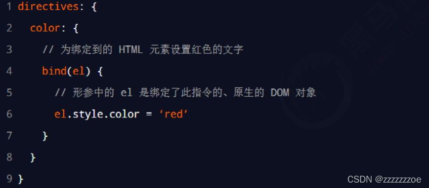

directives是自定义指令节点，里面包含了color自定义指令，指向一个配置的对象，里面有一个bind方法，bind方法的第一个形参是固定写法，是原生DOM对象，是指令绑定的元素。当指令被绑定到相应元素后，会立即触发指令中的bind方法。拿到el元素后如图就可以修改元素的颜色。

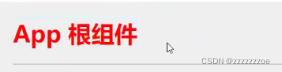

### 使用自定义指令

在使用自定义指令时，需要加上 v- 前缀。示例代码如下：

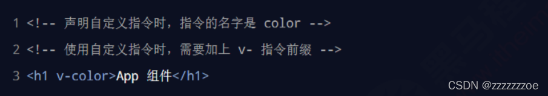

### 为自定义指令动态绑定参数值

在 template 结构中使用自定义指令时，可以通过等号（=）的方式，为当前指令动态绑定参数值：

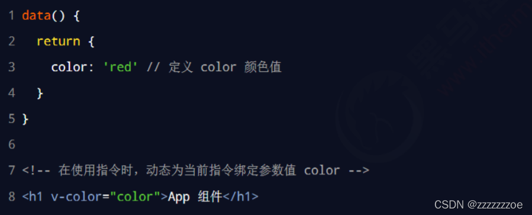

### 通过 binding 获取指令的参数值

在声明自定义指令时，可以通过形参中的第二个参数，一般命名为binding，来接收指令的参数值：

```html
<h1 v-color="color">App 根组件</h1>
<p v-color="'red'">测试</p>
```

```javascript
data() {
    return {
      color: 'blue'
    }
  },
```

```javascript
directives: {
    // 定义名为color的自定义指令，指向一个配置对象
    color: {
      bind(el,binding) {
        el.style.color=binding.value
        console.log(binding);
      }
    }
  }
```

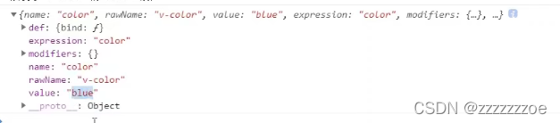

打印的第一个binding对象结果，其中value是使用的值，expression是用户写的v-color的值的表达式

### update 函数

bind 函数只调用 1 次：当指令第一次绑定到元素时调用，当 DOM 更新时 bind 函数不会被触发。 update函数会在每次 DOM 更新时被调用。示例代码如下：

```html
<h1 v-color="color">App 根组件</h1>
<p v-color="'red'">测试</p>
<button @click="color='green'">改变color的颜色值</button>
```

```javascript
 directives: {
    // 定义名为color的自定义指令，指向一个配置对象
    color: {
      bind(el,binding) {
        el.style.color=binding.value
        console.log(binding);
      },
      // 在DOM更新的时候会触发update函数
      update(el,binding) {
        console.log("触发了v-color的update函数");
        el.style.color=binding.value
        console.log(binding);
      },
    }
  }
```

### 函数简写

如果bind和update函数中的逻辑完全相同，则对象格式的自定义指令可以简写成函数格式：

```js
directives: {
color(el,binding){
      el.style.color=binding.value
    }
 }
```

### inserted函数

```
//指令所在元素被插入页面时
inserted(element,binding){
	element.focus()
},
```

### 全局自定义指令

全局共享的自定义指令需要通过“Vue.directive()”进行声明，示例代码如下：

```js
/*
*main.js
*/
// 全局自定义指令
Vue.directives('color', function(el,binding){
  el.style.color = binding.value
})
```

（类似定义全局过滤器）这样其他组件都可以使用v-color指令。

实际开发中更常用全局自定义指令。

小补充：

```javascript
/*
*main.js
*/
Vue.config.productionTip = false
```

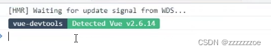

```js
/*
*main.js
*/
Vue.config.productionTip = true
```

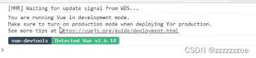
