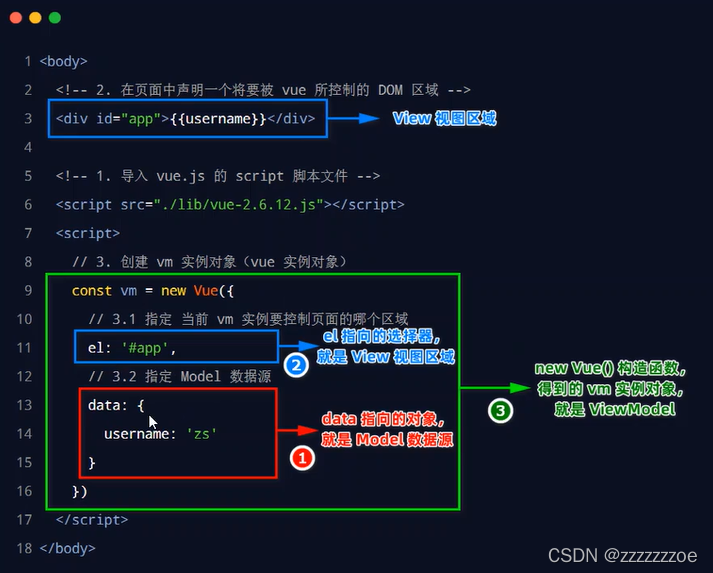

# Vue介绍

## 什么是Vue

是一套用于构建（往页面填数据）用户界面（用户看得到的）的前端框架（现成的解决方案，程序员需要遵守规范编写自己的业务功能）


学习Vue就是学习Vue框架中规定的用法，例如：vue指令、组件（是对UI结构的复用）、路由、Vuex、Vue组件库

## Vue的特性

vue框架的特性，主要体现在如下两个方面：

* 数据驱动视图
* 双向数据绑定

数据：AJAX从服务器请求回来的东西

### 数据驱动视图

* 数据的变化会驱动视图自动更新
* 程序员只需将数据维护好，页面结构会被Vue自动渲染出来


### 双向数据绑定

表单负责采集数据，AJAX负责提交数据


js数据的变化，会被自动渲染到页面上

页面上表单采集的数据发生变化时，会被vue自动获取到，并更新到js数据中

### MVVM


Model数据源，View视图，ViewModel就是Vue的实例

### MVVM的工作原理


## Vue的版本


# Vue的基本使用

注意：.vue文件与引入vue.js的文件区别

## 基本使用步骤


```html
<body>
  <!-- 希望 Vue 能够控制下面的这个 div，帮我们在把数据填充到 div 内部 -->
  <div id="app">{{ username }}</div>

  <!-- 1. 导入 Vue 的库文件，在 window 全局就有了 Vue 这个构造函数 -->
  <script src="./lib/vue-2.6.12.js"></script>
  <!-- 2. 创建 Vue 的实例对象 -->
  <script>
    // 创建 Vue 的实例对象
    new Vue({
      // el 属性是固定的写法，表示当前 vm 实例要控制页面上的哪个区域，接收的值是一个选择器
      el: '#app',
      // data 对象就是要渲染到页面上的数据
      data: {
        username: 'zhangsan'
      }
    })
  </script>
</body>
```

## 基本代码与MVVM的对应关系



/1683976012564.png)

# this的指向

## 由Vue管理的函数

例如：

* `computed` 计算属性
* `watch` 监视属性
* `filters (Vue3中已弃用且不再支持)` 过滤器
* ....

上述属性里配置的函数不要采用箭头函数写法，因为箭头函数没有自己的this对象，使用this时会向外找到 `window`，不会指向 `Vue`实例，也就调用不到Vue中的数据。

## 不被vue管理的函数

例如：

* `setTimeout`计时器里的回调函数
* `setInterval`定时器里的回调函数
* `ajax`请求里的回调函数
* ....

上述回调函数(除定时器外)使用普通函数定义的话，里面的this指向的是 `window`，定时器中this指向 `undifined`(这个死磕了老长时间，vscode没提示，换webstorm调试出来的...)

用箭头函数时，this会向函数外找，找到Vue实例（因为在vue环境里嘛）。

## this指向大致分类

奉上 菜鸟教程(yyds) 里大佬总结的

* 在对象方法中， this 指向调用它所在方法的对象。
* 单独使用 this，它指向全局(Global)对象。
* 函数使用中，this 指向函数的所属者。
* 严格模式下函数是没有绑定到 this 上，这时候 this 是 undefined。
* 在 HTML 事件句柄中，this 指向了接收事件的 HTML 元素。
* apply 和 call 允许切换函数执行的上下文环境（context），即 this 绑定的对象，可以将 this 引用到任何对象。

附上 菜鸟中介绍this的直达链接：[this详解](https://www.runoob.com/js/js-this.html)

## 总结

在Vue环境里：

* 由Vue管理的函数,尽量使用普通函数定义。
* 不被Vue管理的函数，尽量使用箭头函数定义。
* 监视属性里的普通函数，函数体里要使用定时器的话，要用箭头函数来定义定时器。

这样保证this总是指向Vue实例，可以调用到Vue数据。

# el和data的两种写法

/1683974700560.png)

```html
<!DOCTYPE html>
<html lang="en">
<head>
    <meta charset="UTF-8">
    <meta http-equiv="X-UA-Compatible" content="IE=edge">
    <meta name="viewport" content="width=device-width, initial-scale=1.0">
    <title>Document</title>

    <!-- 引入vue -->
    <script  src="../js/vue.js"></script>
</head>
<body>

    <!-- 准备好一个容器 -->

    <div id="root">
      <h1>你好，{{name}}</h1>
    </div>

    <script>
        Vue.config.productionTip = false //以阻止 vue 在启动时生成生产提示

        // el的两种写法
        /* const v = new Vue({
            // el:"#root",   第一种写法
            data:{
                name:"鲸落"
            }
        })
        console.log(v);

        setTimeout(()=>{
            v.$mount('#root')  //第二种写法对于有定时器的时候更加的好
        },1000) */


        //data的两种写法
        const x = new Vue({
            // 第一种在上面
            // data的函数式写法(第二种写法)
            el:"#root",
            data() {
          	return {
               		name: "张三"
          	}
       	    }
        })
  
    </script>
</body>
</html>

```

/1683975791158.png)

# 数据代理(vue 数据绑定)

## 回顾 Object.defineProperty方法

这个方法vue的底层用的比较多，所以有必要深入的了解它

这个方法是定义属性的意思，这个方法传入三个参数
**在没有用到这个方法的时候**

```html
<!DOCTYPE html>
<html lang="en">
<head>
    <meta charset="UTF-8">
    <meta http-equiv="X-UA-Compatible" content="IE=edge">
    <meta name="viewport" content="width=device-width, initial-scale=1.0">
    <title>Document</title>
</head>
<body>
    <script>
        let person = {
            name:"金落",
            sex:'男',
            age:12
        }
        console.log(person);  
    </script>
</body>
</html>

```

/1683976103009.png)

**使用这个方法添加属性**

```js
 let person = {
	name:"金落",
	    sex:'男',
	    // age:12
	}

	Object.defineProperty(person,'age',{
	    value:12
	})
	console.log(person);  

```

/1683976372274.png)

这个时候的通过这个方法添加的属性 `age`是不参加遍历的(也就是不参加枚举)

```js
 let person = {
            name:"金落",
            sex:'男',
            // age:12
        }
Object.defineProperty(person,'age',{
   value:12
})
/* Object.keys()这个方法可以把传入其中的
对象的属性名提取出来组成一个数组 */
console.log(Object.keys(person));

```

/1683976399766.png)

进一步分析

```js
  let person = {
            name:"金落",
            sex:'男',
        }

        Object.defineProperty(person,'age',{
            value:12,
            enumerable:true   //控制属性是否可以枚举
        })
        /* Object.keys()这个方法可以把参入其中的
        对象的属性名提取出来组成一个数组 */
        console.log(Object.keys(person));

```

/1683976422177.png)

```js
let number = 22;
        let person = {
            name:"金落",
            sex:'男',
        }


        Object.defineProperty(person,'age',{

            /* 当有人读取person的age属性时，
            get函数(getter)就会被调用，且返回值就是age的值 */
            get:function(){
                return number
            }
        })
        /* Object.keys()这个方法可以把参入其中的
        对象的属性名提取出来组成一个数组 */
        console.log(person);

```

/1683976489449.png)

完整代码

```html
<!DOCTYPE html>
<html>
	<head>
		<meta charset="UTF-8" />
		<title>回顾Object.defineproperty方法</title>
	</head>
	<body>
		<script type="text/javascript" >
			let number = 18
			let person = {
				name:'张三',
				sex:'男',
			}

			Object.defineProperty(person,'age',{
				// value:18,
				// enumerable:true, //控制属性是否可以枚举，默认值是false
				// writable:true, //控制属性是否可以被修改，默认值是false
				// configurable:true //控制属性是否可以被删除，默认值是false

				//当有人读取person的age属性时，get函数(getter)就会被调用，且返回值就是age的值
				// get:function()可以简写成get()
				get(){
					console.log('有人读取age属性了')
					return number
				},

				//当有人修改person的age属性时，set函数(setter)就会被调用，且会收到修改的具体值
				set(value){
					console.log('有人修改了age属性，且值是',value)
					number = value
				}

			})

			// console.log(Object.keys(person))

			console.log(person)
		</script>
	</body>
</html>

```

## 理解数据代理

```html
<!DOCTYPE html>
<html>
	<head>
		<meta charset="UTF-8" />
		<title>何为数据代理</title>
	</head>
	<body>
		<!-- 数据代理：通过一个对象代理对另一个对象中属性的操作（读/写）-->
		<script type="text/javascript" >
			let obj = {x:100}
			let obj2 = {y:200}

			Object.defineProperty(obj2,'x',{
				get(){
					return obj.x
				},
				set(value){
					obj.x = value
				}
			})
		</script>
	</body>
</html>

```

这个就相当于数据的[双向绑定](https://so.csdn.net/so/search?q=%E5%8F%8C%E5%90%91%E7%BB%91%E5%AE%9A&spm=1001.2101.3001.7020)了

/1683976558923.png)

## vue中的数据代理

```html
<!DOCTYPE html>
<html lang="en">
<head>
    <meta charset="UTF-8">
    <meta http-equiv="X-UA-Compatible" content="IE=edge">
    <meta name="viewport" content="width=device-width, initial-scale=1.0">
    <title>Vue中的数据代理</title>

    <!-- 引入vue -->
    <script  src="../js/vue.js"></script>
</head>
<body>

    <!-- 准备好一个容器 -->

    <div id="root">
      <h1>学校名称:{{name}}</h1>
      <h2>学校地址:{{address}}</h2>
    </div>

    <script>
        Vue.config.productionTip = false //以阻止 vue 在启动时生成生产提示

        const vm =  new Vue({
            el:"#root",
            data:{
                name:"鲸落",
                address:"武汉"
            }
        })
    </script>
</body>
</html>

```

/1683976590831.png)

## Vue检测改变对象

```html
<!DOCTYPE html>
<html>

<head>
  <meta charset="UTF-8" />
  <title>Document</title>
</head>

<body>
  <script type="text/javascript">

    let data = {
      name: '尚硅谷',
      address: '北京',
    }

    //创建一个监视的实例对象，用于监视data中属性的变化
    const obs = new Observer(data)
    console.log(obs)

    //准备一个vm实例对象
    let vm = {}
    vm._data = data = obs

    function Observer(obj) {
      //汇总对象中所有的属性形成一个数组
      const keys = Object.keys(obj)
      //遍历
      keys.forEach((k) => {
        Object.defineProperty(this, k, {
          get() {
            return obj[k]
          },
          set(val) {
            console.log(`${k}被改了，我要去解析模板，生成虚拟DOM.....我要开始忙了`)
            obj[k] = val
          }
        })
      })
    }
  </script>
</body>

</html>
```

## Vue.set()（vue3默认会采取此方式）

vue不允许在已经创建的实例上动态添加新的根级响应式属性，不过可以使用Vue.set()方法将响应式属性添加到嵌套的对象上。

```html
<div id="app">
	<p>msg===>{{msg}}</p>
	<p>sex===>{{json.sex }}</p>
<div/>
<script src="https://cdn.bootcss.com/vue/2.6.10/vue.min.js"></script>
 <script>
        let vm = new Vue({
            el:"#app",  
            data:{
                json:{
                    username:"张三",
                    age:20
                },
                msg:"hello"
            }
        })
        //vm.json.username = "李四"  修改属性可以
        //如果对之前存在的属性username，age进行更改是可以的，因为内部通过Object.defineProperty实现了数据双向绑定，但是对与后续新增添的属性例如sex，那么视图是没有办法渲染的
      //  vm.json["sex"]="男"  //发现页面不会渲染sex这个属性
      Vue.set(vm.json, "sex", "女")
</script>  

```

## Vue检测改变数组

Vue在这里使用了一种技术，叫包装。

什么意思呢？也就是说当我们在使用vm._data.student.hobby.push('学习')中的push的时候，这里的push已经不是数组中原汁原味的push了。也就是Array.prototype.push

在Vue中修改数组中的某个元素一定要使用如下方法：

1. 使用这些API：push(),pop(),shift(),unshift(),splice(),sort(),reverse();
2. Vue.set()或vm.$set();
