# Vue组件

## 什么是组件化开发

组件化开发指的是：根据封装的思想，把页面上可重用的 UI 结构封装为组件，从而方便项目的开发和维护。

## Vue中的组件化开发

vue 是一个支持组件化开发的前端框架。

vue 中规定：组件的后缀名是 .vue。之前接触到的 App.vue 文件本质上就是一个 vue 的组件

## vue 组件的三个组成部分

每个 .vue 组件都由 3 部分构成，分别是：

1. template -> 组件的模板结构
2. script -> 组件的 JavaScript 行为
3. style -> 组件的样式

其中，每个组件中必须包含 template 模板结构，而 script 行为和 style 样式是可选的组成部分。

### template

vue 规定：每个组件对应的模板结构，需要定义到 `<template>`节点中。

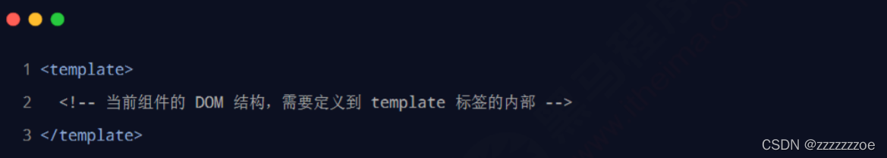

 注意：

1. template 是 vue 提供的容器标签，只起到包裹性质的作用，它不会被渲染为真正的DOM 元素；
2. template 中只能包含唯一的根节点（el所控制的区域）。

### script

vue 规定：开发者可以在 `<script>`节点中封装组件的 JavaScript 业务逻辑。

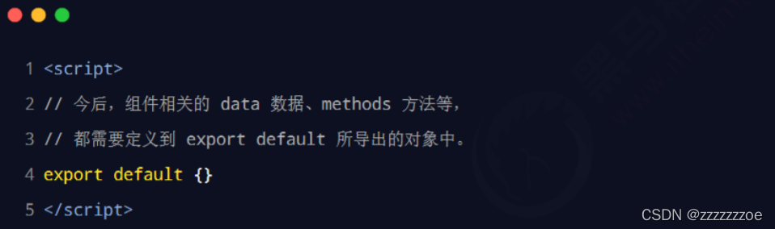

.vue组件中的 data 必须是函数

vue 规定：.vue 组件中的 data 必须是一个函数，不能直接指向一个数据对象。 因此在组件中定义 data 数据节点时，下面的方式是错误的：

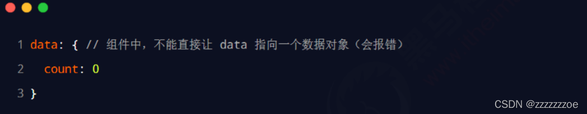

上面的做法会导致多个组件实例共用同一份数据的问题，请参考官方给出的示例：

### style

vue 规定：组件内的 `<style>`节点是可选的，开发者可以在 `<style>`节点中编写样式美化当前组件的 UI 结构。

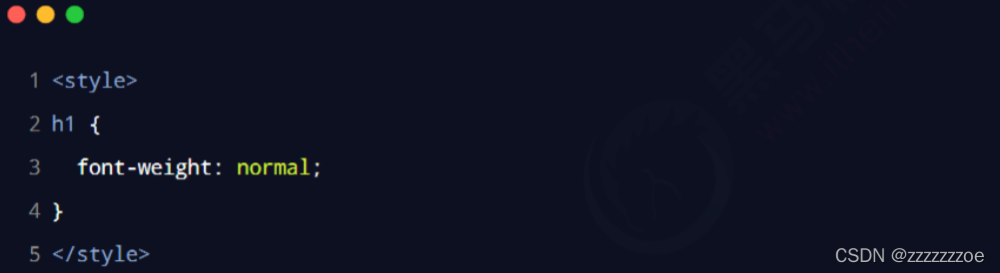

**让 style 中支持 less 语法**

在 `<style>`标签上添加 lang="less" 属性，即可使用 less 语法编写组件的样式：

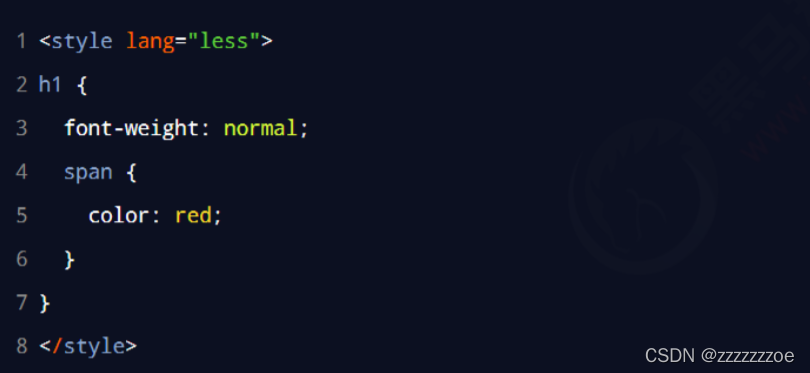

## 组件之间的父子关系

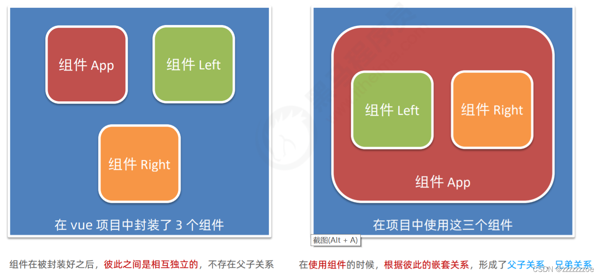

### 使用组件的三个步骤

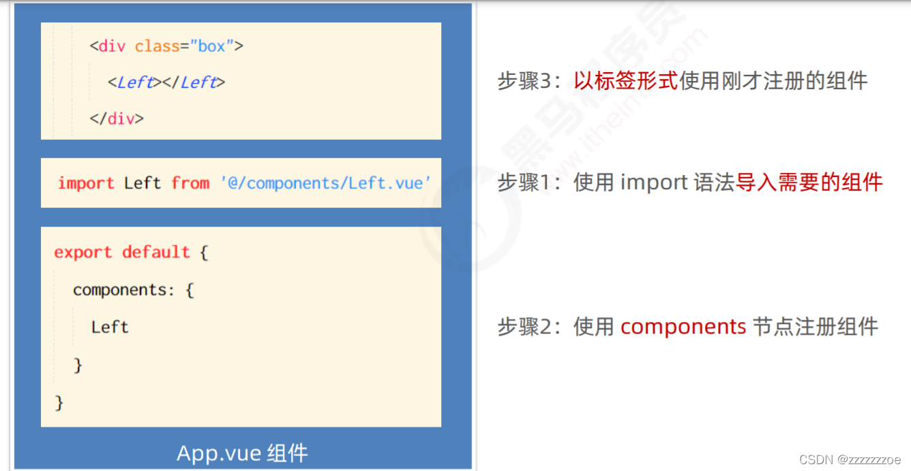

```html
<template>
  <div class="app-container">
    <h1>App 根组件</h1>
    <hr />
 
    <div class="box">
      <!-- 以标签的形式使用注册好的组件 -->
      <!-- 渲染 Left 组件和 Right 组件 -->
      <Left></Left>
      <Right></Right>
    </div>
  </div>
</template>
 
<script>
// 1、导入需要使用的.vue组件
import Left from '@/components/Left.vue'
import Right from '@/components/Right.vue'
 
export default {
  // 2、注册组件
  components:{
    Left,
    Right
  }
}
</script>
 
<style lang="less">
.app-container {
  padding: 1px 20px 20px;
  background-color: #efefef;
}
.box {
  display: flex;
}
</style>
```

复习：路径中的@是在webpack.config.js中配置好的

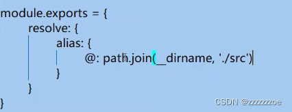

想要导入文件时携带文件扩展名以及配置@的路径提示，先安装Path Autocomplete插件

再在settings.json里输入添加以下：

```javascript
"path-autocomplete.extensionOnImport": true,
"path-autocomplete.pathMappings": {
   "@":"${folder}/src"
 },
```

### 通过 components 注册的是私有子组件

例如： 在组件 A 的 components 节点下，注册了组件 F。 则组件 F 只能用在组件 A 中；不能被用在组件 C 中。

为什么 F 不能用在组件 C 中？因为C组件中没有注册F；

怎样才能在组件 C 中使用 F？在C中的components节点注册F。

### 注册全局组件

如果某个组件频繁被用到，重复注册会很麻烦，可以注册全局组件解决，只需注册一次，除了自己其他每个组件都可以直接使用。

在 vue 项目的 main.js 入口文件中，通过 Vue.component() 方法，可以注册全局组件。示例代码如下：

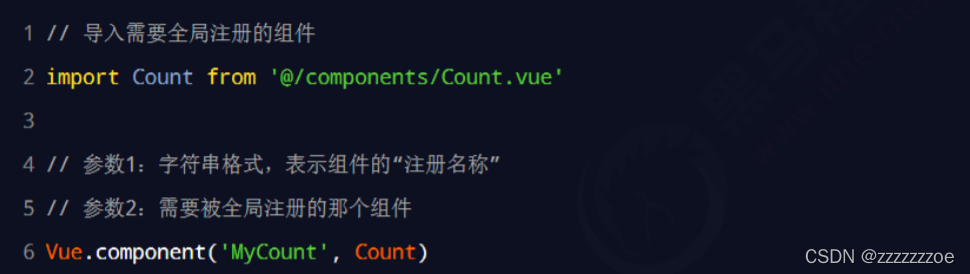

## 组件的 props

props 是组件的自定义属性，允许在使用自定义属性时为当前组件指定初始值。在封装通用组件的时候，合理地使用 props 可以极大的提高组件的复用性！ 它的语法格式如下：

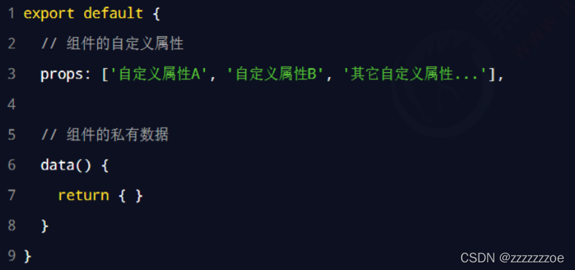

然后就能在使用这个组件的组件里使用自定义过的属性，props中的属性可以直接再模板结构中被使用。

举个栗子：

```html
//Count.vue 全局组件名为MyCount
<p>count的值是：{{ init }}</p>
...
<scrpit>
export default {
...
props: ['init']
...
}
</script>
```

```javascript
//Left.vue
<MyCount :init="9"></MyCount>
//使用的是v-bind属性绑定，此处的9是数值，字符串应该再加一层引号
```

```javascript
//Right.vue
<MyCount :init="6"></MyCount>
//使用的是v-bind属性绑定，此处的6是数值，字符串应该再加一层引号
```

区别：Count.vue是被封装的组件，Left.vue和Right.vue是该被封装组件的使用者。

### props 是只读的

vue 规定：组件中封装的自定义属性是只读的，程序员不能直接修改 props 的值。否则会直接报错：

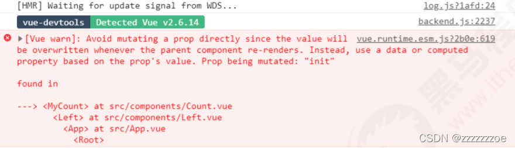

解决办法：如果需要修改props自定义属性的值，可以将其转存到data中，因为data中的数据是可读可写的。例如，上述栗子中的init，可以转存给数据源中的count变量，再就可以调用count并修改值。

```html
<!-- Count.vue -->
<p>count的值是：{{ count }}</p>
<button @click="count+=1">+1</button>
...
<script>
data() {
return {
count: this.init
}
}
...
</script>
```

### props 的 default 默认值

在声明自定义属性时，可以通过 default 来定义属性的默认值。示例代码如下：

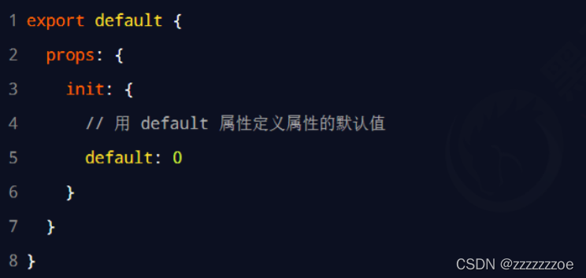

实际开发中更多是这样的写法，而不是上述数组的写法。

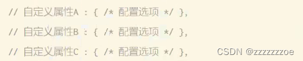

### props 的 type 值类型

在声明自定义属性时，可以通过 type 来定义属性的值类型。示例代码如下：

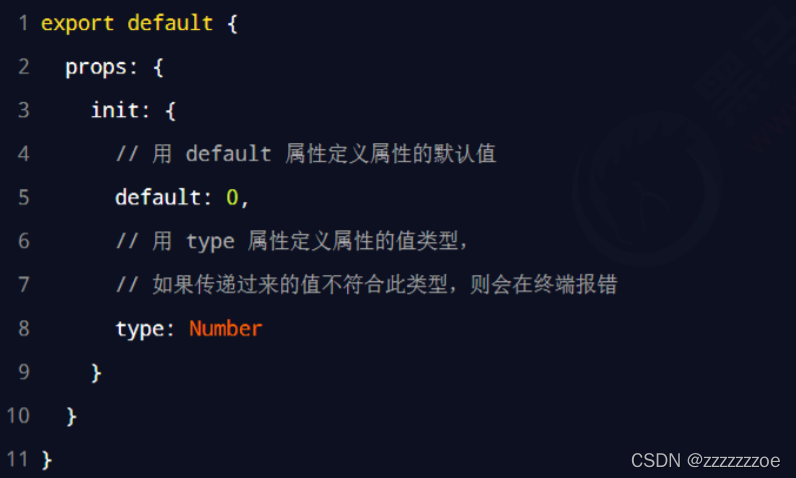

### props 的 required 必填项

在声明自定义属性时，可以通过 required 选项，将属性设置为必填项，强制用户必须传递属性的值。示例代码如下：

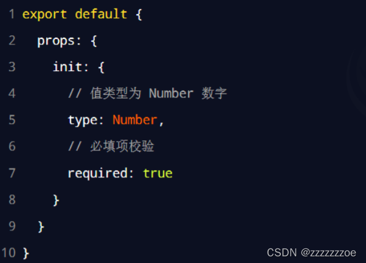

**小结：** 在封装通用组件的时候，合理地使用 props 可以极大的提高组件的复用性！

## 组件之间的样式冲突问题

默认情况下，写在 .vue 组件中的样式会全局生效，因此很容易造成多个组件之间的样式冲突问题。

导致组件之间样式冲突的根本原因是：

1. 单页面应用程序中，所有组件的 DOM 结构，都是基于唯一的 index.html 页面进行呈现的；
2. 每个组件中的样式，都会影响整个 index.html 页面中的 DOM 元素。

### 思考：如何解决组件样式冲突的问题

为每个组件分配唯一的自定义属性，在编写组件样式时，通过属性选择器来控制样式的作用域，示例代码如下：

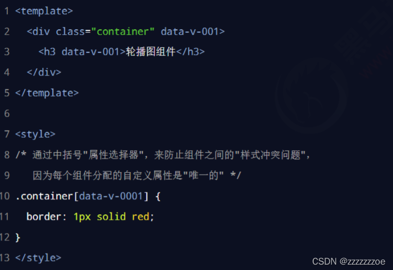

需要同一组件加相同的属性，不同的组件加的属性不一样。

### style 节点的 scoped 属性

为了提高开发效率和开发体验，vue 为 style 节点提供了 scoped 属性，从而防止组件之间的样式冲突问题：

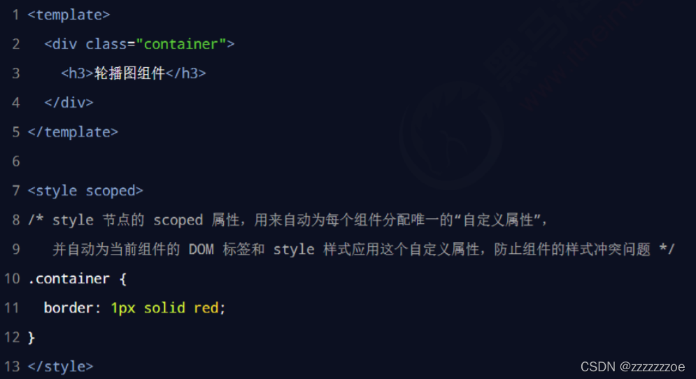

（在底层Vue会为该组件的标签加上如6.1所描述的属性data-v-xxxx一串数字）

### /deep/ 样式穿透

如果给当前组件的 style 节点添加了 scoped 属性，则当前组件的样式对其子组件是不生效的。如果想让某些样式对子组件生效，可以使用 /deep/ 深度选择器。

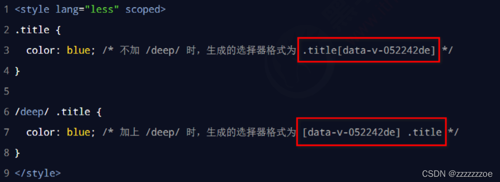

使用场景：当使用第三方组件库的时候，如果有修改第三方组件库默认样式的需求，需要用到/deep/

小补充：

1. 实际上浏览器并不认识.vue文件，需要通过Vue模板编译器编译成js文件再渲染到浏览器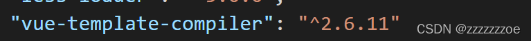
2. 被调用的子组件相当于一个构造函数，是Vue组件的实例对象，以标签形式使用组件相当于new一个构造函数的过程

# 组件之间的数据共享

## 组件之间的关系

在项目开发中，组件之间的最常见的关系分为如下两种： ① 父子关系 ② 兄弟关系

### 父组件向子组件共享数据

父组件向子组件共享数据需要使用自定义属性props。示例代码如下：

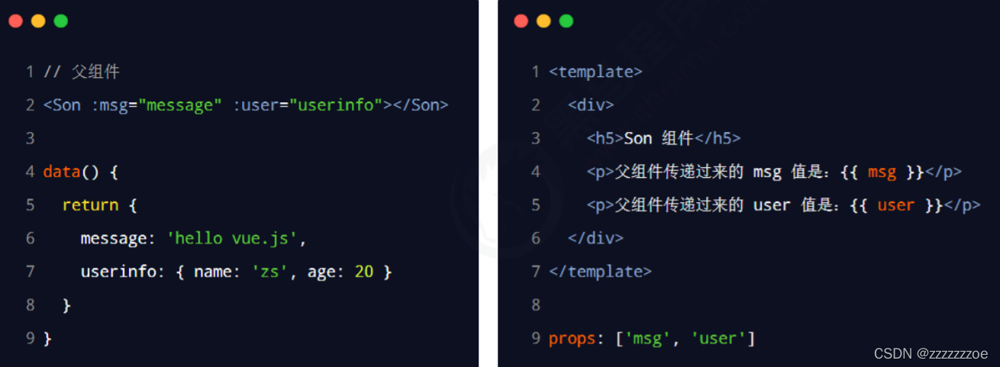

即在子组件中props中声明属性，父组件中被调用的子组件绑定属性并传值。

父组件还可以通过$ref.子组件调用子组件的方法进行传参（一般做调用子组件方法用）

### 子组件向父组件共享数据

#### 传入父组件的函数

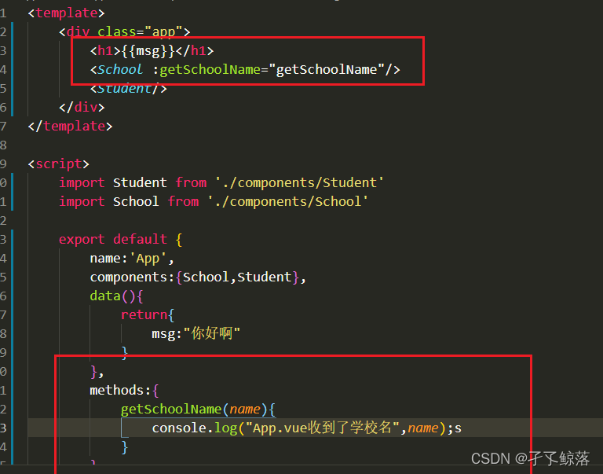


#### 自定义事件

子组件向父组件共享数据使用自定义事件。示例代码如下：


当$emit被触发的时候，自定义事件被触发，对应的处理函数被触发。左边this.count是实参，传递给右边val形参。

#### 动态自定义事件

此方式较为灵活，可以动态绑定与解绑

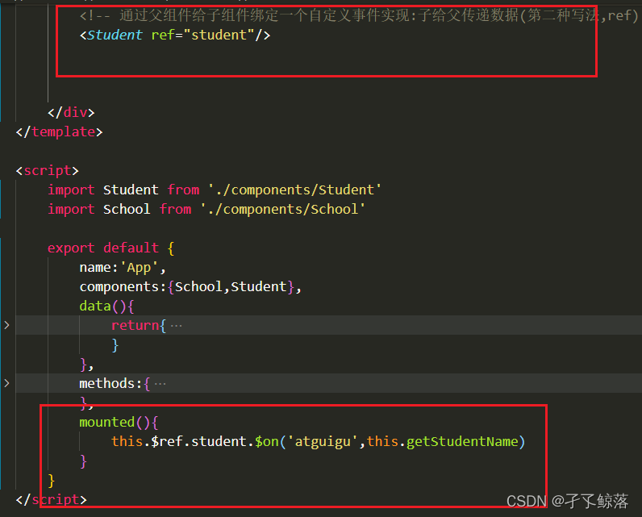

解绑自定义事件（子组件主动解绑）

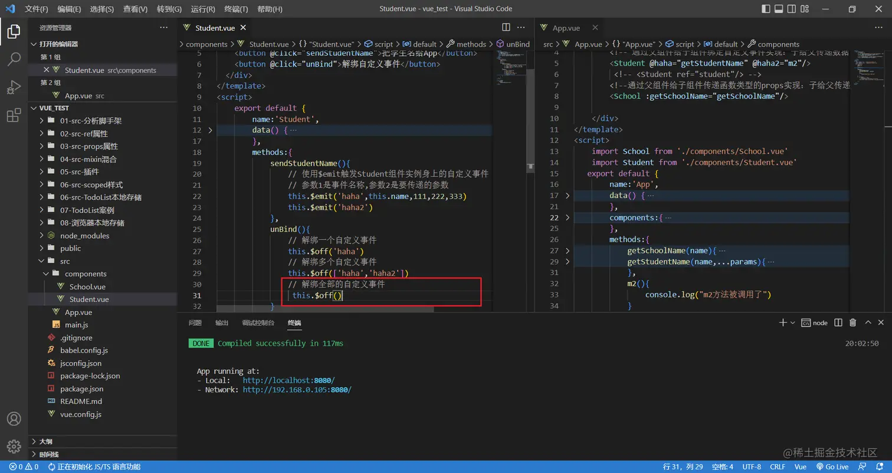

### 兄弟组件之间的数据共享

在 vue2.x 中，兄弟组件之间数据共享的方案是 EventBus。

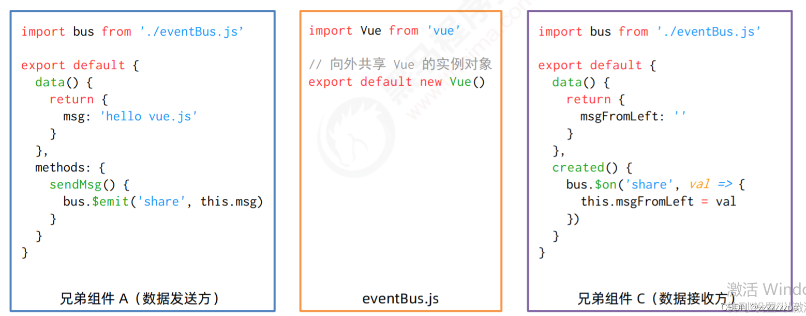

**EventBus 的使用步骤 ：**

1. 创建 eventBus.js 模块，并向外共享一个 Vue 的实例对象；
2. 在数据发送方，调用 bus.$ emit('事件名称', 要发送的数据) 方法触发自定义事件；
3. 在数据接收方，调用 bus.￥on('事件名称', 事件处理函数) 方法注册一个自定义事件。

### 全局事件总线（重要）

可以实现任意组件之间的通信

兄弟组件之间的通信(传数据)

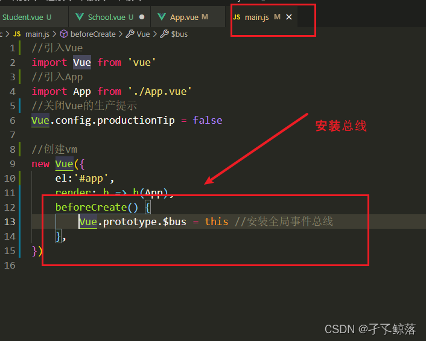

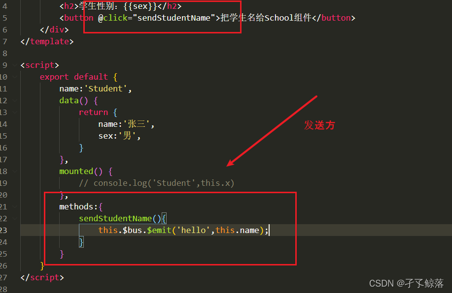

记得销毁前解绑全局总线

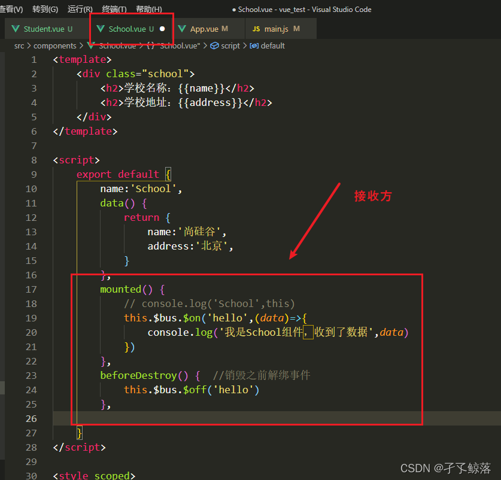

# 非单文件组件(不常用,跳过)

```html
<!DOCTYPE html>
<html>

<head>
  <meta charset="UTF-8" />
  <title>基本使用</title>
  <script type="text/javascript" src="../js/vue.js"></script>
</head>

<body>
<!-- 
  Vue中使用组件的三大步骤：
  一、定义组件(创建组件)
  二、注册组件
  三、使用组件(写组件标签)

  一、如何定义一个组件？
  使用Vue.extend(options)创建，其中options和new Vue(options)时传入的那个options几乎一样，但也有点区别；
  区别如下：
  1.el不要写，为什么？ ——— 最终所有的组件都要经过一个vm的管理，由vm中的el决定服务哪个容器。
  2.data必须写成函数，为什么？ ———— 避免组件被复用时，数据存在引用关系。
  备注：使用template可以配置组件结构。

  二、如何注册组件？
  1.局部注册：靠new Vue的时候传入components选项
  2.全局注册：靠Vue.component('组件名',组件)

  三、编写组件标签：
  <school></school> -->

  <!-- 准备好一个容器-->
  <div id="root">
    <hello></hello>
    <hr>
    <h1>{{msg}}</h1>
    <hr>
    <!-- 第三步：编写组件标签 -->
    <school></school>
    <hr>
    <!-- 第三步：编写组件标签 -->
    <student></student>
  </div>

  <div id="root2">
    <hello></hello>
  </div>
</body>

<script type="text/javascript">
  Vue.config.productionTip = false

  //第一步：创建school组件
  const school = Vue.extend({
    template: `
				<div class="demo">
					<h2>学校名称：{{schoolName}}</h2>
					<h2>学校地址：{{address}}</h2>
					<button @click="showName">点我提示学校名</button>
				</div>
			`,
    // el:'#root', //组件定义时，一定不要写el配置项，因为最终所有的组件都要被一个vm管理，由vm决定服务于哪个容器。
    data() {
      return {
        schoolName: '尚硅谷',
        address: '北京昌平'
      }
    },
    methods: {
      showName() {
        alert(this.schoolName)
      }
    },
  })

  //第一步：创建student组件
  const student = Vue.extend({
    template: `
				<div>
					<h2>学生姓名：{{studentName}}</h2>
					<h2>学生年龄：{{age}}</h2>
				</div>
			`,
    data() {
      return {
        studentName: '张三',
        age: 18
      }
    }
  })

  //第一步：创建hello组件
  const hello = Vue.extend({
    template: `
				<div>
					<h2>你好啊！{{name}}</h2>
				</div>
			`,
    data() {
      return {
        name: 'Tom'
      }
    }
  })

  //第二步：全局注册组件
  Vue.component('hello', hello)

  //创建vm
  new Vue({
    el: '#root',
    data: {
      msg: '你好啊！'
    },
    //第二步：注册组件（局部注册）
    components: {
      school,
      student
    }
  })

  new Vue({
    el: '#root2',
  })
</script>

</html>
```

组件名注意事项

```html
<!DOCTYPE html>
<html>

<head>
  <meta charset="UTF-8" />
  <title>几个注意点</title>
  <script type="text/javascript" src="../js/vue.js"></script>
</head>

<body>
  <!-- 
  几个注意点：
  1.关于组件名:
  一个单词组成：
  第一种写法(首字母小写)：school
  第二种写法(首字母大写)：School
  多个单词组成：
  第一种写法(kebab-case命名)：my-school
  第二种写法(CamelCase命名)：MySchool (需要Vue脚手架支持)
  备注：
  (1).组件名尽可能回避HTML中已有的元素名称，例如：h2、H2都不行。
  (2).可以使用name配置项指定组件在开发者工具中呈现的名字。

  2.关于组件标签:
  第一种写法：<school></school>
  第二种写法：
  <school />
  备注：不用使用脚手架时，
  <school />会导致后续组件不能渲染。

  3.一个简写方式：
  const school = Vue.extend(options) 可简写为：const school = options -->

  <!-- 准备好一个容器-->
  <div id="root">
    <h1>{{msg}}</h1>
    <school></school>
  </div>
</body>

<script type="text/javascript">
  Vue.config.productionTip = false

  //定义组件
  const s = Vue.extend({
    name: 'atguigu',
    template: `
      <div>
        <h2>学校名称：{{name}}</h2>
        <h2>学校地址：{{address}}</h2>
      </div>
			`,
    data() {
      return {
        name: '尚硅谷',
        address: '北京'
      }
    }
  })

  new Vue({
    el: '#root',
    data: {
      msg: '欢迎学习Vue!'
    },
    components: {
      school: s
    }
  })
</script>

</html>
```

组件嵌套

```html
<!DOCTYPE html>
<html>
	<head>
		<meta charset="UTF-8" />
		<title>组件的嵌套</title>
		<!-- 引入Vue -->
		<script type="text/javascript" src="../js/vue.js"></script>
	</head>
	<body>
		<!-- 准备好一个容器-->
		<div id="root">

		</div>
	</body>

	<script type="text/javascript">
		Vue.config.productionTip = false //阻止 vue 在启动时生成生产提示。

		//定义student组件
		const student = Vue.extend({
			name:'student',
			template:`
				<div>
					<h2>学生姓名：{{name}}</h2>
					<h2>学生年龄：{{age}}</h2>
				</div>
			`,
			data(){
				return {
					name:'尚硅谷',
					age:18
				}
			}
		})

		//定义school组件
		const school = Vue.extend({
			name:'school',
			template:`
				<div>
					<h2>学校名称：{{name}}</h2>
					<h2>学校地址：{{address}}</h2>
					<student></student>
				</div>
			`,
			data(){
				return {
					name:'尚硅谷',
					address:'北京'
				}
			},
			//注册组件（局部）
			components:{
				student
			}
		})

		//定义hello组件
		const hello = Vue.extend({
			template:`<h1>{{msg}}</h1>`,
			data(){
				return {
					msg:'欢迎来到尚硅谷学习！'
				}
			}
		})

		//定义app组件
		const app = Vue.extend({
			template:`
				<div>
					<hello></hello>
					<school></school>
				</div>
			`,
			components:{
				school,
				hello
			}
		})

		//创建vm
		new Vue({
			template:'<app></app>',
			el:'#root',
			//注册组件（局部）
			components:{app}
		})
	</script>
</html>

```

VueComponent

```html
<!DOCTYPE html>
<html>

<head>
  <meta charset="UTF-8" />
  <title>VueComponent</title>
  <script type="text/javascript" src="../js/vue.js"></script>
</head>

<body>
<!-- 
  关于VueComponent：
  1.school组件本质是一个名为VueComponent的构造函数，且不是程序员定义的，是Vue.extend生成的。

  2.我们只需要写
  <school />或<school></school>，Vue解析时会帮我们创建school组件的实例对象，
  即Vue帮我们执行的：new VueComponent(options)。

  3.特别注意：每次调用Vue.extend，返回的都是一个全新的VueComponent！！！！

  4.关于this指向：
  (1).组件配置中：
  data函数、methods中的函数、watch中的函数、computed中的函数 它们的this均是【VueComponent实例对象】。
  (2).new Vue(options)配置中：
  data函数、methods中的函数、watch中的函数、computed中的函数 它们的this均是【Vue实例对象】。

  5.VueComponent的实例对象，以后简称vc（也可称之为：组件实例对象）。
  Vue的实例对象，以后简称vm。 -->

  <!-- 准备好一个容器-->
  <div id="root">
    <school></school>
    <hello></hello>
  </div>
</body>

<script type="text/javascript">
  Vue.config.productionTip = false

  //定义school组件
  const school = Vue.extend({
    name: 'school',
    template: `
      <div>
        <h2>学校名称：{{name}}</h2>
        <h2>学校地址：{{address}}</h2>
        <button @click="showName">点我提示学校名</button>
      </div>
			`,
    data() {
      return {
        name: '尚硅谷',
        address: '北京'
      }
    },
    methods: {
      showName() {
        console.log('showName', this)
      }
    },
  })

  const test = Vue.extend({
    template: `<span>atguigu</span>`
  })

  //定义hello组件
  const hello = Vue.extend({
    template: `
      <div>
        <h2>{{msg}}</h2>
        <test></test>
      </div>
			`,
    data() {
      return {
        msg: '你好啊！'
      }
    },
    components: { test }
  })


  // console.log('@',school)
  // console.log('#',hello)

  //创建vm
  const vm = new Vue({
    el: '#root',
    components: { school, hello }
  })
</script>

</html>
```
