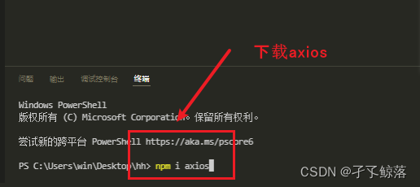

# axios

Vue.js 2.0 版本推荐使用 axios 来完成 ajax 请求。

Axios 是一个基于 Promise 的 HTTP 库，可以用在浏览器和 node.js 中。

vue-axios|axios中文网:http://www.axios-js.com/zh-cn/docs/index.html

**特性：**

* 从浏览器中创建 XMLHttpRequest
* 从 node.js 创建 [http](http://nodejs.org/api/http.html) 请求
* 支持 [Promise](https://developer.mozilla.org/en-US/docs/Web/JavaScript/Reference/Global_Objects/Promise) API
* 拦截请求和响应
* 转换请求数据和响应数据
* 取消请求
* 自动转换 JSON 数据
* 客户端支持防御 XSRF

## axios下载



```
npm install --save axios vue-axios
```

## axios引入

```
import axios from 'axios'
```

## axios封装

此处每次请求路径加上前缀/proxy，如果需要请求多个服务器，则需要自己按需修改

需要搭配前端代理使用（解决跨域问题）

```js
import axios from 'axios'
// import router from "@/router";
// import { ElMessage } from 'element-plus'
// import store from '@/store/index'
const request = axios.create({
    //每次请求路径加上前缀
    baseURL: "/proxy",
    timeout: 50000
})

// 请求白名单，如果请求在白名单里面，将不会被拦截校验权限
// const whiteUrls = ["/javaweb04/", "/user/login", '/user/register',"/advert/advertList"]

// request 拦截器
// 可以自请求发送前对请求做一些处理
// 比如统一加token，对请求参数统一加密
request.interceptors.request.use(config => {
    //spring
    config.headers['Content-Type'] = 'application/json;charset=utf-8';
    //Servlet
    // config.headers['Content-Type'] = 'application/x-www-form-urlencoded';
    // if (!whiteUrls.includes(config.url)) {  // 校验请求白名单
    //     if (localStorage.token == null) {
    //         store.state.userInfo={}
    //     }else{
    //         config.headers['Access-Token'] = localStorage.token;  // 设置请求头

    //     }
    // }
    config.headers['Access-Token'] = localStorage.token;
    return config
}, error => {
    return Promise.reject(error)
});

// response 拦截器
// 可以在接口响应后统一处理结果
request.interceptors.response.use(
    response => {
        let res = response.data;
        // 如果是返回的文件
        if (response.config.responseType === 'blob') {
            return res
        }
        //兼容服务端返回的字符串数据
        if (typeof res === 'string') {
            res = res ? JSON.parse(res) : res
        }
        return res;
    },
    error => {
        console.log('err' + error) // for debug
        return Promise.reject(error)
    }
)


export default request
```

## 前端代理

```js
module.exports = {
	devServer: {
      proxy: {
      '/proxy': {// 匹配所有以 '/proxy'开头的请求路径
        target: 'http://localhost:5000',// 代理目标的基础路径
        changeOrigin: true,
        pathRewrite: {'^/proxy': ''}
      },
      '/api2': {// 匹配所有以 '/api2'开头的请求路径
        target: 'http://localhost:5001',// 代理目标的基础路径
        changeOrigin: true,
        pathRewrite: {'^/api2': ''}
      }
    }
  }
}
/*
   changeOrigin设置为true时，服务器收到的请求头中的host为：localhost:5000
   changeOrigin设置为false时，服务器收到的请求头中的host为：localhost:8080
   changeOrigin默认值为true
*/

```

## 请求方式

1. 如果在axios封装加入了前缀，则可以在使用时只注重后端的RequestMapping即可，如‘/RequestMapping’
2. 如果没有加入前缀，需要在RequestMapping前书写前端代理的请求路径，如‘/proxy/RequestMapping’
3. 两者都可以全写，如‘http://ip:port/前缀/RequestMapping’+参数
