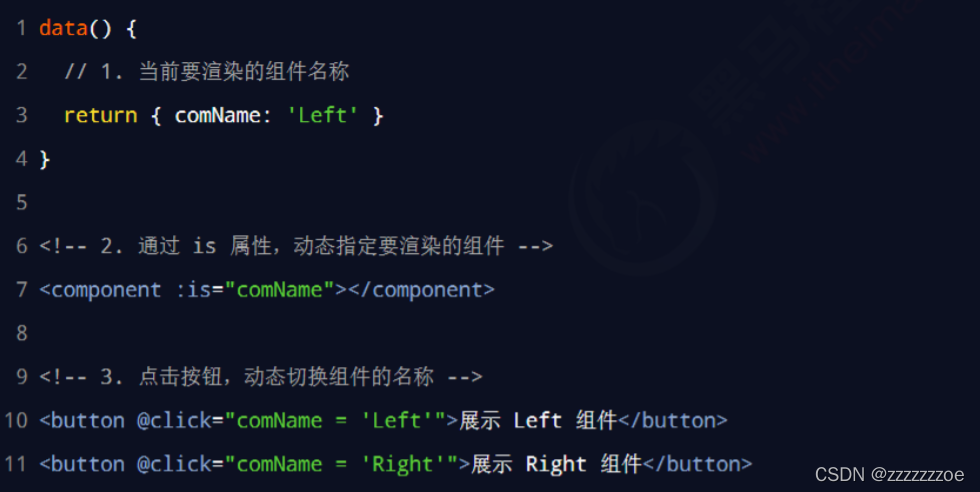
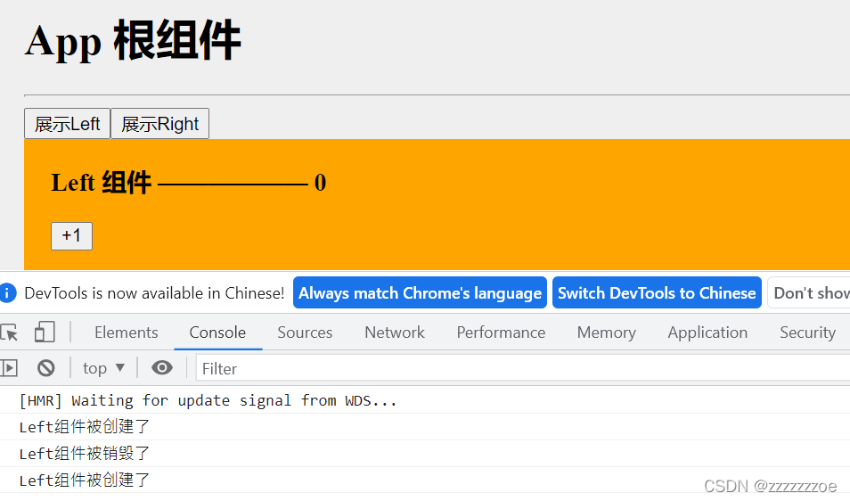
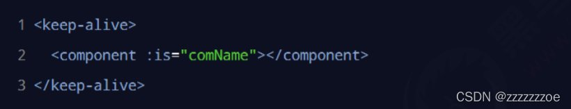
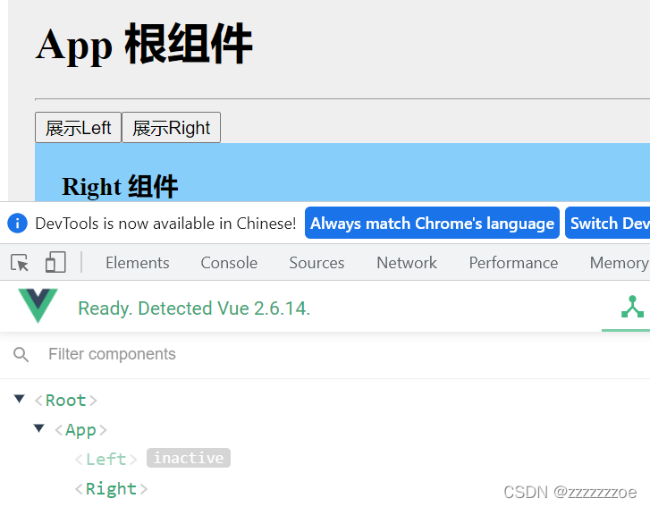
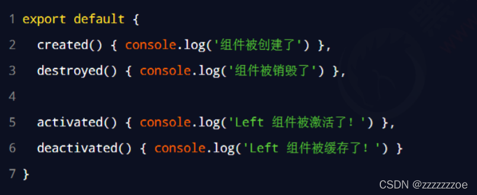
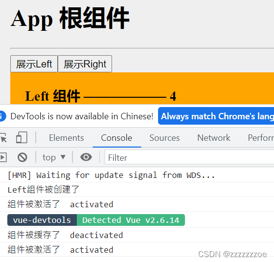
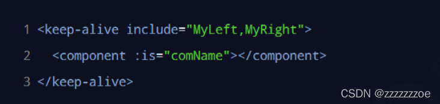
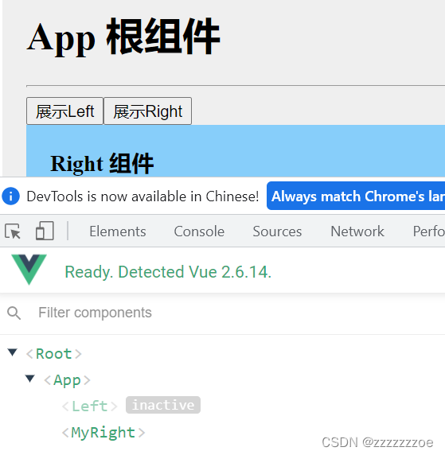

# 动态组件

## 什么是动态组件

动态组件指的是动态切换组件的显示与隐藏。

## 如何实现动态组件渲染

vue 提供了一个内置的 `<component>`组件，专门用来实现动态组件的渲染。示例代码如下：



可以认为 `<component>`是一个占位符，给组件占位。它的is属性指定哪个组件的名称，就把哪个组件渲染到它所在的位置。

举个栗子：按钮切换展示的组件

```javascript

<template>
  <div class="app-container">
    <h1>App 根组件</h1>
    <hr />
    <button @click="comName='Left'">展示Left</button>
    <button @click="comName='Right'">展示Right</button>
    <div class="box">
      <!-- 渲染 Left 组件和 Right 组件 -->
      <component :is="comName"></component>
    </div>
  </div>
</template>

<script>
import Left from '@/components/Left.vue'
import Right from '@/components/Right.vue'


export default {
  components: {
    Left,Right
  },
  data() {
    return {
      comName: 'Left'
    }
  }
}
</script>

<style lang="less">
.app-container {
  padding: 1px 20px 20px;
  background-color: #efefef;
}
.box {
  display: flex;
}
</style>
```

## 使用 keep-alive 保持状态

上例中有一个小问题，就是组件在切换的时候是重新被渲染到页面上的，也就是不会保留在页面上数据的改变，具体如下：

```html

/**
Left组件 */
 
<template>
  <div class="left-container">
    <h3>Left 组件 —————— {{count}}</h3>
    <button @click="count+=1">+1</button>
  
  </div>
</template>
 
<script>
export default {
  data() {
    return {
      count:0
    }
  },
  created() {
    console.log('Left组件被创建了');
  },
  destroyed() {
    console.log('Left组件被销毁了');
  }}
</script>
 
<style lang="less">
.left-container {
  padding: 0 20px 20px;
  background-color: orange;
  min-height: 250px;
  flex: 1;
}
</style>
```



 即<component>动态组件会使每次被隐藏的组件被销毁，被展示的组件被重新创建。

而我们希望的是被隐藏的组件不被销毁。

默认情况下，切换动态组件时无法保持组件的状态。此时可以使用 vue 内置的 <keep-alive> 组件保持动态组件的状态。示例代码如下：





即 `<keep-alive>`标签可以将组件缓存，而不是在切换显示时被销毁

## keep-alive 对应的生命周期函数

当组件被缓存时，会自动触发组件的 deactivated 生命周期函数。

当组件被激活时，会自动触发组件的 activated 生命周期函数。

侦听一下：





当组件第一次被创建的时候，既会执行created生命周期（先），又会执行activated生命周期（后）。但组件被激活的时候只会触发activated生命周期，不再触发created，因为组件没有被创建。

只有在使用 `<keep-alive>`时才能使用activated和deactivated生命周期。

## keep-alive 的 include 属性

include 属性用来指定只有名称匹配的组件会被缓存。多个组件名之间使用英文的逗号分隔：



补充：还使用exclude属性指定不需要被缓存的组件，与include只能用其中之一，不能同时使用。

补充：如果在“声明组件”的时候没有为组件指定name名称，则组件的名称默认就是“注册时候的名称”。如果声明了：

```js
export default {
  name: MyRight
}
```



这时`<keep-alive>`中的include或者exclude属性值应当换成相应的组件名称

实际开发中建议都给组件添加name属性起组件名。

对比一下：

1. 组件的“注册名称”主要应用场景是：以标签的形式，把注册好的组件，渲染和使用到页面结构中；
2. 组件声明时候的“name名称”的主要应用场景：结合 `<keep-alive>`标签实现组件缓存功能，以及在调试工具中看到组件的name名称。
