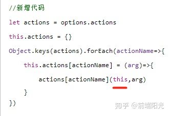
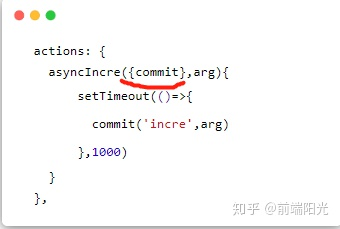
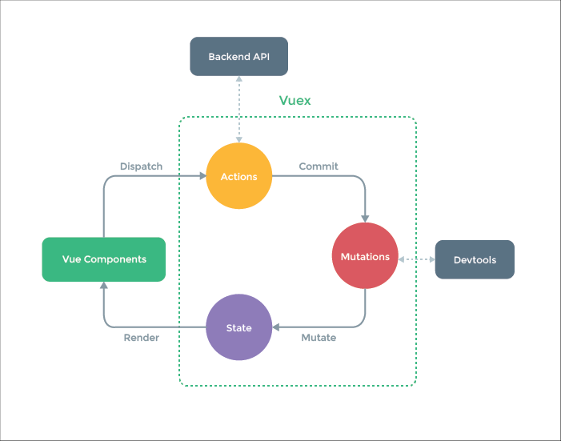

# Vuex(Vue状态管理模式)

## 介绍

Vue为这些被多个组件频繁使用的值提供了一个统一管理的工具——VueX。在具有VueX的Vue项目中，我们只需要把这些值定义在VueX中，即可在整个Vue项目的组件中使用。

了解更多：https://www.jianshu.com/p/2e5973fe1223

## 安装

由于 `VueX`是在学习 `VueCli`后进行的，所以在下文出现的项目的目录请参照 `VueCli 2.x`构建的目录。

以下步骤的前提是你已经完成了Vue项目构建，并且已转至该项目的文件目录下。

```
npm i vuex -s
```

在项目的根目录下新增一个 `store`文件夹，在该文件夹内创建index.js

此时你的项目的 `src`文件夹应当是这样的：

```
│  App.vue
│  main.js
│
├─assets
│      logo.png
│
├─components
│      HelloWorld.vue
│
├─router
│      index.js
│
└─store
       index.js

```

## 简单使用

### 初始化store

```js
import Vue from 'vue'
import Vuex from 'vuex'
 
//挂载Vuex
Vue.use(Vuex)
 
//创建VueX对象
const store = new Vuex.Store({
    state:{
        //存放的键值对就是所要管理的状态
        name:'helloVueX'
    }
})
 
export default store

```

### 挂载main.js

```js
import Vue from 'vue'
import App from './App'
import router from './router'
import store from './store'

Vue.config.productionTip = false

/* eslint-disable no-new */
new Vue({
  el: '#app',
  router,
  store,  //store:store 和router一样，将我们创建的Vuex实例挂载到这个vue实例中
  render: h => h(App)
})

```

### 组件内调用

在组件中使用Vuex

```html
<template>
    <div id='app'>
        name:
        <h1>{{ $store.state.name }}</h1>
    </div>
</template>

```

或者要在组件方法中使用

```js
...,
methods:{
    add(){
      console.log(this.$store.state.name)
    }
},
...

```

**注意，请不要在此处更改state中的状态的值**

## Vuex和EventBus的区别

 vuex 的底层实现原理其实就是 event-bus，那么它和普通的 event-bus 有什么不同呢？我们通过简单的源码一步步实现来搞懂这个问题。

### **EventBus**

首先一个普通的 event-bus 是这样的：

```js
// main.js
Vue.prototype.$bus = new Vue();

// 组件中
this.$bus.$on('console', (text) => {
    console.log(text);
});

// 组件中
this.$bus.$emit('console', 'hello world');

```

它是通过 Vue 的 $on和 $emit api 来传递消息的。

### **vuex 的响应式数据**

前面讲过，我们是这样使用Store的

```js
export default new Vuex.Store({
  state: {
    num:0
  },
  mutations: {
  },
  actions: {
  },
  modules: {
  }
})
```

也就是说，我们把这个对象

```js
{
  state: {
    num:0
  },
  mutations: {
  },
  actions: {
  },
  modules: {
  }
}
```

当作参数了。

那我们可以直接在Class Store里，获取这个对象

```js
class Store{
    constructor(options){
        this.state = options.state || {}
      
    }
}
```

此时是可以直接使用的（非响应式）

#### 响应式获取数据

那要怎么实现响应式呢？ 我们知道，我们new Vue（）的时候，传入的data是响应式的，那我们是不是可以new 一个Vue，然后把state当作data传入呢？ 没有错，就是这样。

```js
class Store{
 
    constructor(options) {
        this.vm = new Vue({
            data:{
                state:options.state
            }
        })
    }
}
```

现在是实现响应式了，但是我们怎么获得state呢？好像只能通过 `this.$store.vm.state`了？但是跟我们平时用的时候不一样，所以，是需要转化下的。

我们可以给Store类添加一个state属性。这个属性自动触发get接口。

```js
class store {
    constructor(options) {
        this.vm = new Vue({
            data: {
                state: options.state
            },
        });
    }
    get state() {
        return this.vm.state;
    }
}

```

这是ES6，的语法，有点类似于Object.defineProperty的get接口

注意，上面的data **不是一个函数** ，因为这里我们只会实例化一次。然后我们通过添加一个 state 的 getter 方法来暴露内部的 event-bus 的 state 属性。

#### 实现getter

```js
class store {
    constructor(options) {
        this.vm = new Vue({
            data: {
                state: options.state
            },
        });
        const getters = options.getter || {};
	//vuex的getters
        this.getters = {};
	//遍历getters的key
        Object.keys(getters).forEach((key) => {
            Object.defineProperty(this.getters, key, () => {
                get: () => getters[key](this.state)
            })
        });
    }

    get state() {
        return this.vm.state;
    }
}
//Object.defineproperty(obj, prop, desc)
//obj :  第一个参数就是要在哪个对象身上添加或者修改属性
//prop : 第二个参数就是添加或修改的属性名
//desc ： 配置项，一般是一个对象
	//writable：	是否可重写
    	//value：  	当前值
    	//get：    	 读取时内部调用的函数
	//set：        写入时内部调用的函数
	//enumerable： 	是否可以遍历
	//configurable： 	是否可再次修改配置项

这段代码是在定义一个`store`类用于管理Vue应用中的数据状态。

1. 在`constructor`函数中，首先使用`Vue`的构造函数创建一个Vue实例对象`vm`，并将`options.state`作为`vm`的初始data，也就是将Vuex中的state数据存储在Vue实例对象`vm`中。

2. 接着，通过`options.getter`获取`getter`，`getter`是一个返回状态值的计算属性，通过对状态进行计算返回新的状态，从而获取派生状态的一种方式。

3. 在后续的代码中，通过对象的方式进行遍历`getters`，将其赋值给`this.getters`，从而实现定义类成员函数。

4. 在`getters`中定义了计算属性，通过`Object.defineProperty`将其设置为只读属性，即只能读取不能修改，通过使用`get`关键字对该函数进行保护。这样，在`store`类中可以调用`this.getters`来获取计算属性的值，并且无法进行修改。

5. 最后，定义了`state`的getter方法，用于返回Vue实例对象`vm`中的数据状态。

这段代码主要实现了以下两个功能：

1. 通过将`state`保存在Vue实例对象中，使得在`store`中调用`state`时，可以获得到数据状态。

2. 通过定义`getter`成员函数以及保护`getter`成员函数的方式，可以避免该计算属性被修改，确保获取计算属性的准确性。
```

我们把用户传进来的getter保存到getters数组里。

最有意思的是经常会有面试题问： **为什么用getter的时候不用写括号** 。要不是我学到这个手写Vuex，也不会想不明白，原来这个问题就像问我们平时写个变量，为什么不用括号一样。（如 {{num}},而不是 {{num()}}）

原来就是利用了Object.defineProperty的get接口。

```html
<template>
  <div id="app">
    123
    <p>state：{{this.$store.state.num}}</p>
    <p>getter:{{this.$store.getters.getNum}}</p>
  </div>
</template>
```

#### **实现mutations**

类似的，我们可以**添加一个 mutations 属性**来保存 mutations，然后实现一个 commit 方法，在调用 commit 方法的时候去 mutations 里面找，然后调用相应函数即可：

```js
//myVuex.js
class Store{
 
    constructor(options) {
        this.vm = new Vue({
            data:{
                state:options.state
            }
        })
 
        let getters = options.getter || {}
        this.getters = {}
        Object.keys(getters).forEach(getterName=>{
            Object.defineProperty(this.getters,getterName,{
                get:()=>{
                    return getters[getterName](this.state)
                }
            })
        })
        //新增代码
        let mutations = options.mutations || {}
        this.mutations = {}
        Object.keys(mutations).forEach(mutationName=>{
            this.mutations[mutationName] = (arg)=> {
                mutations[mutationName](this.state,arg)
            }
        })
 
    }
    get state(){
        return this.vm.state
    }
}
```

mutations跟getter一样，还是用mutations对象将用户传入的mutations存储起来。

但是怎么触发呢？回忆一下，我们是怎么触发mutations的。

```js
this.$store.commit('incre',1)
```

对，是这种形式的。可以看出store对象有commit这个方法。而commit方法触发了mutations对象中的某个对应的方法，因此我们可以给Store类添加commit方法

```js
//myVuex.js
class Store{
    constructor(options) {
        this.vm = new Vue({
            data:{
                state:options.state
            }
        })
 
        let getters = options.getter || {}
        this.getters = {}
        Object.keys(getters).forEach(getterName=>{
            Object.defineProperty(this.getters,getterName,{
                get:()=>{
                    return getters[getterName](this.state)
                }
            })
        })
      
        let mutations = options.mutations || {}
        this.mutations = {}
        Object.keys(mutations).forEach(mutationName=>{
            this.mutations[mutationName] =  (arg)=> {
                mutations[mutationName](this.state,arg)
            }
        })
 
    }
    //新增代码
    commit(method,arg){
        this.mutations[method](arg)
    }
    get state(){
        return this.vm.state
    }
}
```

调用一下

```js
<script>
  export default {
      methods:{
          add(){
              this.$store.commit('incre',1)
          }
      }
  }
</script>
```

store/index.js

```js
//store/index.js
import Vue from 'vue'
import Vuex from './myVuex'
 
Vue.use(Vuex)
 
export default new Vuex.Store({
  state: {
    num:0
  },
  getter:{
    getNum:(state)=>{
      return state.num
    }
  },
  // 新增测试代码
  mutations: {
    incre(state,arg){
        state.num += arg
    }
  },
  actions: {
  },
})
```

#### **实现actions**

当会实现mutations后，那actions的实现也很简单，很类似，不信看代码：

```js
//myVuex.js
class Store{
    constructor(options) {
        this.vm = new Vue({
            data:{
                state:options.state
            }
        })
 
        let getters = options.getter || {}
        this.getters = {}
        Object.keys(getters).forEach(getterName=>{
            Object.defineProperty(this.getters,getterName,{
                get:()=>{
                    return getters[getterName](this.state)
                }
            })
        })
 
        let mutations = options.mutations || {}
        this.mutations = {}
        Object.keys(mutations).forEach(mutationName=>{
            this.mutations[mutationName] =  (arg)=> {
                mutations[mutationName](this.state,arg)
            }
        })
        //新增代码
        let actions = options.actions
        this.actions = {}
        Object.keys(actions).forEach(actionName=>{
            this.actions[actionName] = (arg)=>{
                actions[actionName](this,arg)
            }
        })
 
    }
    // 新增代码
    dispatch(method,arg){
        this.actions[method](arg)
    }
    commit(method,arg){
        console.log(this);
        this.mutations[method](arg)
    }
    get state(){
        return this.vm.state
    }
}
```

一毛一样，不过有一点需要解释下，就是这里为什么是传this进去。这个this代表的就是store实例本身



这是因为我们使用actions是这样使用的：

```js
  actions: {
    asyncIncre({commit},arg){
        setTimeout(()=>{
          commit('incre',arg)
        },1000)
    }
  },
```

其实{commit} 就是对this，即store实例的解构，即{commit}（使用了this.commit）



测试（出错，下面解决）

```js
<script>
  export default {
      methods:{
          add(){
              this.$store.commit('incre',1)
          },
          asyncAdd(){
              this.$store.dispatch('asyncIncre',2)
          }
      }
  }
</script>
```

store/index.js

```js
//store/index.js
import Vue from 'vue'
import Vuex from './myVuex'
 
Vue.use(Vuex)
 
export default new Vuex.Store({
  state: {
    num:0
  },
  getter:{
    getNum:(state)=>{
      return state.num
    }
  },
  mutations: {
    incre(state,arg){
        state.num += arg
    }
  },
  //新增测试代码
  actions: {
    asyncIncre({commit},arg){
        setTimeout(()=>{
          commit('incre',arg)
        },1000)
    }
  },
})
```

此时直接调用会出错了，它这里错误 说的是执行到这里发现这里的this为undefined。

我们在实现mutation的时候也执行到这里了啊，而且执行成功了啊。

来分析一下：

```js
this.$store.commit('incre',1)
```

执行这段代码的时候，执行commit的时候，this是谁调用就指向谁，所以this指向 `$store`。

```js
this.$store.dispatch('asyncIncre',2)
```

执行这段代码，就会执行

```js
asyncIncre({commit},arg){
    setTimeout(()=>{
      commit('incre',arg)
    },1000)
}
```

发现问题了吧？？ 谁调用commit？？是 $store吗？并不是。所以要解决这个问题，我们必须换成箭头函数

```js
//myVuex.js
class Store{
    constructor(options) {
        this.vm = new Vue({
            data:{
                state:options.state
            }
        })
 
        let getters = options.getter || {}
        this.getters = {}
        Object.keys(getters).forEach(getterName=>{
            Object.defineProperty(this.getters,getterName,{
                get:()=>{
                    return getters[getterName](this.state)
                }
            })
        })
 
        let mutations = options.mutations || {}
        this.mutations = {}
        Object.keys(mutations).forEach(mutationName=>{
            this.mutations[mutationName] =  (arg)=> {
                mutations[mutationName](this.state,arg)
            }
        })
 
        let actions = options.actions
        this.actions = {}
        Object.keys(actions).forEach(actionName=>{
            this.actions[actionName] = (arg)=>{
                actions[actionName](this,arg)
            }
        })
 
    }
    dispatch(method,arg){
        this.actions[method](arg)
    }
    // 修改代码
    commit=(method,arg)=>{
        console.log(method);
        console.log(this.mutations);
        this.mutations[method](arg)
    }
    get state(){
        return this.vm.state
    }
}
```

成功

详细原因

```js
/*在代码中，当调用`s.dispatch('asyncIncre',2)`时，实际上是执行了`this.actions['asyncIncre'](2)`，即调用了由`actions`对象中定义的`asyncIncre()`函数。

在`asyncIncre()`函数的内部，使用了箭头函数来定义异步回调函数，并且在回调函数执行期间访问`commit`方法。在JavaScript中，箭头函数没有自己的`this`，所以它会继承外部函数的`this`，
也就是当前的执行上下文。在这种情况下，其外部包裹的函数是`actions`对象中的函数，所以箭头函数的`this`被设置为`undefined`。因此，当在箭头函数中访问`commit`方法时，
会导致`this.commit`为`undefined`错误。

为了解决这个问题，可以在调用`actions`函数时使用`bind()`方法将`store`对象作为上下文来调用它。修改后的`s.dispatch()`方法如下所示：
//新旧代码对比
dispatch(method, arg) {
  this.actions[method].bind(this, arg)()
}

//原始代码
dispatch(method, arg) {
  this.actions[method](arg)
}

由于使用了箭头函数来定义异步回调函数，在这种情况下箭头函数在整个外部作用域中都是有效的，因此通过创建新函数并绑定上下文来调用`asyncIncre`方法，将`store`对象绑定到callbacks上下文，
从而保证在异步回调函数中能够正确的引用`this.commit()`。*/

```

## VueX中的核心内容

在VueX对象中，其实不止有 state,还有用来操作 state中数据的方法集，以及当我们需要对 state中的数据需要加工的方法集等等成员。

成员列表：

* state 存放状态
* mutations state成员操作
* getters 加工state成员给外界
* actions 异步操作
* modules 模块化状态管理

### VueX的工作流程



首先，Vue组件如果调用某个 VueX的方法过程中需要向后端请求时或者说出现异步操作时，需要 dispatch VueX中 actions的方法，以保证数据的同步。可以说，action的存在就是为了让 mutations中的方法能在异步操作中起作用。

 如果没有异步操作，那么我们就可以直接在组件内提交状态中的 Mutations中自己编写的方法来达成对 state成员的操作。注意，不建议在组件中直接对 state中的成员进行操作，这是因为直接修改(例如：this.$store.state.name = 'hello')的话不能被 VueDevtools所监控到。

 最后被修改后的state成员会被渲染到组件的原位置当中去。

### Mutations

mutations是操作 state数据的方法的集合，比如对该数据的修改、增加、删除等等。

#### Mutations使用方法

mutations方法都有默认的形参：(**[state]**  **[,payload]** )

* state是当前 VueX对象中的 state
* payload是该方法在被调用时传递参数使用的

例如，我们编写一个方法，当被执行时，能把下例中的name值修改为 `"jack"`,我们只需要这样做

index.js

```js
import Vue from 'vue'
import Vuex from 'vuex'

Vue.use(Vuex)

const store = new Vuex.store({
    state:{
        name:'helloVueX'
    },
    mutations:{
        //es6语法，等同edit:funcion(){...}
        edit(state){
            state.name = 'jack'
        }
    }
})

export default store

```

而在组件中，我们需要这样去调用这个 `mutation`——例如在App.vue的某个 `method`中:

```js
this.$store.commit('edit')
```

#### Mutation传值

在实际生产过程中，会遇到需要在提交某个 mutation时需要携带一些参数给方法使用。

单个值提交时:

```js
this.$store.commit('edit',15)   
```

当需要多参提交时，推荐把他们放在一个对象中来提交:

```js
this.$store.commit('edit',{age:15,sex:'男'})
```

接收挂载的参数：

```js
edit(state,payload){
    state.name = 'jack'
    console.log(payload) // 15或{age:15,sex:'男'}
}
```

**另一种提交方式**

```js
this.$store.commit({
    type:'edit',
    payload:{
        age:15,
        sex:'男'
    }
})
```

### 增删state中的成员

为了配合Vue的响应式数据，我们在Mutations的方法中，应当使用Vue提供的方法来进行操作。如果使用 delete或者 xx.xx = xx的形式去删或增，则Vue不能对数据进行实时响应。

* Vue.set 为某个对象设置成员的值，若不存在则新增
  例如对state对象中添加一个age成员
* Vue.delete() 删除成员
  将刚刚添加的age成员删除

```js
Vue.delete(state,'age')
```

### Getters

 功能：可以对state中的成员加工后传递给外界

 Getters中的方法有两个默认参数

* state 当前VueX对象中的状态对象
* getters 当前getters对象，用于将getters下的其他getter拿来用

例如

```js
getters:{
    nameInfo(state){
        return "姓名:"+state.name
    },
    fullInfo(state,getters){
        return getters.nameInfo+'年龄:'+state.age
    }  
}
12345678
```

组件中调用

```js
this.$store.getters.fullInfo
```

### Actions

由于直接在 mutation方法中进行异步操作，将会引起数据失效。所以提供了Actions来专门进行异步操作，最终提交 mutation方法。

Actions中的方法有两个默认参数

* context 上下文(相当于箭头函数中的this)对象
* payload 挂载参数

由于 setTimeout是异步操作，所以需要使用 actions

```js
actions:{
    aEdit(context,payload){
        setTimeout(()=>{
            context.commit('edit',payload)
        },2000)
    }
}

```

在组件中调用:

```js
this.$store.dispatch('aEdit',{age:15})
```

**改进:**

由于是异步操作，所以我们可以为我们的异步操作封装为一个 Promise对象

```js
aEdit(context,payload){
    return new Promise((resolve,reject)=>{
        setTimeout(()=>{
            context.commit('edit',payload)
            resolve()
        },2000)
    })
}

```

### modules

当项目庞大，状态非常多时，可以采用模块化管理模式。Vuex 允许我们将 store 分割成 **模块（module）** 。每个模块拥有自己的 state、mutation、action、getter、甚至是嵌套子模块——从上至下进行同样方式的分割。

```js
modules:{
    a:{
        state:{},
        getters:{},
        ....
    },
    b:{
        state:{},
        getters:{},
        ....
    }
}
```

组件内调用模块a的状态：

```js
this.$store.state.a
```

而提交或者 dispatch某个方法和以前一样,会自动执行所有模块内的对应 type的方法：

```js
this.$store.commit('editKey')
this.$store.dispatch('aEditKey')
```

```js
const moduleA = {
        state: () => ({ ... }),
        mutations: { ... },
        actions: { ... },
        getters: { ... }
    }
    const moduleB = {
        state: () => ({ ... }),
        mutations: { ... },
        actions: { ... }
    }
    const store = new Vuex.Store({
        modules: {
            a: moduleA,
            b: moduleB
        }
    })
    this.store.state.a // -> 获得moduleA 的状态
    this.store.state.b // -> 获得moduleB 的状态
```

#### 模块的细节

模块中 mutations和 getters中的方法接受的第一个参数是自身局部模块内部的 state

```js
modules:{
    a:{
        state:{key:5},
        mutations:{
            editKey(state){
                state.key = 9
            }
        },
        ....
    }
}
```

getters中方法的第三个参数是根节点状态

```js
modules:{
    a:{
        state:{key:5},
        getters:{
            getKeyCount(state,getter,rootState){
                return  rootState.key + state.key
            }
        },
        ....
    }
}
```

actions中方法获取局部模块状态是 context.state,根节点状态是 context.rootState

```js
modules:{
    a:{
        state:{key:5},
        actions:{
            aEidtKey(context){
                if(context.state.key === context.rootState.key){
                    context.commit('editKey')
                }
            }
        },
        ....
    }
}
```

## vuex的辅助函数（组件中）

我们在使用vuex中的公共内容时，总要用 $store.state.名字，将内容从vuex中获取到，使用vuex的辅助函数，可以将内容直接获取到想要展示的页面中，减少代码量

**vuex的辅助函数一共有四个**

1. **mapState 获取数据**

   ```javascript
   import { mapState} from 'vuex' 	// 将vuex中的数据获取到页面上
   //   mapState 获取到的是vuex中的数据
   // mapState和mapGetters都是使用在computed中的
    computed: {
        ...mapState(['tasks'])
    }, 
   ```

   在页面中使用时，直接用tasks来获取，即

   ```html
   <li v-for="(item, index) in tasks" :key="item.id">
   </li>
   ```
2. mapGetters vuex中的计算属性

   ```javascript
   import { mapGetters } from "vuex";
   computed: {
    // mapGetters可以将getters中的方法 放入 computed 计算属性中 便于在页面中直接使用getters数据
    ...mapGetters(["countWorking"]),
   },
   ```

   **同样也是使用在computed，使用方式**

   ```html
   <span>正在进行</span><span class="count">{{ countWorking }}</span>
   ```
3. **mapMutations**
4. **mapActions**

mapMutations 和mapActions都是函数方法 所以都是放在methods中的 ，这里就把他们放在一起使用

```javascript
import { mapState, mapMutations } from 'vuex'
methods:{
        ...mapMutations(['delTask', 'closeExit']),
        // 删除任务的逻辑
        // del(i) {
        //     this.$store.commit('delTask', i)
        // },
        }
        // blur(i) {
        //     // console.log(1);
        //     this.$store.commit('closeExit', i)
        // }
    },

```

使用方式

```html
<button @click="delTask(index)">-</button>
```

#### 规范目录结构

如果把整个 `store`都放在 `index.js`中是不合理的，所以需要拆分。比较合适的目录格式如下：

```shell
store:.
│  actions.js
│  getters.js
│  index.js
│  mutations.js
│  mutations_type.js   ##该项为存放mutaions方法常量的文件，按需要可加入
│
└─modules
        Astore.js
123456789
```

对应的内容存放在对应的文件中，和以前一样，在 `index.js`中存放并导出 `store`。`state`中的数据尽量放在 `index.js`中。而 `modules`中的 `Astore`局部模块状态如果多的话也可以进行细分。

## Vue项目打包

 首先，要配置 vue.config.js 文件，在打包的时候做一些配置，最新版本的vue cli项目会自动创建vue.config.js文件，低版本的vue cli 创建的项目没有vue.config.js,新建一个vue.config.js 文件

 下面是配置信息：

```javascript
const { defineConfig } = require('@vue/cli-service')
module.exports = defineConfig({
  transpileDependencies: true,

  /* 代码保存时进行eslint检测 */
  lintOnSave: false,
   /* 部署生产环境和开发环境下的URL：可对当前环境进行区分，baseUrl 从 Vue CLI 3.3 起已弃用，要使用publicPath */
  publicPath: './',

   /* 输出文件目录：在npm run build时，生成文件的目录名称 */
  outputDir: "dist",

    /* 放置生成的静态资源 (js、css、img、fonts) 的 (相对于 outputDir 的) 目录 */
  assetsDir: "assets",

  /* 是否在构建生产包时生成 sourceMap 文件，false将提高构建速度 */
  productionSourceMap: false,
  
  /* 默认情况下，生成的静态资源在它们的文件名中包含了 hash 以便更好的控制缓存，你可以通过将这个选项设为 false 来关闭文件名哈希。(false的时候就是让原来的文件名不改变) */
  filenameHashing: false,

})
```
