# 插槽

## 什么是插槽

插槽（Slot）是 vue 为组件的封装者提供的能力。允许开发者在封装组件时，把不确定的、希望由用户指定的 部分定义为插槽。

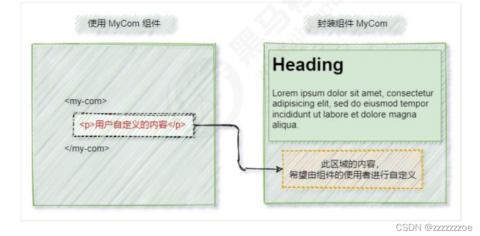

可以把插槽认为是组件封装期间，为用户预留的内容的占位符。

## 默认插槽

封装组件时，可以通过 `<slot>` 元素定义插槽，从而为用户预留内容占位符。示例代码如下：

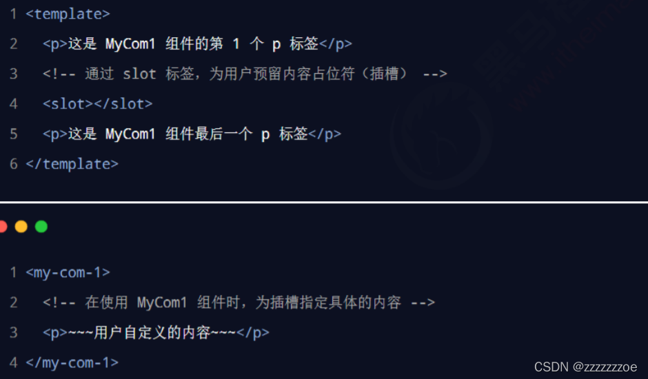

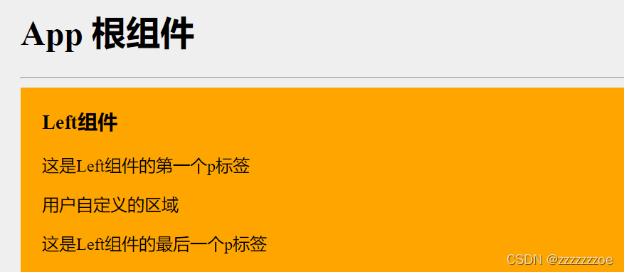

### 没有预留插槽

如果在封装组件时没有预留任何 `<slot>` 插槽，则用户提供的任何自定义内容都会被丢弃。示例代码如下：

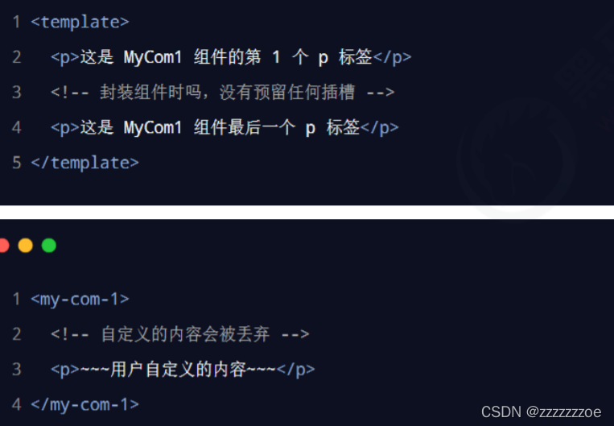

### 后备内容

封装组件时，可以为预留的 `<slot>`插槽提供后备内容（默认内容）。如果组件的使用者没有为插槽提供任何 内容，则后备内容会生效。示例代码如下：

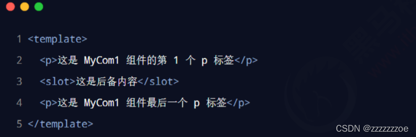

## 具名插槽

实际上每个插槽都应该有name属性，来指定当前插槽的名称，如果省略了slot的name值，默认为default。默认情况下，在使用组件的时候提供的内容都会被填充到名字为default的插槽中。

如果需要指定某个内容放到哪个插槽中，需要在内容外包裹一个 <template>标签，将v-slot命令放在 <template>标签里。

如果没有则会报错:v-slot只能使用在组件或 <template>标签中

<template>标签只起到包裹的作用，不会被渲染成元素。

示例代码：

```html
/*
*App.vue
*/
<Left>
        <!-- 1. 如果要把内容填充到指定名称的插槽中需要使用：v-slot这个指令 -->
        <!-- 2. v-slot后面要跟上插槽的的名字 -->
        <!-- 3. v-slot指令不能直接使用在元素身上，必须使用在template标签上 -->
        <!-- 4. template标签是一个虚拟标签，只起到包裹的作用，不会被渲染成任何实质性的html元素 -->
        <template v-slot:default>
        <!-- v-slot:简写是# -->
          <p>这是在Left组件的内容区域，声明的p标签</p>
        </template>
      </Left>
```

```html
/*
*Left.vue
*/
<template>
  <div class="left-container">
    <h3>Left组件</h3>
    <!-- 声明一个插槽区域 -->
    <slot name="default"></slot>
  </div>
</template>
```

即，如果在封装组件时需要预留多个插槽节点，则需要为每个 `<slot>` 插槽指定具体的 name 名称。这种带有具体名称的插槽叫做“具名插槽”。示例代码如下：

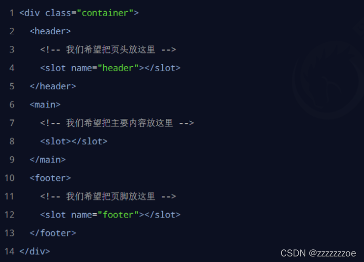

注意：没有指定 name 名称的插槽， 会有隐含的名称叫做 “default”。内部内容没有指定v-slot会默认放到名为default的插槽中。

### 为具名插槽提供内容

如上面提到，在向具名插槽提供内容的时候，我们可以在一个 `<template>` 元素上使用 v-slot 指令，并以 v-slot 的参数的 形式提供其名称。示例代码如下：

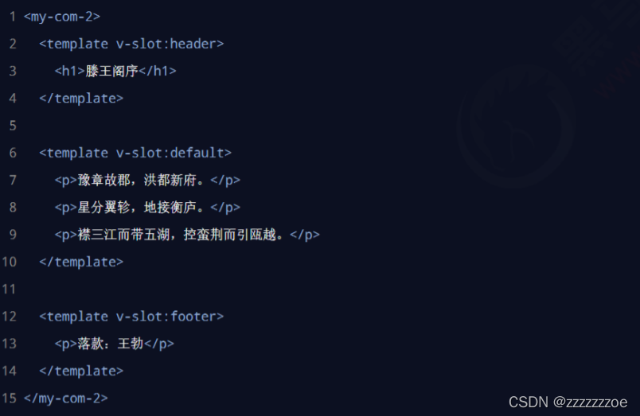

### 具名插槽的简写形式

跟 v-on 和 v-bind 一样，v-slot 也有缩写，即把参数之前的所有内容 (v-slot:) 替换为字符 #。例如 v-slot:header 可以被重写为 #header：

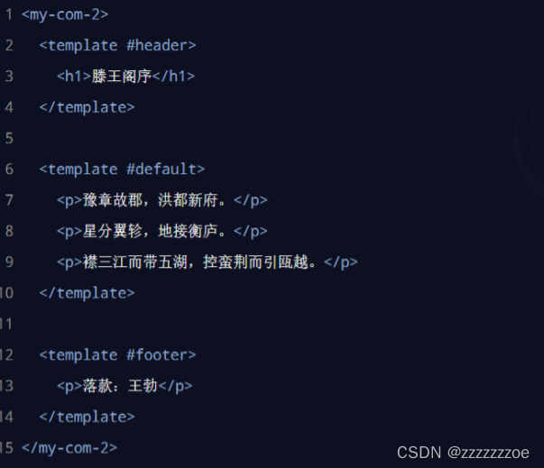

小总结：在子组件中封装插槽时slot节点用name属性定义插槽，在父组件使用插槽时template节点用v-slot命令指定内容渲染到哪个插槽里面。

## 作用域插槽

希望在父组件中使用到子组件 `<slot>`节点的属性，相当于子传父传值。实际上可以通过插槽接受插槽想要传递的数据。eg.

```html

/*Artical.vue*/
<slot name="content" msg="hello,vue!" :user="userInfo"></slot>
...
<script>
export default {
    // 首字母要大写
    name: 'Aticle',
    data(){
      return {
        userInfo: {
          name:'zs',
          age:'20'
        }
      }
    }
}
</script>
```

```html
/*App.vue*/
<template #content="scope">
        <p>啊，大海，全是水</p>
        <p>啊，蜈蚣，全是腿</p>
        <p>啊，辣椒，净辣嘴</p>
        <p>{{ scope}}</p>
</template>
```

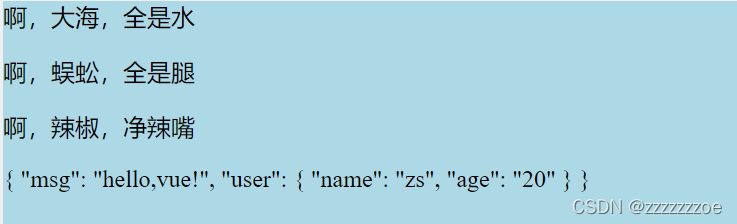

为插槽绑数据时可以直接写死也可以v-bind绑定数据源中的数据。

 在封装组件时，为预留的`<slot>`声明数据对象，提供属性对应的值，在使用插槽的时候接收该对象使用，这种用法叫作用域插槽。* 建议将对象命名为scope（作用域）。

即，在封装组件的过程中，可以为预留的 `<slot>` 插槽绑定 props 数据，这种带有 props 数据的 `<slot>` 叫做“作用域插槽”。示例代码如下：

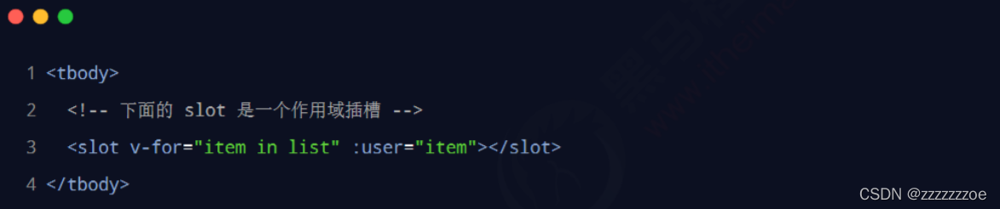

### 使用作用域插槽

可以使用 v-slot: 的形式，接收作用域插槽对外提供的数据。示例代码如下：

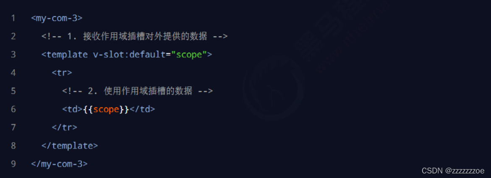

### 解构插槽 Prop

作用域插槽对外提供的数据对象，可以使用解构赋值简化数据的接收过程。示例代码如下：

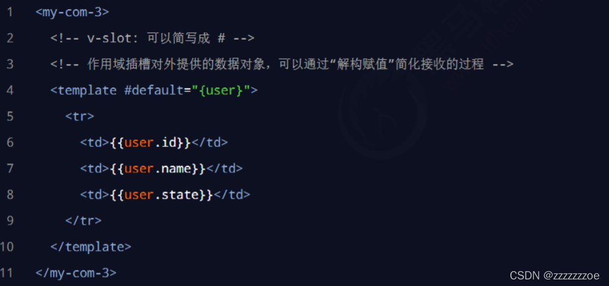

自己写个小栗子：

```html
<template #content="{msg,user}">
        <p>啊，大海，全是水</p>
        <p>啊，蜈蚣，全是腿</p>
        <p>啊，辣椒，净辣嘴</p>
        <p>{{ msg }}</p>
        <p>{{ user.name }}</p>
</template>
```
