# 前端路由的概念和原理

## 什么是路由

路由（英文：router）就是对应关系。（key - value），key为 **路径** ，value可能是 function或 component

**后端路由**

 **理解：** value是 function，用于处理客户端提交的请求

 工作过程：服务器收到一个请求时，根据请求路径找到匹配的函数来处理请求，返回响应数据

**前端路由**

  **理解：** value是 component，用于展示页面内容

## SPA 与前端路由

SPA （单页面应用程序）指的是一个 web 网站只有唯一的一个 HTML 页面，所有组件的展示与切换都在这唯一的一个页面内完成。 此时，不同组件之间的切换需要通过前端路由来实现。

结论：在 SPA 项目中，不同功能之间的切换，要依赖于前端路由来完成！

## 什么是前端路由

### history模式

1. 地址干净，美观
2. 兼容性和 hash模式相比略差
3. 应用部署上线时需要后端人员支持，解决刷新页面服务器端404的问题

```js
const router =  new VueRouter({
	mode:'history',
	routes:[...]
})

export default router

```

### hash模式

1. 地址中永远带着#号，不美观
2. 若以后将地址通过第三方手机app分享，若app校验严格，则，地址会被标记为不合法
3. 兼容性较好

通俗易懂的概念：Hash地址与组件之间的对应关系。

举例子：

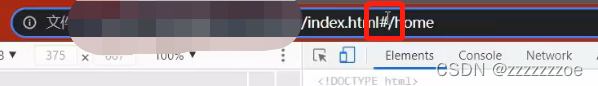

这里地址中的#是锚链接，在一个页面进行位置跳转，不会导致页面的刷新，会导致一个页面的上下跳转和历史记录的变化。#之后为Hash地址。

写个小栗子：

```html
<style>
    .box {
      height: 800px;
    }

    #b1 {
      background-color: pink;
    }

    #b2 {
      background-color: red;
    }

    #b3 {
      background-color: orange;
    }

    #b4 {
      background-color: skyblue;
    }

    .side-bar {
      position: fixed;
      top: 0;
      right: 0;
      background: white;
    }
  </style>
</head>

<body>
  <div class="side-bar">
    <a href="#b1">b1</a>
    <a href="#b2">b2</a>
    <a href="#b3">b3</a>
    <a href="#b4">b4</a>
  </div>

  <div class="box" id="b1"></div>
  <div class="box" id="b2"></div>
  <div class="box" id="b3"></div>
  <div class="box" id="b4"></div>
</body>
```

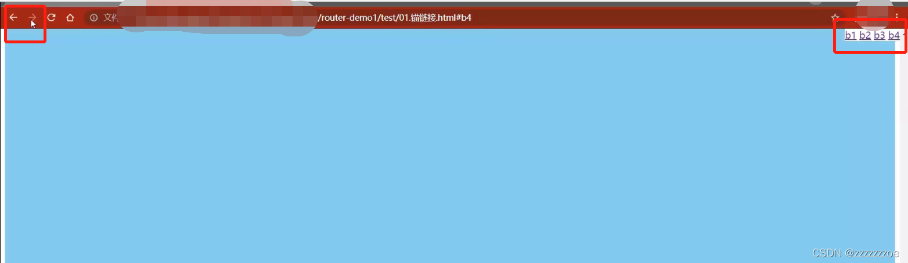

点击链接可以跳转本页面上下位置，并产生历史记录

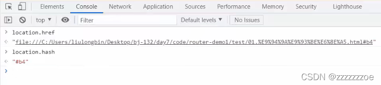

可以在控制台打印出当前Hash地址（包含#）

类比一下，在单页面中，点击不同的链接，Hash地址会变，页面上的组件会跟着发生切换。即不同的Hash地址对应不同的组件。理解为，前端路由是Hash地址与组件之间的对应关系。

## 前端路由的工作方式

1. 用户点击了页面上的路由链接（本质是a链接）
2. 导致了 URL 地址栏中的 Hash 值发生了变化
3. 前端路由监听了到 Hash 地址的变化
4. 前端路由把当前 Hash 地址对应的组件渲染都浏览器中


结论：前端路由，指的是 Hash 地址与组件之间的对应关系！

## 实现简易的前端路由

步骤1：通过 `<component>` 标签，结合 comName 动态渲染组件。示例代码如下：

```html
 <!-- 通过is属性，指定要展示的组件的名称 -->
    <component :is="comName"></component>

<script>
export default {
  name: 'App',
  data() {
    return {
      // 在动态组件的位置，要展示的组件的名字，值必须是字符串
      comName: 'Home'
    }
  },
</script>
```

步骤2：在 App.vue 组件中，为 `<a>`链接添加对应的Hash值

```html
<a href="#/home">首页</a>
<a href="#/movie">电影</a>
<a href="#/about">关于</a>
```

步骤3：在 created 生命周期函数中，监听浏览器地址栏中 hash 地址的变化，动态切换要展示的组件的名称：

```javascript
created() {
    // 只要当前的 App 组件一被创建，就立即监听 window 对象的 onhashchange 事件
    //使用箭头函数使里面的this和外面的this保持一致
    window.onhashchange = () => {
      console.log('监听到了 hash 地址的变化', location.hash)
      switch (location.hash) {
        case '#/home':
          this.comName = 'Home'
          break
        case '#/movie':
          this.comName = 'Movie'
          break
        case '#/about':
          this.comName = 'About'
          break
      }
    }
  },
```

原理是使用到了onhashchange事件。实际开发中一般不用自己封装路由，而是使用第三方库实现路由的创建和监听。所以接下来我们学习vue-router

# vue-router的基本使用

## 什么是 vue-router

vue-router 是 vue.js 官方给出的路由解决方案。它只能结合 vue 项目进行使用，能够轻松的管理 SPA 项目 中组件的切换。

vue-router 的官方文档地址🔗：[Vue Router](https://router.vuejs.org/zh/ "Vue Router")

## vue-router 安装和配置的步骤

1. 安装 vue-router 包
2. 创建路由模块（.js文件）管理组件的切换
3. 导入并挂载路由模块
4. 声明路由链接和占位符

### 在项目中安装 vue-router

在 vue2 的项目中，安装 vue-router 的命令如下：

> npm i vue-router@3.5.2 -S

指定版本号，-S指将包记录到dependencies节点下。

## 创建路由模块

在 src 源代码目录下，新建 router/index.js 路由模块，并初始化如下的代码：

```javascript
//1、导入Vue和VueRouter的包
import Vue from 'vue'
import VueRouter from 'vue-router'

//2、调用Vue.use函数，把VueRouter安装为Vue的插件
Vue.use(VueRouter)

//3、创建路由的实例对象
const router = new VueRouter()

//4、向外共享路由的实例对象
export default router
```

### 导入并挂载路由模块

在 src/main.js 入口文件中，导入并挂载路由模块。示例代码如下：

```javascript
...
//1、导入路由模块 目的：拿到路由的实例对象
//import router from '@/router/index.js'
// 在进行模块化导入的时候，如果给定的是文件夹，则默认导入这个文件夹下，名字叫做 index.js 的文件
import router from '@/router'
...
new Vue({
  render: h => h(App),
//2、挂载路由模块
  // 在 Vue 项目中，要想把路由用起来，必须把路由实例对象，通过下面的方式进行挂载
  // router: 路由的实例对象
//router: router 属性名和属性值一样可以简写
  router
}).$mount('#app')
```

注：在项目开发中如果使用vue-cli创建时勾选路由会自动创建router里面的index.js并生成初始化代码，同时在main.js中导入并挂载。

### 声明路由链接和占位符

在 src/App.vue 组件中，使用 vue-router 提供的 `<router-link>` 和 `<router-view>`声明路由链接和占位符（占位符可以理解为“出口”）：

```html
<template>
  <div class="app-container">
    <h1>App2 组件</h1>

    <!-- 当安装和配置了 vue-router 后，就可以使用 router-link 来替代普通的 a 链接了 -->
    <router-link to="/home">首页</router-link>
    <!-- 1、定义路由链接 -->
    <router-link to="/movie/1">洛基</router-link>
    <router-link to="/movie/2?name=zs&age=20">雷神</router-link>
    <router-link to="/movie/3">复联</router-link>
    <router-link to="/about">关于</router-link>

    <hr />

    <!-- 只要在项目中安装和配置了 vue-router，就可以使用 router-view 这个组件了 -->
    <!-- 2、定义路由的占位符 -->
    <router-view></router-view>
  </div>
</template>


```

官方推荐使用router-link替代a链接。router-link的to属性对应a的href属性，Hash地址中的#不用再写。在浏览器中router-link会被渲染成a链接：

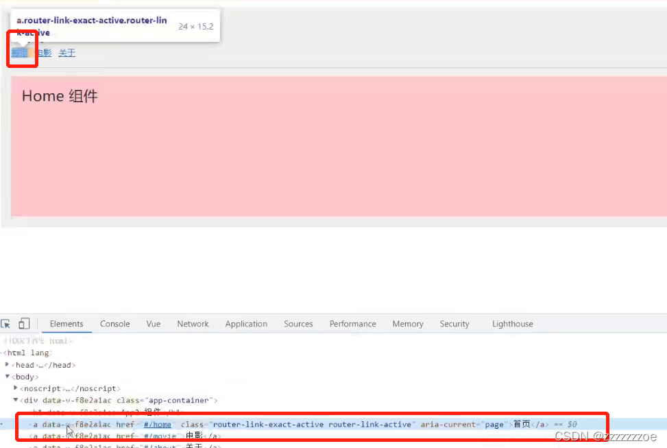

 **注意1** ：在 hash 地址中， / 后面的参数项，叫做“路径参数” 。

在路由“参数对象”中，需要使用 this.$route.params 来访问路径参数

 **注意2** ：在 hash 地址中，? 后面的参数项，叫做“查询参数”。

在路由“参数对象”中，需要使用 this.$route.query 来访问查询参数

 **注意3** ：在 this.$route 中，path 只是路径部分；fullPath 是完整的地址

例如：

/movie/2?name=zs&age=20 是 fullPath 的值

/movie/2 是 path 的值

## 声明路由的匹配规则

在 src/router/index.js 路由模块中，通过 routes 数组声明路由的匹配规则。示例代码如下：

```javascript
// 导入需要的组件
import Home from '@/components/Home.vue'
import Movie from '@/components/Movie.vue'
import About from '@/components/About.vue'

// 创建路由的实例对象
const router = new VueRouter({
  //在routers数组中，声明路由的配置规则
  // path表示要匹配的hash地址，component表示要展示的路由组件
  routes: [
    //#不写了，下面这是规定的简便写法
    { path: '/home', component: Home },
    { path: '/movie', component: Movie },
    { path: '/about', component: About}
  ]
})
```

这样的对应关系叫路由规则。会根据Hash地址进行从上至下的匹配过程。

# vue-router的常见用法

## 路由重定向

路由重定向指的是：用户在访问地址 A 的时候，强制用户跳转到地址 C ，从而展示特定的组件页面。 通过路由规则的 redirect 属性，指定一个新的路由地址，可以很方便地设置路由的重定向：

```javascript
const router = new VueRoutre({
//在routers数组中声明路由的匹配规则
routers: [
  //当用户访问'/'的时候，通过redirect属性跳转到'/home'对应的路由规则
 { path: '/', redirect: '/home' },
 { path: '/home', component: Home },
 { path: '/movie', component: Movie },
 { path: '/about', component: About }
] 
})
```

## 嵌套路由

通过路由实现组件的嵌套展示，叫做嵌套路由。

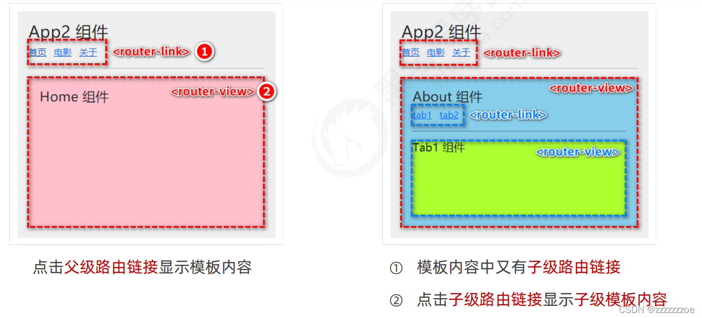

### 声明子路由链接和子路由占位符

在 About.vue 组件中，声明 tab1 和 tab2 的子路由链接以及子路由占位符。示例代码如下：

```html
<template>
  <div class="about-container">
    <h3>About 组件</h3>

    <!-- 子级路由链接 -->
    <router-link to="/about/tab1">tab1</router-link>
    <router-link to="/about/tab2">tab2</router-link>

    <hr />

    <!-- 子级路由占位符 -->
    <router-view></router-view>
  </div>
</template>
```

在展示About组件的时候展示Tab1或者Tab2组件，所以在About组件中加路由链接和要展示的子组件实例。

### 通过 children 属性声明子路由规则

在 src/router/index.js 路由模块中，导入需要的组件，并使用 children 属性声明子路由规则：

```javascript
//导入需要的组件
import Tab1 from '@/components/tabs/Tab1.vue'
import Tab2 from '@/components/tabs/Tab2.vue'

const router = new VueRouter({
  routers: [
...
  {
    //About页面的路由规则（父级路由规则）
    path: '/about',
    component: About,
    //给'/about'加个重定向
    redirect: '/about/tab1'
    children: [//1、通过children属性，嵌套声明子级路由规则
      { path: 'tab1', component: Tab1 }, //访问'/about/tab1'时，展示Tab1组件
      { path: 'tab2', component: Tab2 } //访问'/about/tab2'时，展示Tab2组件
    ]
    }
  ]
})
```

 **注意：** 子路由规则的path前面没有/

除了给父级路由规则加重定向，还可以加默认子路由。默认子路由：如果children数组中，某个路由规则的path值为空字符串，则这条路由规则叫“默认子路由”。此时就不需要redirect了。

```javascript
...
    children: [
      //默认子路由：如果children数组中，某个路由规则的path值为空字符串，则这条路由规则叫“默认子路由”。
      { path: '', component: Tab1 }, //访问'/about/tab1'和'/about'时，展示Tab1组件
      { path: 'tab2', component: Tab2 } //访问'/about/tab2'时，展示Tab2组件
    ]
```

## 路由的query参数

```html
<!-- 跳转并携带query参数，to的字符串写法 -->
<router-link :to="`/home/message/detail?id=${m.id}&title=${m.title}`">跳转</router-link>

<!-- 跳转并携带query参数，to的对象写法（推荐） -->
<router-link 
	:to="{
		path:'/home/message/detail',
		query:{
		   id: m.id,
       		   title: m.title
		}
	}"
>跳转</router-link>
```

接收参数

```js
$route.query.id
$route.query.title
```

## 路由的params参数

配置路由，声明接收 `params` 参数

```javascript
{
	path:'/home',
	component:Home,
	children:[
		{
			path:'news',
			component:News
		},
		{
			component:Message,
			children:[
				{
					name:'xiangqing',
					path:'detail/:id/:title', // 使用占位符声明接收params参数
					component:Detail
				}
			]
		}
	]
}
```

传递参数
特别注意：路由携带 `params`参数时，若使用**to**的对象写法，则**不能使用path配置项，必须使用name配置！**

```html
<!-- 跳转并携带params参数，to的字符串写法 -->
<router-link :to="/home/message/detail/666/你好">跳转</router-link>

<!-- 跳转并携带params参数，to的对象写法 -->
<router-link 
	:to="{
		name:'xiangqing',
		params:{
		   id:666,
                   title:'你好'
		}
	}"
>跳转</router-link>
12345678910111213
```

接收参数

```
$route.params.id
$route.params.title
```

## 动态路由匹配

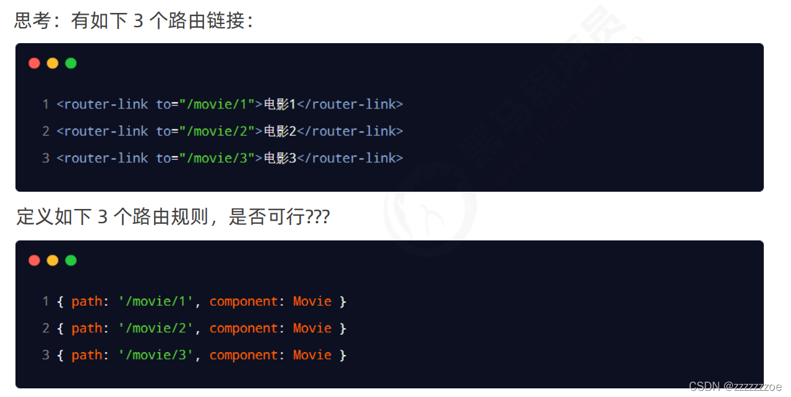

缺点：路由规则的复用性差。

### 动态路由的概念

动态路由指的是：把 Hash 地址中可变的部分定义为参数项，从而提高路由规则的复用性。

在 vue-router 中使用英文的冒号（:）来定义路由的参数项。示例代码如下：

```javascript
//路由中的动态参数以 : 进行声明，冒号后面是动态参数的名称
{ path: '/movie/:mid', component: Movie}
```

### $route.params 参数对象

在动态路由渲染出来的组件中，可以使用 this.$route.params 对象访问到动态匹配的参数值。

```html
<template>
  <div class="movie-container">
    <!-- this.$route是路由的参数对象 -->
    <h3>Movie组件 -- {{ this.$route.params.mid }}</h3>
    </div>
</template>
```


### 使用 props 接收路由参数

为了简化路由参数的获取形式，vue-router 允许在路由规则中开启 props 传参。示例代码如下：

```javascript
//index.js
//1、在定义路由规则时，声明props: true选项
//即可在movie组件中以props的形式接收到路由规则匹配到的参数项
{ 
	path: '/movie/:mid', 
	component: Movie, 
	props: true 
	 //第一种写法：props值为对象，该对象中所有的key-value的组合最终都会通过props传给Detail组件
	// props:{a:900}

	//第二种写法：props值为布尔值，为true时，则把路由收到的所有params参数通过props传给Detail组件
	// props:true

	//第三种写法：props值为函数，该函数返回的对象中每一组key-value都会通过props传给Detail组件
	props($route){
		return {
			id: $route.query.id,
			title: $route.query.title
		}
	}
}
```

```html
//Movie.vue 在对应组件中接收
<template>
<!-- 直接使用props中的中接收的路由参数 -->
  <h3>Movie组件 -- {{ mid }}</h3>
</template>

<script>
export default {
  props: ['mid'] //2、使用props接收路由规则中匹配到的参数项
}
</script>
```

这时就不用this.$route.xxx拿参数了。

补充s：

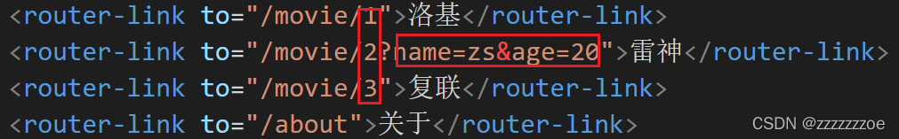

在Hash地址中，/后面的参数项（这里是 1 2 3）是路径参数。

在路由参数对象￥route中，需要使用this.$route.params来访问路径参数

在Hash地址中，?后面的参数项是查询参数，需要使用this.$route.query来访问查询参数

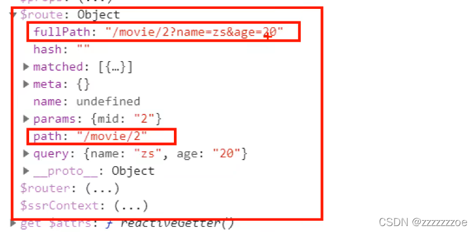

在this.$route中，path只是路径部分，fullPath是完整的地址

## 声明式导航 & 编程式导航

在浏览器中，点击链接实现导航的方式，叫做声明式导航。例如：

普通网页中点击 `<a>`链接，vue项目中点击 `<router-link>` 都属于声明式导航

在浏览器中，调用 API 方法实现导航的方式，叫做编程式导航。例如：

普通网页中调用 location.href 跳转到新页面的方式，属于编程式导航

### vue-router 中的编程式导航 API

vue-router 提供了许多编程式导航的 API，其中最常用的导航 API 分别是：

1. this.$router.push('hash 地址')：跳转到指定 hash 地址，并增加一条历史记录
2. this.$router.replace('hash 地址')：跳转到指定的 hash 地址，并替换掉当前的历史记录
3. this.$router.go(数值 n)：实现导航历史前进、后退

### $router.push

调用 this.$router.push() 方法，可以跳转到指定的 hash 地址，从而展示对应的组件页面。示例代码如下：

```html
<template>
  <div class="home-container">
    <h3>Home组件</h3>
    <hr />
    <button @click="gotoLK">通过push跳转到“洛基”页面</button>
  </div>
</template>

<script>
export default {
  name: 'Home',
  methods: {
    gotoLK(){
      //通过编程式导航API，导航跳转到指定的页面
      this.$router.push('/movie/1')
    }
  }
}
</script>
```

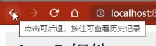

### $router.replace

调用 this.$router.replace() 方法，可以跳转到指定的 hash 地址，从而展示对应的组件页面。示例代码如下：

```html
<template>
  <div class="home-container">
    <h3>Home组件</h3>
    <hr />
    <button @click="gotoLK2">通过replace跳转到“洛基”页面</button>
  </div>
</template>

<script>
export default {
  name: 'Home',
  methods: {
    gotoLK2(){
      //通过编程式导航API，导航跳转到指定的页面
      this.$router.replace('/movie/1')
    }
  }
}
</script>
```

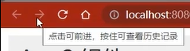

push 和 replace 的区别：

1. push 会增加一条历史记录；
2. replace 不会增加历史记录，而是替换掉当前的历史记录。

### $router.go

调用 this.$router.go() 方法，可以在浏览历史中前进和后退。示例代码如下：

```html
<template>
  <div class="home-container">
    <h3>Home组件</h3>
    <hr />
    <button @click="goback">后退</button>
  </div>
</template>

<script>
export default {
  name: 'Home',
  methods: {
    goback(){
      //通过编程式导航API，导航跳转到指定的页面
      this.$router.go(-1)}}
}
</script>


```

go的参数代表前进或后退的步数（正数为前进，负数为后退）。

### $router.go 的简化用法

在实际开发中，一般只会前进和后退一层页面。因此 vue-router 提供了如下两个便捷方法：

1. $router.back()：在历史记录中，后退到上一个页面
2. $router.forward()：在历史记录中，前进到下一个页面

```java
 <button @click="$router.forward">前进</button>
 <button @click="$router.back">后退</button>
```

注：在行内使用编程式导航跳转的时候，this要省略，否则会报错。

## 导航守卫

导航守卫可以控制路由的访问权限。示意图如下：

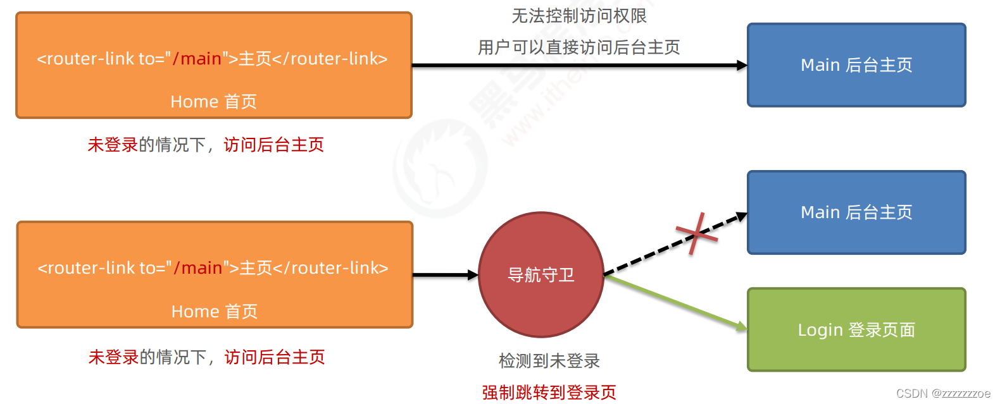

提供安全机制

### 全局守卫

每次发生路由的导航跳转时，都会触发全局前置守卫。因此，在全局前置守卫中，程序员可以对每个路由进行访问权限的控制：

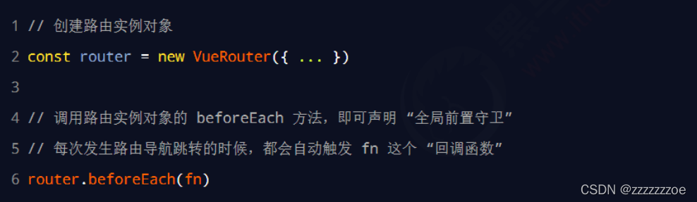

```js
// 全局前置守卫：初始化时、每次路由切换前执行
router.beforeEach((to,from,next) => {
	console.log('beforeEach',to,from)
	if(to.meta.isAuth){ // 判断当前路由是否需要进行权限控制
		if(localStorage.getItem('school') === 'atguigu'){ // 权限控制的具体规则
			next()	// 放行
		}else{
			alert('暂无权限查看')
		}
	}else{
		next()	// 放行
	}
})

// 全局后置守卫：初始化时、每次路由切换后执行
router.afterEach((to,from) => {
	console.log('afterEach',to,from)
	if(to.meta.title){ 
		document.title = to.meta.title //修改网页的title
	}else{
		document.title = 'vue_test'
	}
})
```

### 独享守卫

在单个路由的配置项后面添加

```js
const router = new VueRouter({
  routes: [
    {
      path: '/foo',
      component: Foo,
      beforeEnter: (to, from, next) => {
        // ...
      }
    }
  ]
})

```

### 组件内守卫

```javascript
const Foo = {
  template: `...`,
  beforeRouteEnter(to, from, next) {
    // 不能获取组件实例 
    // 因为当守卫执行前，组件实例还没被创建
  }

```


### 守卫方法的 3 个形参

全局前置守卫的回调函数中接收 3 个形参，格式为：

```javascript
//创建路由的实例对象
const router = new VueRouter({...})

//为router实例对象，声明全局前置导航守卫
//只要发生了路由的跳转，必然会触发beforeEach指定的function回调函数
router.beforeEach((to, from, next)=>{
//to是将要访问的路由的信息对象
//from是将要离开的路由的信息对象
//next是一个函数，调用next()表示放行，允许这次路由导航
next(); //next函数表示放行的意思
})

export default router
```

### next 函数的 3 种调用方式

参考示意图，分析 next 函数的 3 种调用方式最终导致的结果：

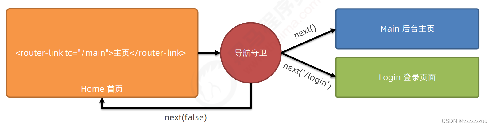

当前用户拥有后台主页的访问权限，直接放行：next()

当前用户没有后台主页的访问权限，强制其跳转到登录页面：next('/login')

当前用户没有后台主页的访问权限，不允许跳转到后台主页：next(false)

小案例

```js
router.beforeEach((to, from, next) => {
  if (to.path === '/login') {
    next()
    return 
  }
  let adminInfo = store.state.adminInfo
  if (JSON.stringify(adminInfo) == '{}' ) {
    next('/login')
    return
  }
  if ((to.path === '/home' || to.path === '/person' || to.path === '/Visualization')) {
    next()
    return
  }else if (!adminInfo.permissions.find(p => p.permissionsPath === to.path)){
    next('/404')
  }else {
    next()
  }
})

```
