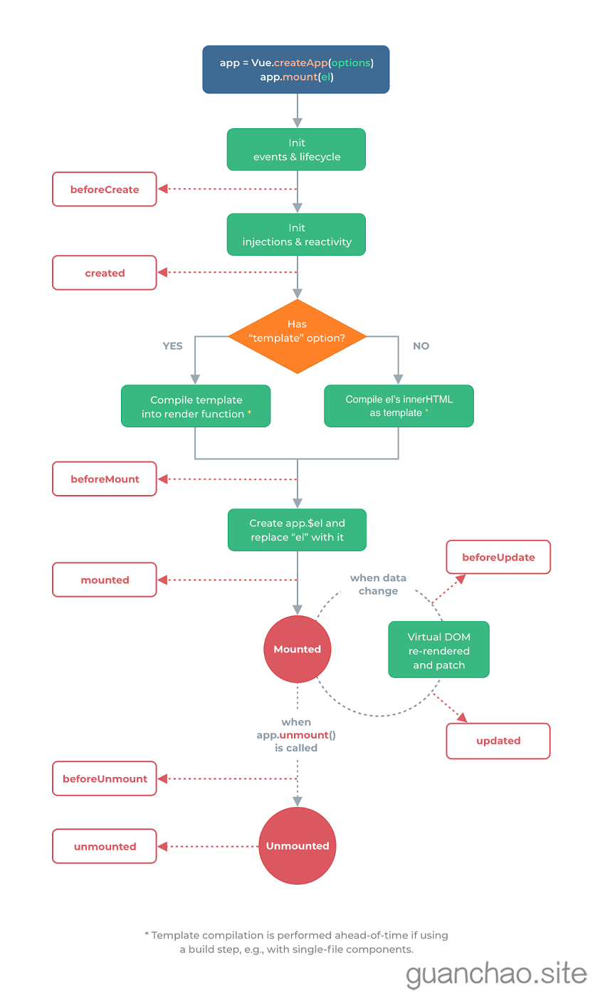

# 生命周期



* **Vue3.0中可以继续使用Vue2.x中的生命周期钩子** ，但有有两个被更名：
* beforeDestroy改名为 beforeUnmount
* destroyed（销毁）改名为 unmounted（卸载）
* Vue3.0也提供了 Composition API 形式的生命周期钩子，与Vue2.x中钩子对应关系如下：
  * beforeCreate===>setup()
  * created===>setup()
  * beforeMount == = > onBeforeMount
  * mounted => onMounted
  * beforeUpdate= == >onBeforeUpdate
  * updated = == == >onUpdated
  * beforeUnmount == >onBeforeUnmount
  * unmounted ===>onUnmounted

```html
<script>
    export default = {
        // 直接写在配置项中 仍可使用
        beforeCreate(){

        },
        created(){

        },
	beforeMount(){
    
        },
        mounted(){
    
        },
        beforeUpdate(){
    
        },
        updated(){
    
        },
        // destory 改名为 unmount
        beforeUnmount(){
    
        },
        unmounted(){
    
        }
    }
</script>
```

```js
<script>
    import {onBeforeMount,onMounted,onBeforeUpdate,onUpdated,onBeforeUnmount,onUnmounted} from 'vue'
    export default = {
        setup(){
            // 直接在 setup中设置也可
            onBeforeMount(()=>{
                // 函数体
            })
            onMounted(()=>{
                // 函数体
            })
            onBeforeUpdate(()=>{
                // 函数体
            })
            onUpdated(()=>{
                // 函数体
            })
            onBeforeUnmount(()=>{
                // 函数体
            })
            onUnmounted(()=>{
                // 函数体
            })

        }
    }
</script>
```
