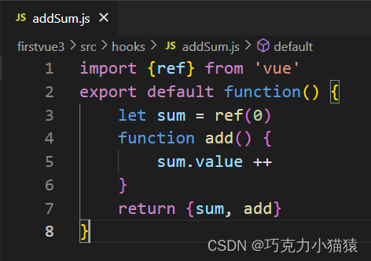
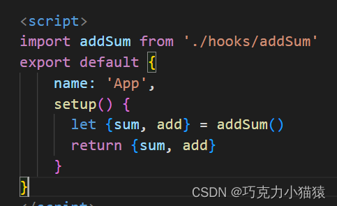

# 自定义hook函数(类似 Vue2 minxin)

* 什么是hook？—— 本质是一个函数，把setup函数中使用的Composition API进行了封装。
* 类似于vue2.x中的mixin。
* 自定义hook的优势: 复用代码, 让setup中的逻辑更清楚易懂。

```js
let point = reactive({
    x:0,
    y:0,
})

function savePoint(event){
    point.x = event.pageX
    point.y = event.pageY
    console.log(event.pageX,event.pageY)
}

onMounted(()=>{
    window.addEventListener('click',savePoint)
})
onBeforeUnmount(()=>{
    window.removeEventListener('click',savePoint)
})
```

在 src 文件夹下 新建 hook文件夹

**新建 usePoint.js**

```js
// usePoint.js
import {reactive,onMounted,onBeforeUnmount} from 'vue'
// 需要混入的功能放入一个函数中
export default = function(){
    let point = reactive({
        x:0,
        y:0,
    })

    function savePoint(event){
        point.x = event.pageX
        point.y = event.pageY
        console.log(event.pageX,event.pageY)
    }

    onMounted(()=>{
        window.addEventListener('click',savePoint)
    })
    onBeforeUnmount(()=>{
        window.removeEventListener('click',savePoint)
    })
  
    // 需要用到的数据返回
    return point
}
```

```js
// 在其他 .vue 文件中的使用
import usePoint from '../hooks/usePoint'

const point = usePoint()

return {point}
```


