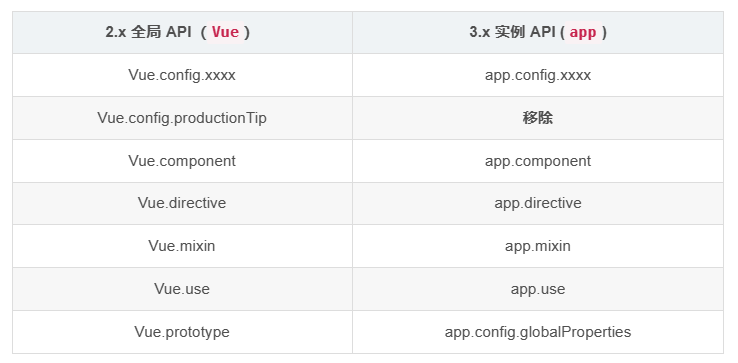

# 其他

## 全局API转移

Vue 2.x 有许多全局 API 和配置。

* 例如：注册全局组件、注册全局指令等。
  ```js
  //注册全局组件
  Vue.component('MyButton', {
    data: () => ({
      count: 0
    }),
    template: '<button @click="count++">Clicked {{ count }} times.</button>'
  })

  //注册全局指令
  Vue.directive('focus', {
    inserted: el => el.focus()
  }
  ```
* Vue3.0中对这些API做出了调整：
  * 将全局的API，即：`Vue.xxx`调整到应用实例（`app`）上



```js
// vue3 可以识别 是执行 build 还是 serve 所以移除了 config.production
```

## 其他改变

* data选项应始终被声明为一个函数。
* 过度类名的更改：
  * Vue2.x写法
    ```css
    .v-enter,
    .v-leave-to {
        opacity: 0;
    }
    .v-leave,
    .v-enter-to {
        opacity: 1;
    }
    ```
  * Vue3.x写法
    ```css
    .v-enter-from,
    .v-leave-to {
      opacity: 0;
    }

    .v-leave-from,
    .v-enter-to {
      opacity: 1;
    }
    ```
* **移除**keyCode作为 v-on 的修饰符，同时也不再支持 `config.keyCodes`
* **移除** `v-on.native`修饰符
  * 父组件中绑定事件
    ```html
    <my-component
      v-on:close="handleComponentEvent"
      v-on:click="handleNativeClickEvent"
    />
    ```
  * 子组件中声明自定义事件
    ```html
    <script>
        export default {
            // 声明的事件为自定义事件 其余为原生事件
            emits: ['close']
        }
    </script>
    ```
* **移除**过滤器（filter）
  * 过滤器虽然这看起来很方便，但它需要一个自定义语法，打破大括号内表达式是 “只是 JavaScript” 的假设，这不仅有学习成本，而且有实现成本！建议用方法调用或计算属性去替换过滤器。
