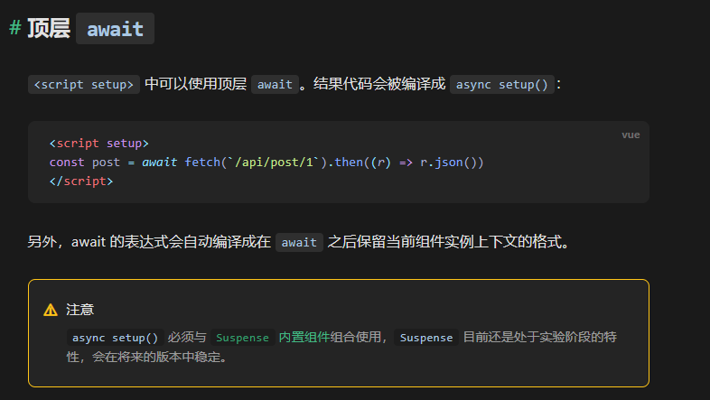

## 新的组件

### Fragment  碎片

* 在Vue2中: 组件必须有一个根标签
* 在Vue3中: 组件可以没有根标签, 内部会将多个标签包含在一个Fragment虚拟元素中
* 好处: 减少标签层级, 减小内存占用

```js
// Fragment 类似于wx小程序 的 block组件
```

```html
<template>
<!--Vue3支持无根标签实际上是 自动添加一层根Fragment在虚拟DOM中使用 在渲染真实DOM是会删除 提高渲染速度-->
<Fragment>
    <h3>hello</h3>
    <h3>hello</h3>
    <h3>hello</h3>
    <h3>hello</h3>
    </Fragment>
</template>
```

### Teleport  瞬移

* 什么是Teleport？—— `Teleport` 是一种能够将我们的**组件html结构**移动到指定位置的技术。

```html
<!-- teleport包裹的Html不会在当前组件中渲染 会传送到 to 参数指定的位置 -->
<!-- to 支持的写法 #app body css选择器 html标签 -->
<teleport to="移动位置">
    <div v-if="isShow" class="mask">
        <div class="dialog">
            <h3>我是一个弹窗</h3>
            <button @click="isShow = false">关闭弹窗</button>
        </div>
    </div>
</teleport>
```

### Suspense（试验阶段）  悬念

* 等待异步组件时渲染一些额外内容，让应用有更好的用户体验
* 使用步骤：
  * 异步引入组件
    ```js
    import {defineAsyncComponent} from 'vue'
    // 异步/动态 引入组件
    const Child = defineAsyncComponent(()=>import('./components/Child.vue'))
    ```
  * 使用 `Suspense`包裹组件，并配置好 `default`与 `fallback`
    ```html
    <template>
        <div class="app">
            <h3>我是App组件</h3>
            <!-- Suspense 内部存在两个插槽 -->
            <!-- default 当其中的数据准备完毕后进行加载 -->
            <!-- fallback 当default中的数据未准备完毕时展示 -->
            <Suspense>
                <template v-slot:default>
                    <Child/>
                </template>
                <template v-slot:fallback>
                    <h3>加载中.....</h3>
                </template>
            </Suspense>
        </div>
    </template>
    ```

```js
/*
静态引入： 当最内层组件（最后渲染的组件）全部准备完毕后  再进行渲染

动态引入： 无需等待最后加载完毕再渲染  准备好哪个渲染哪个
使用动态引入的组件时
组件内部可以返回promise实例对象

出现动态加载的原因
1.网速慢
2.使用异步Promise返回数据
*/
```


