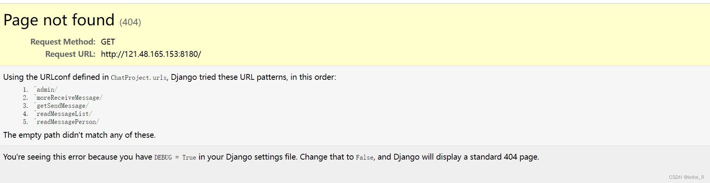

# 什么是代理？

代理就是通过一个特定的网络服务去访问另一网络服务的一种间接访问方式。就像我们访问国外网站使用VPN一样，同样也是使用了代理。可以理解为前端访问一个服务器地址（出现了跨域），而代理就相当于一个中间的地址转换，让前端不直接访问服务器，而是通过代理的中间转换来访问服务器地址，从而解决跨域问题。代理的出现就是为了解决跨域问题。

## vue配置代理

```javascript
module.exports = {
  // 其他配置
  ...... 
  // 代理配置
  devServer: {
    https: true, // 默认是false, 默认就是http协议，true将http协议转换为https协议
    // 代理配置
    proxy: {
      '/api': { // 配置需要代理的路径 --> 这里的意思是代理http://localhost:80/api/后的所有路由
        target: 'https://172.20.9.153:8085', // 目标地址 --> 服务器地址
        changeOrigin: true, // 允许跨域
        ws: true,  // 允许websocket代理
        // 如果这里没有进行路径重写，当你访问http://localhost:80/api/login/,实际上访问的就是https://172.20.9.153:8085/api/login/
        pathRewrite: { // 重写代理路径
          // 就是把路径中的api都替换为空的字符串
          '^/api': '', // 因为服务端地址里面是没有api字段的，api只是为了区别需要代理的路径，如果服务端有api字段则不需要重新
        }
      }
    }
  }
}
```

## 2.vite配置代理

```javascript
export default defineConfig({
   // 其他配置
  ...... 
  // 代理配置
  server: {
  	https: true,
    proxy: {
      '/api': { // 配置需要代理的路径 --> 这里的意思是代理http://localhost:80/api/后的所有路由
        target: 'https://172.20.9.153:8085', // 目标地址 --> 服务器地址
        changeOrigin: true, // 允许跨域
        ws: true,  // 允许websocket代理
		// 重写路径 --> 作用与vue配置pathRewrite作用相同
        rewrite: (path) => path.replace(/^\/api/, "")
      }
     },
  },
});
```

注意：配置代理的时候'/api'如果直接写成‘ /’,这样表示http://localhost:80/后面的路由都进行代理，这样会导致你加载本地资源会出错，因为你把加载本地资源的路径全部都代理到服务端去了，浏览器会向服务器进行资源请求，这样就会导致页面报错，如以下错误：


