# 前端工程化

## 现代化前端编程

模块化（**js**的模块化、CSS的模块化、资源的模块化）

组件化（复用现有的**UI** **结构、样式** 、行为）

规范化（目录结构的划分、编码规范化、接口规范化、文档规范化、Git分支管理）

自动化（自动化构建、自动部署、自动化测试）

## 前端工程化

是指：在企业级的前端项目开发中，把前端开发所需的工具、技术、流程、经验等进行规范化、标准化。

企业中的Vue项目和React项目都是基于工程化的方式进行开发的。

优点：前端开发自成体系，有一套标准的开发方案和流程。

## 前端工程化的解决方案

目前主流的前端工程化解决方案：

**webpack ( [🔗：webpack中文文档](https://www.webpackjs.com/ "🔗：webpack中文文档") )**

parcel ( [🔗：parcel中文网](https://zh.parceljs.org/ "🔗：parcel中文网") )

# webpack的基本使用

## 什么是webpack

概念：webpack是前端项目工程化的具体解决方案。

主要功能：提供了友好的前端模块化开发支持，以及代码压缩混淆（减小体积）、处理浏览器端JavaScript的兼容性（将高级的代码转换成低级的没有兼容问题的代码，有对应不同版本的解决方案）、性能优化等强大的功能。

优点：让程序员把工作的重心放在具体功能的实现上，提高了前端开发效率和项目的可维护性。

目前Vue, React等前端项目，基本上都是基于webpack进行工程化开发的。

## webpack的使用实践——创建列表隔行变色项目

（发现问题，解决问题）

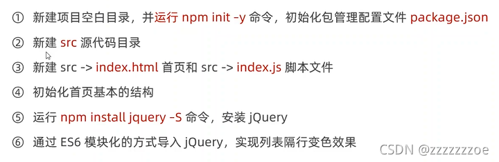

-S等价于--save

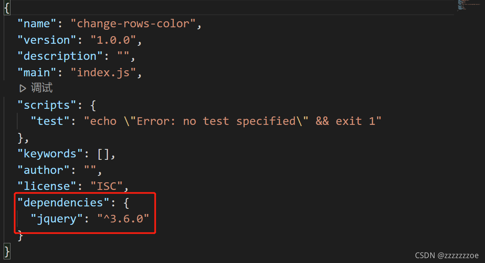

jquery安装完成后package.json中的依赖
dependencies里装的是开发和上线阶段都要使用的包

```html
<!DOCTYPE html>
<html lang="en">

<head>
    <meta charset="UTF-8">
    <meta http-equiv="X-UA-Compatible" content="IE=edge">
    <meta name="viewport" content="width=device-width, initial-scale=1.0">
    <title>Document</title>
    <script src="./index.js"></script>
</head>

<body>
    <ul>
        <li>这是第1个li</li>
        <li>这是第2个li</li>
        <li>这是第3个li</li>
        <li>这是第4个li</li>
        <li>这是第5个li</li>
        <li>这是第6个li</li>
        <li>这是第7个li</li>
        <li>这是第8个li</li>
        <li>这是第9个li</li>
    </ul>
</body>

</html>
```

```javascript
/*
*index.js
*/
// 1、使用ES6导入语法，导入jquery
import $ from 'jquery'

// 2、定义jquery的入口函数
$(function () {
    // 实现奇偶行变色
    $('li:odd').css('background-color', 'red')
    $('li:even').css('background-color', 'pink')
})
```

打开浏览器报语法错，效果未实现 ：

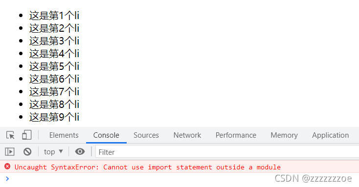

此时使用webpack解决这个问题

## 在项目中安装webpack


-D等价于 --save-dev 指将这两个包记录在devDependencies节点下

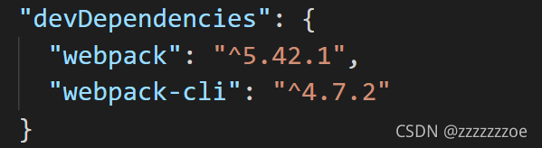

只在开发阶段要使用的包

## 在项目中配置webpack

（1）在项目根目录中，创建名为webpack.config.js的webpack配置文件，并初始化如下的基本配置：

```javascript
// 使用node.js中的导出语法，向外导出一个webpack的配置对象
module.exports = {
    // 代表webpack的运行模式，有 development 和 production
    mode: 'development'
}
```

production模式（需要重新运行脚本）会把文件压缩（webpack的功能之一） 。体积减小，打包时间增长

*开发阶段使用development 追求打包速度快；发布上线阶段使用production 追求打包体积小

（2）在package.json的script节点下，新增dev脚本如下：

```javascript
  "scripts": {
    "dev": "webpack"
  },
```

script节点下的脚本，可以通过 npm run 执行 例如 npm run dev

此时真正执行的命令是 "webpack"

在运行webpack之前，会先读取根目录下webpack.config.js这个配置文件，拿到配置文件中向外导出的配置选项mode

（3）在终端中运行 npm run dev 命令，启动webpack进行项目的打包构建

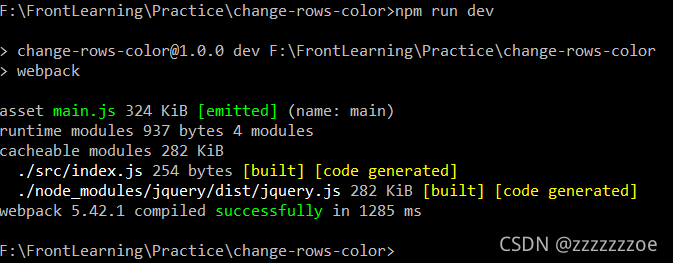

asset代表webpack处理后生成的资源 main.js 默认放在dist目录下。下面两个路径是main.js包含的代码文件

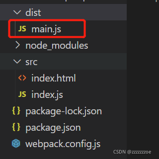

webpack在目录中生成dist文件夹，其下的main.js是index.js解决了兼容性问题后的版本

index.html引入main.js就没有兼容性问题了

```html
    <!-- <script src="./index.js"></script> -->
    <script src="../dist/main.js"></script>
```

 再打开浏览器

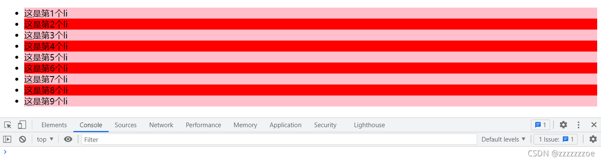

**一些小总结：**

### mode的可选值

（1）development

开发环境

不会对打包生成的文件进行代码压缩和性能优化

打包速度快，适合在开发阶段使用

（2）production

生产环境

会对打包生成的文件进行代码压缩和性能优化

打包速度很慢，仅适合在项目发布阶段使用

### webpack.config.js文件的作用

是webpack的配置文件。webpack在真正开始打包构建之前，会读取这个配置文件（拿到向外导出的配置选项），从而基于给定的配置，对项目进行打包。

注意：由于webpack是基于node.js开发出来的打包工具，因此在它的配置文件中，支持使用node.js相关的语法和模块进行webpack的个性化配置。

### webpack中的默认约定

在webpack 4.x和5.x的版本中有如下默认约定：

（1）默认的入口打包文件为 src -> index.js （没有会报错）

（2）默认的输出文件路径为 dist -> main.js

注意：可以在webpack.config.js中修改打包的默认约定

### 自定义打包的入口和出口

在webpack.config.js配置文件中，通过entry节点指定打包的入口。通过output节点指定打包的出口。示例代码：

```javascript
const path=require('path')//导入node.js中专门操作路径的模块


module.exports = {
    entry:path.join(__dirname,'./src/index.js'),//打包入口文件的路径
    output:{
        path:path.join(__dirname,'./dist'),//输出文件的存放路径
        filename:'bundle.js'//输出文件的名称
    }
}
```

* __dirname代表当前文件的存放路径
* 记得index.html中引用的js文件路径也要跟着改变

```html
    <!-- <script src="./index.js"></script> -->
    <!-- <script src="../dist/main.js"></script> -->
    <script src="../dist/bundle.js"></script>
```

 每次修改index.js需要重新npm run dev进行打包，页面才能展示修改后的内容，很麻烦，下面使用插件来解决

# webpack中的插件

## webpack插件的作用

通过安装和配置第三方的插件，可以拓展webpack的能力，从而使webpack用起来更方便。最常用的webpack插件有如下两个：

（1）webpack-dev-server

类似node.js阶段用到的nodemon工具

每当修改了源代码，webpack会自动进行项目的打包和构建

（2）html-webpack-plugin

webpack中的HTML插件（类似于一个模板引擎插件）

可以通过此插件自定制index.html页面中的内容

## 安装配置使用webpack-dev-server

### 安装webpack-dev-server


*该包会进入devDependencies节点中

### 配置webpack-dev-server

> （1）修改package.json -> scripts 中的dev命令如下

```javascript
"scripts": {
    "dev": "webpack serve"
  },
```

> （2）再次运行npm run dev命令，重新进行项目的打包

笔者在重新运行的时候出现报错 “ Unable to load '@webpack-cli/serve' command”：

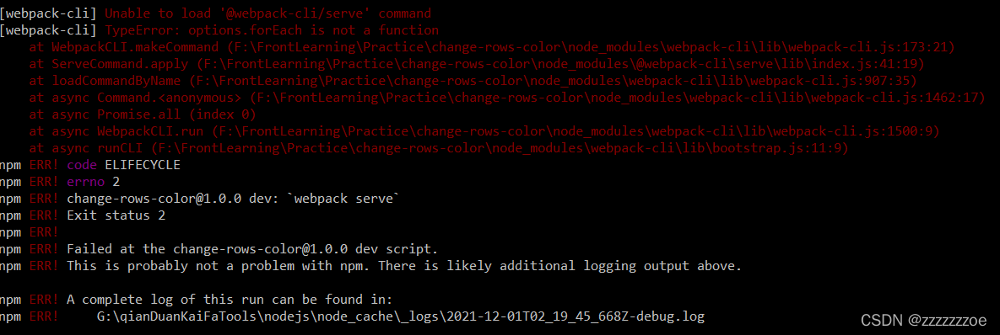

 经分析猜测是因为上文安装的脚手架webpack-cli@4.7.2已不兼容该插件，故改为安装webpack-cli@4.9.0版本（安装最新版本的命令为 "npm install webpack-cli -D" ，即不指定版本号）

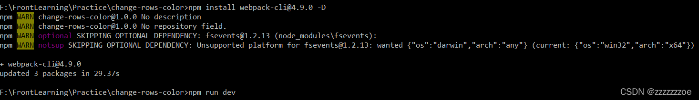

再运行npm run dev，成功

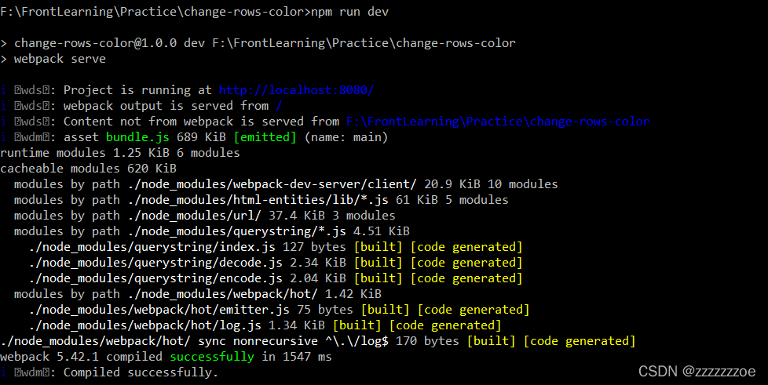

光标闪烁代表在监听代码的改动，一旦改动后保存会自动重新compile

（3）在浏览器中访问http://localhost:8080地址，查看自动打包效果

在file协议看不到修改后的页面效果，因为此时project在http服务器上运行

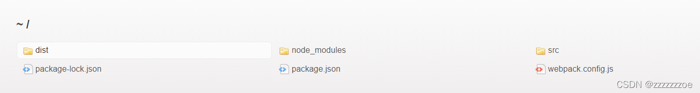

进入 src 目录，浏览器会自动展示index.html页面。此时还是未改变的页面

webpack输出文件是在根目录下的bundle.js

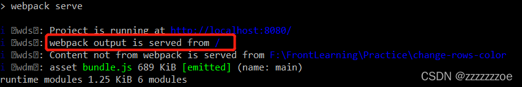

webpack-dev-server没有将输出文件放在物理磁盘上，而是放到了内存中，所以资源管理器中看不到，但是可以通过路径访问到

所以index.html应该引用内存中的输出文件

```html
<!-- <script src="../dist/bundle.js"></script> -->
    <!-- 加载和引用内存中的输出文件 -->
    <script src="/bundle.js"></script>
```

页面样式可以实时改变了 （以li: even的background-color改成了blue为例）


* odd和even的索引是从0开始的
* 结束服务“ctrl+c”按两次

 以上，文件的自动打包是由webpack+webpack-dev-server插件实现的。

但现在每次进入根目录还需要再进入src目录才能看到index.html的页面，比较麻烦。如果能复制一份index.html放到项目根目录中，就能直接打开html页面了

## 安装配置使用html-webpack-plugin

### 安装html-webpack-plugin


### 配置html-webpack-plugin

```javascript
/**
 * webpack.config.js
 */
// 1、导入html-webpack-plugin这个插件，得到插件的构造函数
const HtmlPlugin = require('html-webpack-plugin')

// 2、new构造函数，创建插件的实例对象
const htmlPlugin = new HtmlPlugin({
    // 指定要复制哪个文件
    template: './src/index.html',
    // 指定复制出来的文件名和存放路径
    filename: './index.html'
})

module.exports = {
    // 代表webpack的运行模式，有 development 和 production
    mode: 'development',
    // 3、插件的数组，将来webpack运行时会加载并调用这些插件
    plugins:[htmlPlugin]
}
```

再 npm run dev ，进入[http://localhost:8080/](http://localhost:8080/ "http://localhost:8080/") 首页，就能立即看到立即看到首页

### 解释html-webpack-plugin

1. 通过HTML插件复制到项目根目录中的index.html页面，也被放到了内存中
2. HTML插件在生成的index.html页面，自动注入了打包的bundle.js文件（即不需要手动在HTML文件里引入bundle.js）

## devServer节点

在webpack.config.js配置文件中，可以通过devServer节点对webpack-dev-server插件进行更多的配置，示例代码：

```js
/*
*webpack.config.js中的module.exporte
*/
devServer:{
        // 初次打包完成后,自动打开浏览器
        open:true,
        // 在http协议中,如果端口号是80,可以被省略(仅显示为localhost)
        port:80,
        // 指定运行的主机地址
        host:'127.0.0.1'
    }
```

# webpack中的loader

## loader概述

在实际开发中，webpack默认只能打包处理以.js后缀名结尾的模块。其他非.js后缀名结尾的模块，webpack默认处理不了，需要调用loader加载器才可以正常打包，否则会报错！

loader加载器的作用：协助webpack打包处理特定的文件模块。比如：

css-loader可以打包处理.css相关的文件

less-loader可以打包处理.less相关的文件

babel-loader可以打包处理webpack无法处理的高级js语法

## loader调用的过程

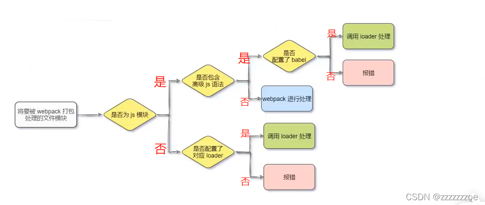

## 打包处理CSS文件

在src下新建css文件夹，css下新建index.css

```css
/* index.css */

li {
    list-style: none;
}
```

  在index.js中导入index.css

```javascript
// 导入样式(在webpack中,一切皆模块都可以通过ES6导入语法进行导入和使用)
import './css/index.css'
```

终端报错，提示需要安装合适的加载器处理此类文件

打包处理CSS文件的步骤：

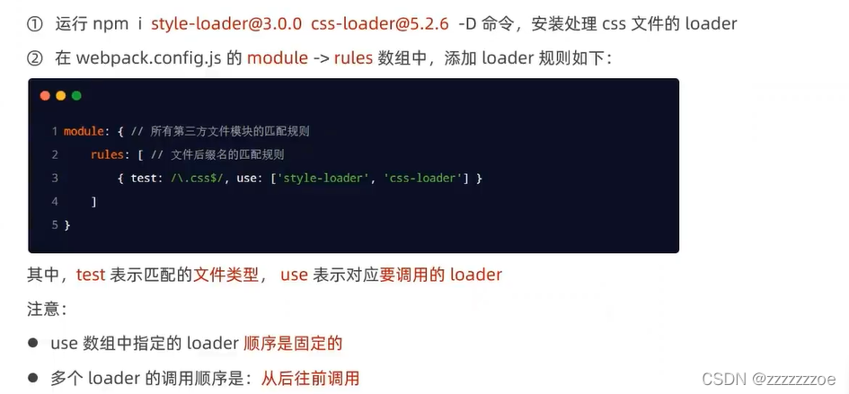

注意module和 mode 、entry、output、plugins、devServer平级

注意style-loader和css-loader顺序不能写反，因为loader在调用的时候是从后往前调的。webpack把index.css这个自己不能处理的文件，先转交给最后一个个loader（css-loader）处理，处理完后转交给前面一个loader（style-loader），直至前面没有loader了，就转交给webpack，weebpack把结果合并到 /dist/bundle.js中，最终生成打包好的文件

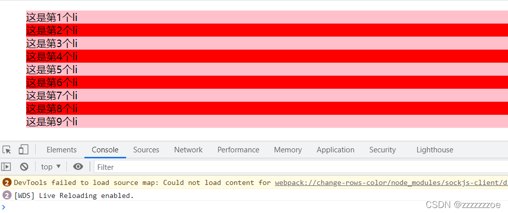

li前面的圆点没了

即，当webpack发现某个文件处理不了的时候，会查找webpack.config.js这个配置文件，看module.rules数组中，是否配置了对应的loader加载器。

## 打包处理less文件(升级版css)

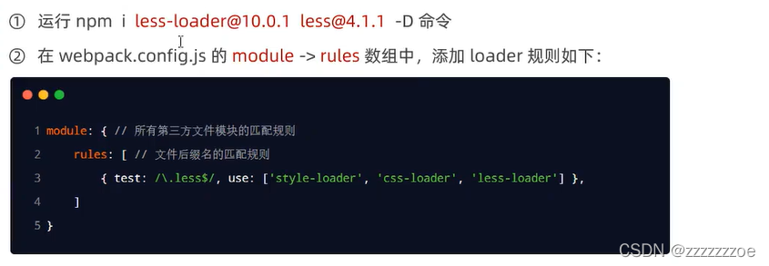

安装的less是配置依赖项，即less-loader依赖的，并没有在rules中使用

```css
// index.less
html, body, ul {
    margin: 0;
    padding: 0;
    li {
        line-height: 30px;
        padding-left: 20px;
        font-size: 12px;
    }
}
```

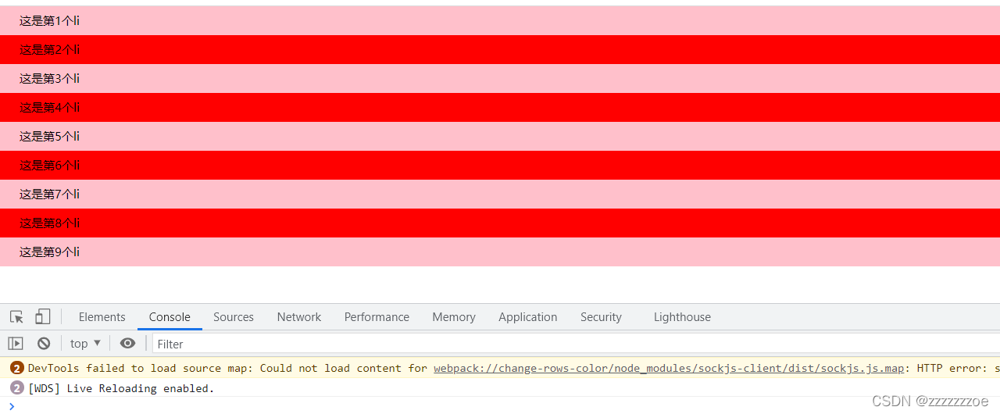

## 打包处理样式表中与url路径相关的文件

base64小复习：

使用相对路径和base64路径都能显示相同的小图片。使用base64可以防止浏览器发起不必要的请求（标签一次请求，logo.jpg又是一次请求），缺点是会稍微增加体积。所以一般图片用base64


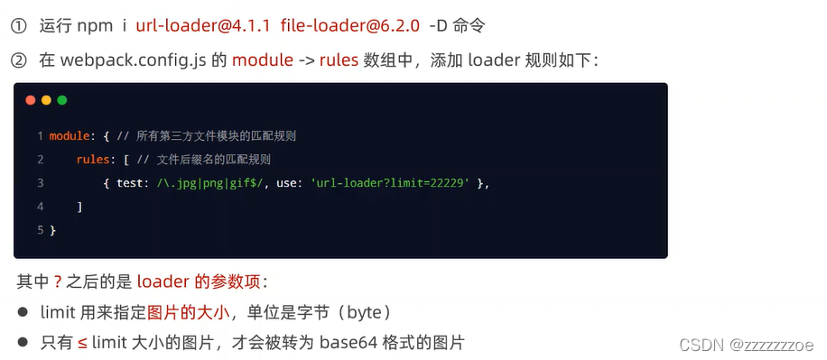

“？”用来分隔路径和参数 eg. http://xxxx/com/api/getbooks?id=0

```html
<!-- index.html -->
    <!-- 需求：把/src/iamges/logo.jpg设置给src属性 -->
    
```

```javascript
//index.js
// 1、导入图片，得到图片文件
import logo from './images/logo.jpg'

// 2、给img标签的src动态赋值
$('.box').attr('src', logo)
```

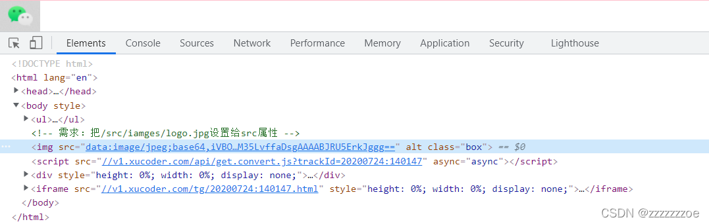

webpack处理样式的方式：

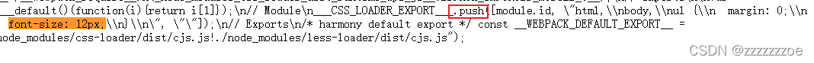

webpack处理样式的过程：

 在webpack中一切皆模块，通过import 加载过来的样式文件会被webpack转换成类似js的形式运行。如果某个模块中，接收到的成员为undefined，则没有必要进行接收，即“import xx from xx”和“import xx”的区别。

## 打包处理js文件中的高级语法

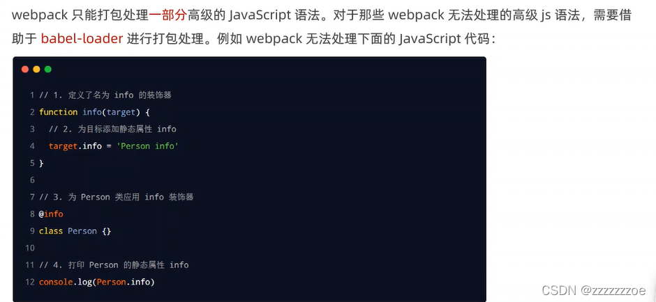

装饰器在React中使用，不理解没关系，只需知道这是个webpack无法处理的高级语法
Person类那里会有红线，是警告不建议使用不稳定的语法，非报错

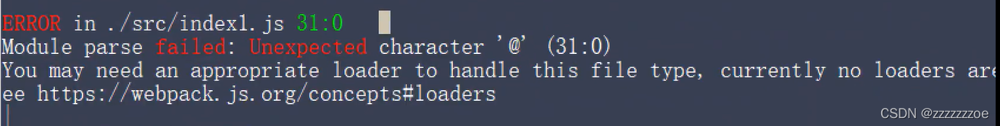

### 安装babel-loader相关的包

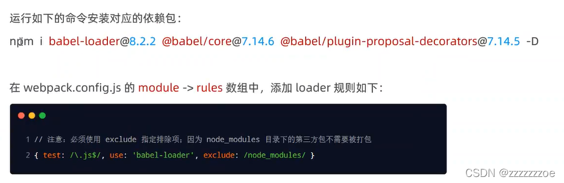

解决兼容性问题应该除去依赖包，应为只有程序员写的代码需要处理

### 配置babel-loader

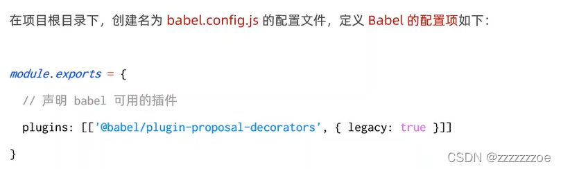

该插件官方文档🔗：[@babel/plugin-proposal-decorators · Babel](https://babeljs.io/docs/en/babel-plugin-proposal-decorators "@babel/plugin-proposal-decorators · Babel") （插件配置均可在官方文档查看粘贴）

# 打包发布

发布上线：前端将写好的项目文件打包（dist）发给后端，后端部署上线

现在需要解决的问题是：把页面（根目录下的index.html和bundle.js）生成到实际的物理磁盘上


## 配置webpack的打包发布

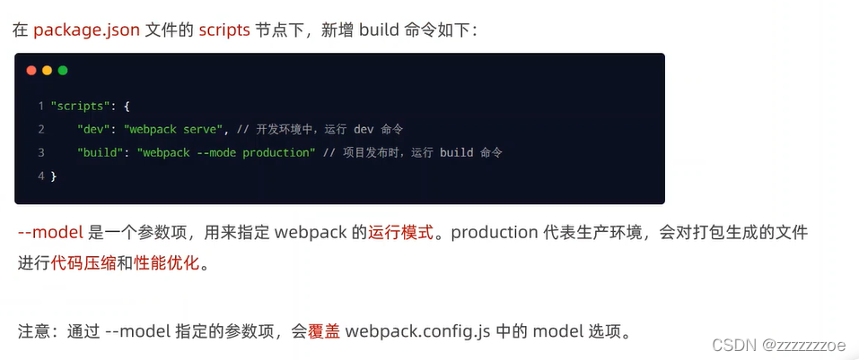

JSON里面不能写注释，别学这个

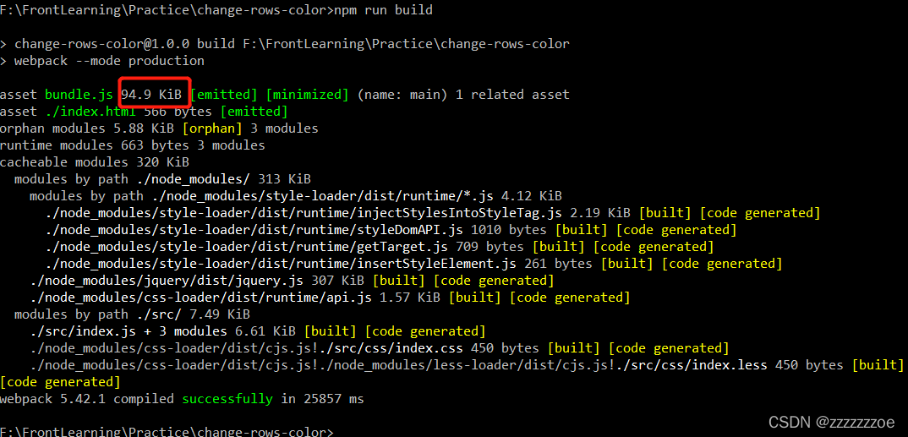

npm run build生产模式打包成功

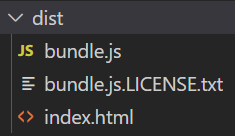

dist文件夹是打包后即时生成的，可以删去重新打包（应该说修改webpack配置后重新打包前必须要删，运行再重新生成，这样会很麻烦，下面会解决这个问题）

## 把JavaScript文件统一生成到js目录中

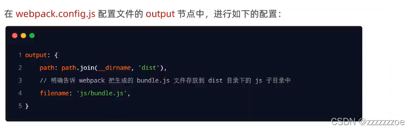

## 把图片文件统一生成到image目录中

> 修改webpack.config.js中的url-loader配置项，新增outPath选项即可指定图片文件的输出路径

```javascript
//webpack.config.js中module.rules
// 在配置url-loader的时候，多个参数用&进行分隔
{ test: /\.jpg|png|gif$/, use: 'url-loader?limit=22229&outputPath=images' },
```

## 自动清理dist目录下的旧文件

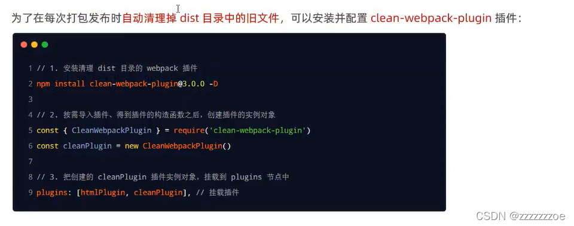

学会在npm.js官方文档查找webpack插件的安装配置方式

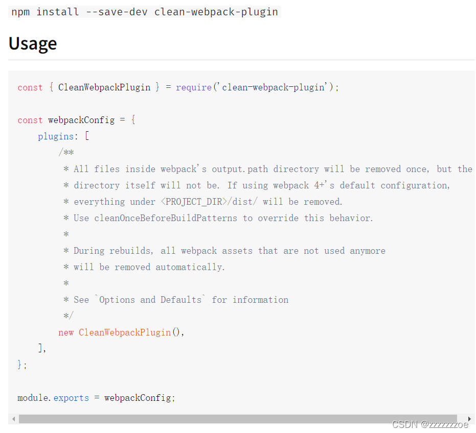

clean-webpack-plugin的安装与使用
先声明一个构造函数（左侧的花括号是解构赋值），再在plugins数组里实例化

现在npm run build时webpack会自动先删除旧的dist再生成新的dist

# Source Map

## 什么是Source Map

 Source Map是一个信息文件，里面存储着位置信息。即Source Map存储着压缩混淆后的代码，所对应的转换前的位置。有了它，出错的时候，除错工具将直接显示原始代码，而不是转换后的代码，能极大的方便后期的调试

eg. 控制台的报错行是bundle.js打包后的行数，要转为原始index.js的行数

## webpack开发环境下的Source Map

开发环境下，webpack默认启用了Source Map功能。当程序运行出错时，可以直接在控制台提示错误行的位置，并定位到具体的源代码

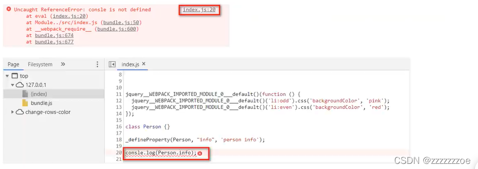

## 默认Source Map的问题

开发环境下生成的Source Map ，记录的是生成后代码的位置，会导致运行时报错的行数和源代码行数不一致的问题，示例如下：


## 解决默认Source Map的问题

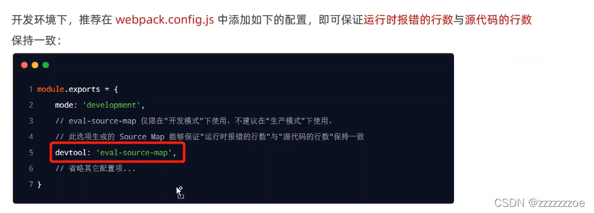

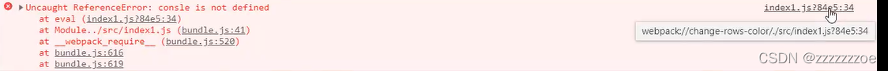

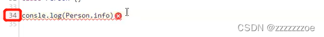

## webpack生产环境下的Source Map

在生产环境下，如果省略了devtool选项，则最终生成的文件中不包含Source Map，这能够防止源代码通过Source Map的形式暴露给别有所图之人

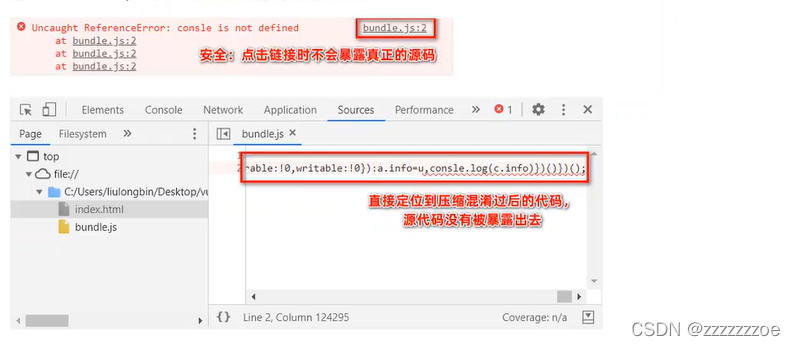

### 只定位行数不暴露源码

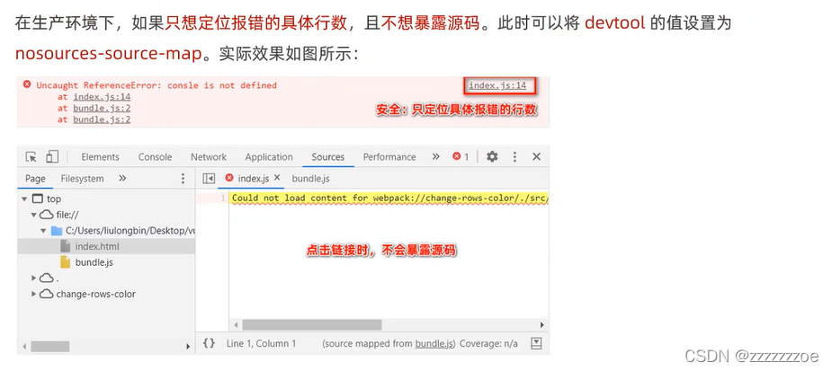

### 定位行数且暴露源码

 （不推荐）

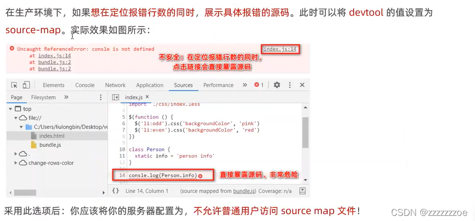

## Source Map的最佳实践

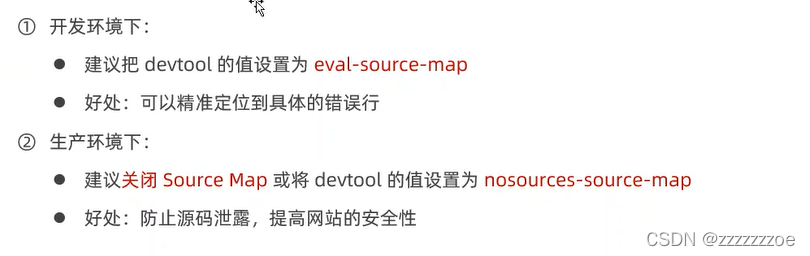

以上，介绍了webpack的一些配置，可以看到是比较复杂容易出错的，在实际开发中往往借助命令行工具（俗称CLI）一键生成带有webpack的项目，不需要自己配置，开箱即用，所有的webpack配置项都是现成的(可以在脚手架上进行二次配置)。但以上实操并不是无用功，了解一些基础原理有助于更好地理解项目打包，以及遇到一些报错时能够知道原因。

**补充：**

在import导入文件的时候建议使用 @ 表示源代码目录，从外往里查找 不要使用../从里往外查找。但在使用前需要配置webpack

```javascript

/**
     * webpack.config.js 与module平齐
     */
    resolve: {
        alias: {
            // 告诉webpack，程序员写的代码中，@符号表示src这一层目录
            '@': path.join(__dirname, './src/')
        }
    }
```

这样可以用 “import msg from '@/msg.js' ”代替“import msg from '../../msg.js' ”

# 总结

以上学习了一些前端工程化的内容，如webpack的简单使用、webpack插件解决生产过程中的需求、项目的打包发布等等。在实际生产中其实往往并不需要手动配置webpack，可以借助脚手架或第三方前端应用框架开箱即用配置好的webpack。但通过简单了解webpack的一些概念以及常见配置，有助于更好地理解项目开发过程，以及有需求需要更改配置时知道如何下手。这即是本章学习的目的。

此章所有配置 webpack.config.js 文件代码展示：

```javascript
const path = require('path')

// 1. 导入 html-webpack-plugin 这个插件，得到插件的构造函数
const HtmlPlugin = require('html-webpack-plugin')
// 2. new 构造函数，创建插件的实例对象
const htmlPlugin = new HtmlPlugin({
  // 指定要复制哪个页面
  template: './src/index.html',
  // 指定复制出来的文件名和存放路径
  filename: './index.html'
})

// 注意：左侧的 { } 是解构赋值
const { CleanWebpackPlugin } = require('clean-webpack-plugin')

// 使用 Node.js 中的导出语法，向外导出一个 webpack 的配置对象
module.exports = {
  // 在开发调试阶段，建议大家都把 devtool 的值设置为 eval-source-map
  // devtool: 'eval-source-map',
  // 在实际发布的时候，建议大家把 devtool 的值设置为 nosources-source-map 或直接关闭 SourceMap
  devtool: 'nosources-source-map',
  // mode 代表 webpack 运行的模式，可选值有两个 development 和 production
  // 结论：开发时候一定要用 development，因为追求的是打包的速度，而不是体积；
  // 反过来，发布上线的时候一定能要用 production，因为上线追求的是体积小，而不是打包速度快！
  mode: 'development',
  // entry: '指定要处理哪个文件'
  entry: path.join(__dirname, './src/index1.js'),
  // 指定生成的文件要存放到哪里
  output: {
    // 存放的目录
    path: path.join(__dirname, 'dist'),
    // 生成的文件名
    filename: 'js/bundle.js'
  },
  // 3. 插件的数组，将来 webpack 在运行时，会加载并调用这些插件
  plugins: [htmlPlugin, new CleanWebpackPlugin()],
  devServer: {
    // 首次打包成功后，自动打开浏览器
    open: true,
    // 在 http 协议中，如果端口号是 80，则可以被省略
    port: 80,
    // 指定运行的主机地址
    host: '127.0.0.1'
  },
  module: {
    rules: [
      // 定义了不同模块对应的 loader
      { test: /\.css$/, use: ['style-loader', 'css-loader'] },
      // 处理 .less 文件的 loader
      { test: /\.less$/, use: ['style-loader', 'css-loader', 'less-loader'] },
      // 处理图片文件的 loader
      // 如果需要调用的 loader 只有一个，则只传递一个字符串也行，如果有多个loader，则必须指定数组
      // 在配置 url-loader 的时候，多个参数之间，使用 & 符号进行分隔
      { test: /\.jpg|png|gif$/, use: 'url-loader?limit=470&outputPath=images' },
      // 使用 babel-loader 处理高级的 JS 语法
      // 在配置 babel-loader 的时候，程序员只需要把自己的代码进行转换即可；一定要排除 node_modules 目录中的 JS 文件
      // 因为第三方包中的 JS 兼容性，不需要程序员关心
      { test: /\.js$/, use: 'babel-loader', exclude: /node_modules/ }
    ]
  },
  resolve: {
    alias: {
      // 告诉 webpack，程序员写的代码中，@ 符号表示 src 这一层目录
      '@': path.join(__dirname, './src/')
    }
  }
}
```


**修改默认的webpack配置**

需要在根目录中创建 vue.config.js 文件，在这个文件中修改相关配置，下面代码就是修改webpack的相关配置

```js
module.exports = {
  //=>process.env.NODE_ENV：环境变量中存储的是开发环境还是生产环境
  publicPath: process.env.NODE_ENV === 'production' &＃63; 'http://www.xxx.cn/' : '/',
  //=>outputDir
  //=>自定义目录名称，把生成的JS/CSS/图片等静态资源放置到这个目录中
  assetsDir: 'assets',
  //=>关闭生产环境下的资源映射（生产环境下不在创建xxx.js.map文件）
  productionSourceMap: false,
  //=>设置一些webpack配置项，用这些配置项和默认的配置项合并
  configureWebpack: {
      plugins: []
  },
  //=>直接去修改内置的webpack配置项
  chainWebpack: cOnfig=> {
      //=>config:原始配置信息对象
      config.module
          .rule('images')
          .use('url-loader')
          .loader('url-loader')
          .tap(optiOns=> {
              options.limit = 200 * 1024;
              return options;
          });
  },
  //=>修改webpack-dev-server配置（尤其是跨域代理）
  devServer: {
      proxy: {
          //请求地址 /user/add
          //代理地址 http://api.xxx.cn/user/add
          "/": {
              changeOrigin: true,
              target: "http://api.xxx.cn/"
          }
      }
  },
  //=>多余1核cpu时：启动并行压缩
  parallel: require('os').cpus().length > 1
}
```
