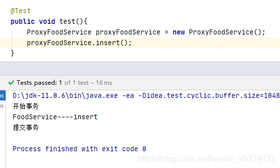
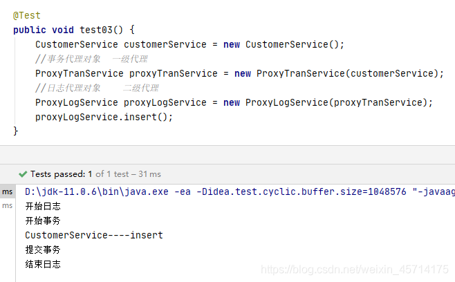
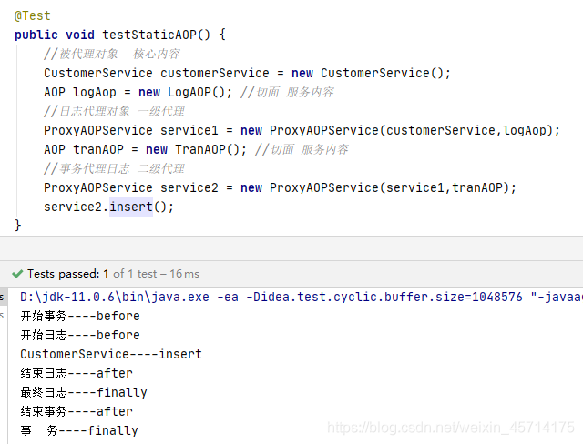

# 静态代理

## 基于类实现静态代理

**首先，编写核心业务** （被代理类）类

```java
public class FoodService{

    public void insert(){
        //核心业务
        System.out.println("FoodService----insert");
    }
}

```

**然后，编写代理类** （代理类需要继承被代理类）

```java
public class ProxyFoodService extends FoodService {

    public void insert(){
        try {
            System.out.println("开始事务");
            super.insert(); //核心业务
            System.out.println("提交事务");
        } catch (Exception e) {
            System.out.println("回滚事务");
        }
    }
}

```

看上面核心业务是继承父类的，由FoodService提供；其他 非核心的业务则在代理类中编写。



**缺点：** 一个核心业务类至少要有一个代理类来对其进行补充，这样要建很多代理类，效率低。

## 基于接口实现静态代理

**首先，编写一个接口** （与它相关的核心业务类都要实现本接口）

```java
public interface IService {

    void insert();
}

```

**然后，编写一个核心业务类** ，并实现接口

```java
public class FoodService implements IService{

    @Override
    public void insert(){
        //核心业务
        System.out.println("FoodService----insert");
    }
}

```

**然后，编写一个代理类**

```java
public class ProxyTranService implements IService {

    private IService service; //被代理对象

    public ProxyTranService(IService service) {
        this.service = service;
    }

    @Override
    public void insert() {
        try {
            System.out.println("开始事务");
            service.insert();  //核心业务是由被代理对象FoodService做，其他由代理类完成
            System.out.println("提交事务");
        } catch (Exception e) {
            System.out.println("回滚事务");
        }
    }
}

```

* 私有一个接口对象IService，这个是我们后面要被代理的对象；
* 写一个一参构造方法，当外面要创建本ProxyTranService 代理对象时，需要传递一个实现了IService接口的核心业务类才能创建代理对象；
* 本ProxyTranService 代理对象也要实现IService接口；
* 本类重写的核心方法由外部传进来的被代理对象提供，其他业务由本代理提供。



* 这里的CustomerService也是一个实现了IService接口的核心业务类；
* ProxyTranService 是一个代理事务的代理类；
* ProxyLogService是一个代理日志记录的代理类 。

**优点：** 可以实现多个核心业务类重复使用一个代理类；
**缺点：** 代理类需要实际编写代理业务代码，后面如果要改，会很不方便。

## 实现AOP静态代理

简单介绍 ：AOP是面向切面编程，我们的非核心业务可以划分为不同的切面。比如记录日志，事务管理都可以划分为一个切面。每一个切面负责好自己该负责的业务就好，能降低代码的关联，提高可复用性。

**首先，创建一个AOP接口**

根据相对于核心业务代码的位置，我们可以将服务型代码划大致分为before、after、exception、finally四种

```java
public interface AOP {

    //这些服务代码，可以基于核心代码的位置来分类
    void before();
    void after();
    void exception();
    void aopFinally();
}

```

**然后，按照需求实现AOP接口**

这是一个记录日志的切面

```java
public class LogAOP implements AOP{
    @Override
    public void before() {
        System.out.println("开始日志----before");
    }

    @Override
    public void after() {
        System.out.println("结束日志----after");
    }

    @Override
    public void exception() {
        System.out.println("异常日志----exception");
    }

    @Override
    public void aopFinally() {
        System.out.println("最终日志----finally");
    }
}

```

是一个处理事务问题的切面

```java
public class TranAOP implements AOP{

    @Override
    public void before() {
        System.out.println("开始事务----before");
    }

    @Override
    public void after() {
        System.out.println("结束事务----after");
    }

    @Override
    public void exception() {
        System.out.println("事  务----exception");
    }

    @Override
    public void aopFinally() {
        System.out.println("事  务----finally");
    }
}

```

**然后，重写代理类** （这时候我们只用编写一个代理类即可完善核心业务）

```java
public class ProxyAOPService implements IService {

    private IService service; //被代理对象
    private AOP aop; //切面

    public ProxyAOPService(IService service, AOP aop) {
        this.service = service;
        this.aop = aop;
    }

    @Override
    public void insert() {
        try {
            aop.before();
            //被代理对象干活
            service.insert();  
            aop.after();
        }catch (Exception e){
            aop.exception();
        }finally {
            aop.aopFinally();
        }
    }
}

```


