# 正则表达式

## 快速入门

```java
public class RegEx01 {
  static String content;
  static {

    try {
      BufferedReader reader = new BufferedReader(new InputStreamReader(new FileInputStream(new File("E:\\桌面\\节点.txt")),"UTF-8"));
      // byte[] bytes = new byte[10240];
      // int count;
      String str = "";
      StringBuffer stringBuffer = new StringBuffer();
      while ((str = reader.readLine()) != null) {
        stringBuffer.append(str);
      }
      content = stringBuffer.toString();
    } catch (Exception e) {
      // TODO Auto-generated catch block
      e.printStackTrace();
    }
  }

  public static void main(String[] args) {
    String content = "流行原因流行语能病毒式传播离不开体裁简洁和短视频的发展。在快节奏生活下，简洁的形式更容易被受众理解并利用。“奥利给”一词只有简单的三个字，一旦理解了其中的“梗”，便很易于传播。此外，快文化背景下的主要产物之一就是短视频，网络短视频形成了小型的互动社区，大量原创用户积极投入拍摄，创造了一个内容丰富有趣的媒介生态环境。在B站，名为“正能量语录奥利给”的18秒视频，播放量就达到了2683万，弹幕数量也达到了10.1万。“奥利给”在短视频中的传播，因有大量互动弹幕而提高了其关键词的到达率，弹幕上的“奥利给”也容易吸引观看者的注意，使观看者更有兴趣探索其含义和效仿利用这一流行语。网友有求新从众心理。“奥利给”的原身“给力”走红于2010年，在年轻人心中已经过时，网友需要更适合当下的词汇，“奥利给”便是一个很好的替代品。它更年轻有趣，满足网友追求新鲜事物的心理。同时，当网络流行语流行到一定程度时，从众心理会使人们为了追赶潮流而学习使用。“奥利给”正能量的表达方式。“奥利给”是具备正能量的流行语，各新闻媒体包容它的存在，并利用它拉近与网络人群的距离感。自媒体个人频繁使用它，不仅增强个人的人格魅力，也吸引观众关注。“冬泳怪鸽”喊出“加油，奥利给！”的时候，也是在向受众传播正能量。积极正面的流行语引导正面情绪,引领受众传播正面情感,产生积极的社会影响，可获得更多认可。 [2] 发展过程2019年，冬泳怪鸽的“加油，奥利给”以及岛市老八的“奥利给，干了兄弟们”进行创作的关于奥利给的二次创作开始流行。而后“岛市老八”在快手平台复出，继续吃播视频创作，并成为B站鬼畜中的素材，干呕声被制成音MAD。同时，岛市老八的行为赋予了“奥利给”一词新的意思，即固态排泄物。 [2]  [4] 2019年10月，“奥利给”已被广泛传播。在2020年1月1日0时50分左右央视新闻频道的《年轮2019》中，有“加油，奥利给”的语音片段。 [2] ";

    // 创建一个pattern对象，模式对象，可以理解成就是一个正则表达式
    // Pattern pattern = Pattern.compile("[0-9]+");
    // Pattern pattern = Pattern.compile("[a-zA-Z]+");
    Pattern pattern = Pattern.compile("([a-zA-Z]+)|([0-9]+)");
    // 创建一个匹配器对象，matcher按照pattern样式，到content文本中进行匹配
    // 找到就返回true，否则返回false
    Matcher matcher = pattern.matcher(content);
    // 循环匹配
    while (matcher.find()) {
      System.out.println(matcher.group(0));
    }

  }
}

class Test01 {
  public static void main(String[] args) {
    Pattern pattern = Pattern.compile("<a target=\"_blank\" title=\"(\\S*)\"");
    // 创建一个匹配器对象，matcher按照pattern样式，到content文本中进行匹配
    // 找到就返回true，否则返回false
    Matcher matcher = pattern.matcher(RegEx01.content);
    // 循环匹配
    while (matcher.find()) {
      System.out.println(matcher.group(1));
    }
  }
}

```

## 正则表达式底层实现

```java
public static void main(String[] args) {
    String content = "2010流行原因流行语能病毒式传播离127.0.0.1不开体裁简洁和短视频的发展。在快节奏生活下，简洁的形式更容易被受众理解并利用。“奥利给”一词只有简单的三个字，一旦理解了其中的“梗”，便很易于传播。此外，快文化背景下的主要产物之一就是短视频，网络短视频形成了小型的互动社区，大量原创用户积极投入拍摄，创造了一个内容丰富有趣的媒介生态环境。在B站，名为“正能量语录奥利给”的18秒视频，播放量就达到了2683万，弹幕数量也达到了10.1万。“奥利给”在短视频中的传播，因有大量互动弹幕而提高了其关键词的到达率，弹幕上的“奥利给”也容易吸引观看者的注意，使观看者更有兴趣探索其含义和效仿利用这一流行语。网友有求新从众心理。“奥利给”的原身“给力”走红于2010年，在年轻人心中已经过时，网友需要更适合当下的词汇，“奥利给”便是一个很好的替代品。它更年轻有趣，满足网友追求新鲜事物的心理。同时，当网络流行语流行到一定程度时，从众心理会使人们为了追赶潮流而学习使用。“奥利给”正能量的表达方式。“奥利给”是具备正能量的流行语，各新闻媒体包容它的存在，并利用它拉近与网络人群的距离感。自媒体个人频繁使用它，不仅增强个人的人格魅力，也吸引观众关注。“冬泳怪鸽”喊出“加油，奥利给！”的时候，也是在向受众传播正能量。积极正面的流行语引导正面情绪,引领受众传播正面情感,产生积极的社会影响，可获得更多认可。 [2] 发展过程2019年，冬泳怪鸽的“加油，奥利给”以及岛市老八的“奥利给，干了兄弟们”进行创作的关于奥利给的二次创作开始流行。而后“岛市老八”在快手平台复出，继续吃播视频创作，并成为B站鬼畜中的素材，干呕声被制成音MAD。同时，岛市老八的行为赋予了“奥利给”一词新的意思，即固态排泄物。 [2]  [4] 2019年10月，“奥利给”已被广泛传播。在2020年1月1日0时50分左右央视新闻频道的《年轮2019》中，有“加油，奥利给”的语音片段。 [2] ";

    // 1. \\d 表示一个任意的数字
    // 2. 创建模式对象[即正则表达式对象]

    // Pattern pattern1 = Pattern.compile("(\\d\\d)(\\d\\d)");
    Pattern pattern = Pattern.compile("\\d\\d\\d\\d");
    // 创建一个匹配器对象，matcher按照pattern样式，到content文本中进行匹配
    // 找到就返回true，否则返回false
    Matcher matcher = pattern.matcher(content);
    // 循环匹配
    /**
     *
     * matcher.find() 完成的任务 （考虑分组）
     * 什么是分组，比如 (\d\d)(\d\d) ,正则表达式中有() 表示分组,第1个()表示第1组,第2个()表示第2组...
     * 
     * 1. 根据指定的规则 ,定位满足规则的子字符串(比如(2010))
     * 2. 找到后，将 子字符串的开始的索引记录到 matcher对象的属性 int[] groups;
     * 2.1 groups[0] = 0 , 把该子字符串的结束的索引+1的值记录到 groups[1] = 4
     * 
     * 2.2 记录1组()匹配到的字符串 groups[2] = 0 groups[3] = 2
     * 2.3 记录2组()匹配到的字符串 groups[4] = 2 groups[5] = 4
     * 2.4.如果有更多的分组.....
     * 
     * 3. 同时记录oldLast 的值为 子字符串的结束的 索引+1的值即4, 即下次执行find时，就从4开始匹配
     *
     * matcher.group(0) 分析
     *
     * 源码:
     * public String group(int group) {
     * if (first < 0)
     * throw new IllegalStateException("No match found");
     * if (group < 0 || group > groupCount())
     * throw new IndexOutOfBoundsException("No group " + group);
     * if ((groups[group*2] == -1) || (groups[group*2+1] == -1))
     * return null;
     * return getSubSequence(groups[group * 2], groups[group * 2 + 1]).toString();
     * }
     * 1. 根据 groups[0]=0 和 groups[1]=4 的记录的位置，从content开始截取子字符串返回
     * 就是 [0,4) 包含 0 但是不包含索引为 4的位置
     *
     * 如果再次指向 find方法.仍然安上面分析来执行
     */

    while (matcher.find()) {
      // 小结
      // 1. 如果正则表达式有() 即分组
      // 2. 取出匹配的字符串规则如下
      // 3. group(0) 表示匹配到的子字符串
      // 4. group(1) 表示匹配到的子字符串的第一组字串
      // 5. group(2) 表示匹配到的子字符串的第2组字串
      // 6. ... 但是分组的数不能越界.
      System.out.println(matcher.group(0));
      // System.out.println(matcher.group(1));
    }
  }
```

## 正则表达式基本语法

默认贪婪匹配，即匹配最多的内容

元字符-转义号\\\

\\\符号说明：在我们使用正则表达式去检索某些特殊字符的时候，需要用到转义符号，否则检索不到结果，甚至会报错的。

```java
    String content = "abc$(a.bc(123( )";
    // 匹配( => \\(
    // 匹配. => \\.   否则.代表所有字符

```

### 限定符

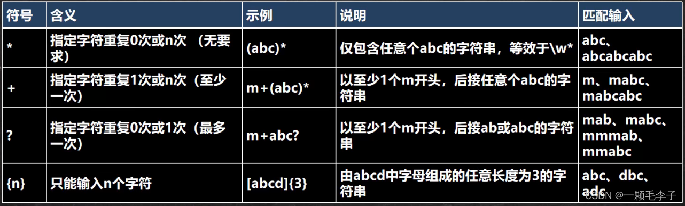
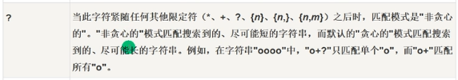
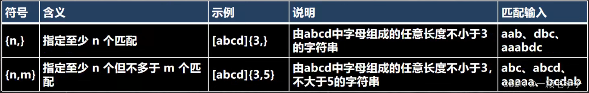

```java
public static void main(String[] args) {
    String content = "a211111aaaaaahello";

    // a{3},1{4},\\d{2}
    // String regStr = "a{3}";// 表示匹配 aaa
    // String regStr = "1{4}";// 表示匹配 1111
    // String regStr = "\\d{2}";// 表示匹配 两位的任意数字字符

    // a{3,4},1{4,5},\\d{2,5}

    // 细节：java匹配默认贪婪匹配，即尽可能匹配多的
    // String regStr = "a{3,4}"; //表示匹配 aaa 或者 aaaa
    // String regStr = "1{4,5}"; //表示匹配 1111 或者 11111
    // String regStr = "\\d{2,5}"; //匹配2位数或者3,4,5

    // 1+
    // String regStr = "1+"; //匹配一个1或者多个1
    // String regStr = "\\d+"; //匹配一个数字或者多个数字

    // 1*
    // String regStr = "1*"; //匹配0个1或者多个1

    // 演示?的使用, 遵守贪婪匹配
    String regStr = "a1?"; // 匹配 a 或者 a1
    Pattern pattern = Pattern.compile(regStr/* , Pattern.CASE_INSENSITIVE */);
    Matcher matcher = pattern.matcher(content);

    while (matcher.find()) {
      System.out.println("找到 " + matcher.group(0));
    }
  }
```

### 选择匹配符

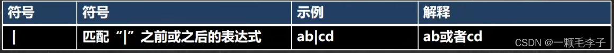

```java
    String content = "hanshunping 韩 寒冷";
    String regStr = "han|韩|寒";

    Pattern pattern = Pattern.compile(regStr/* , Pattern.CASE_INSENSITIVE */);
    Matcher matcher = pattern.matcher(content);

    while (matcher.find()) {
      System.out.println("找到 " + matcher.group(0));
    }
```

### 分组组合符

常用分组

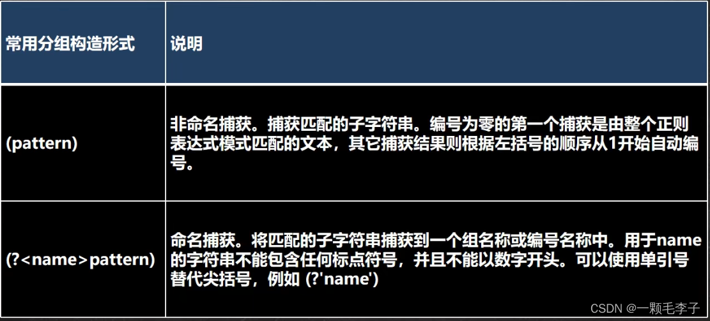

```java
public static void main(String[] args) {
    String content = "hanshunping s7789 nn1189han";

    // 下面就是非命名分组
    // 说明
    // 1. matcher.group(0) 得到匹配到的字符串
    // 2. matcher.group(1) 得到匹配到的字符串的第1个分组内容
    // 3. matcher.group(2) 得到匹配到的字符串的第2个分组内容

    String regStr = "(\\d\\d)(\\d\\d)";//匹配4个数字的字符串

    // 命名分组： 即可以给分组取名
    // String regStr = "(?<g1>\\d\\d)(?<g2>\\d\\d)";// 匹配4个数字的字符串

    Pattern pattern = Pattern.compile(regStr);
    Matcher matcher = pattern.matcher(content);

    while (matcher.find()) {
      System.out.println("找到=" + matcher.group(0));
      System.out.println("第1个分组内容=" + matcher.group(1));
      System.out.println("第1个分组内容[通过组名]=" + matcher.group("g1"));
      System.out.println("第2个分组内容=" + matcher.group(2));
      System.out.println("第2个分组内容[通过组名]=" + matcher.group("g2"));

    }

  }
```

特别分组
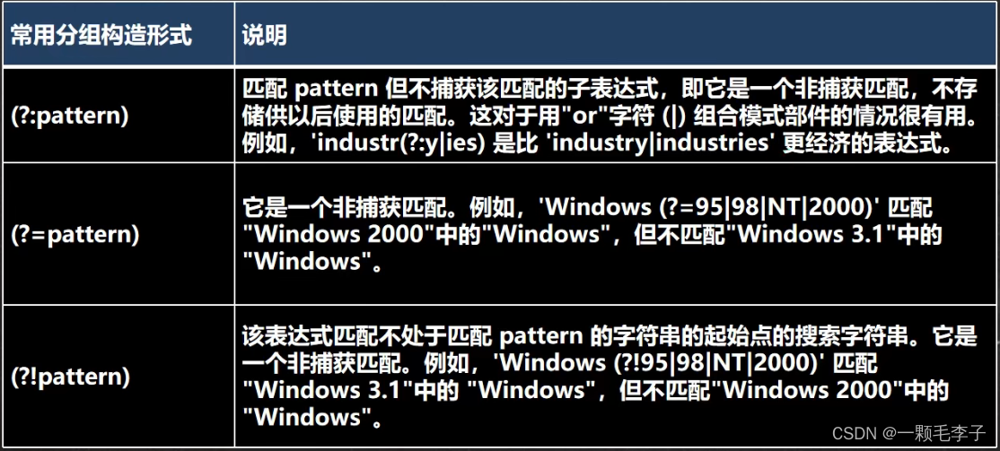

```java
public static void main(String[] args) {
    String content = "hello韩顺平教育 jack韩顺平老师 韩顺平同学hello韩顺平学生";

    // 找到 韩顺平教育 、韩顺平老师、韩顺平同学 子字符串
    // String regStr = "韩顺平教育|韩顺平老师|韩顺平同学";
    // 上面的写法可以等价非捕获分组, 注意：不能 matcher.group(1)
    // String regStr = "韩顺平(?:教育|老师|同学)";

    // 找到 韩顺平 这个关键字,但是要求只是查找韩顺平教育和 韩顺平老师 中包含有的韩顺平
    // 下面也是非捕获分组，不能使用 matcher.group(1)
    // String regStr = "韩顺平(?=教育|老师)";

    // 找到 韩顺平 这个关键字,但是要求只是查找 不是 (韩顺平教育 和 韩顺平老师) 中包含有的韩顺平
    // 下面也是非捕获分组，不能使用 matcher.group(1)
    String regStr = "韩顺平(?!教育|老师)";

    Pattern pattern = Pattern.compile(regStr);
    Matcher matcher = pattern.matcher(content);
    while (matcher.find()) {
      System.out.println("找到: " + matcher.group(0));
    }

  }
```

### 字符匹配符

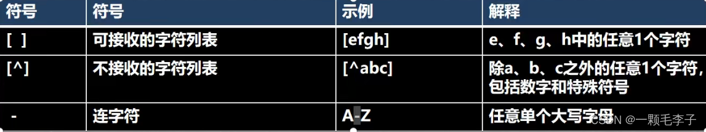
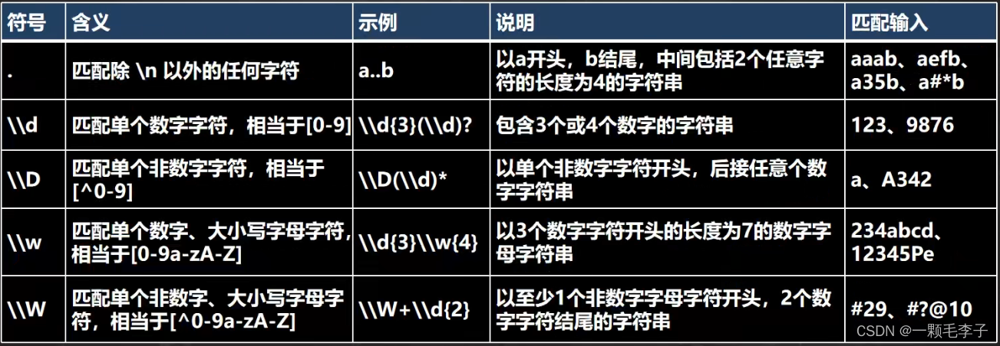
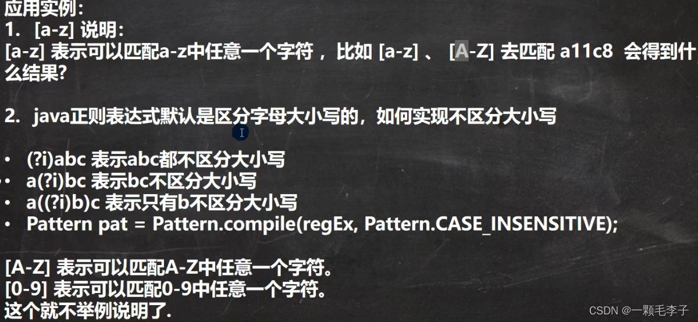

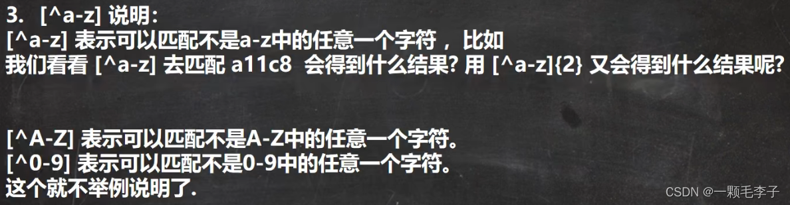
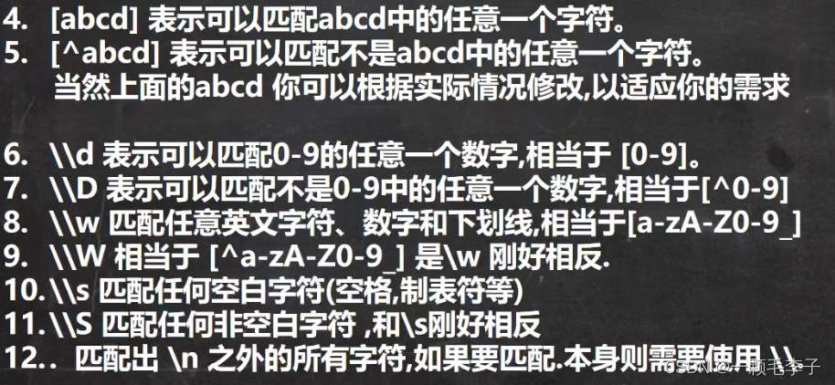

```java
String regStr = "\\."; 
String regStr = "a..b";// 以a开头b结尾，中间包括任意两个字符的长度为4的字符串
String regStr = "\\d\\d\\d"; 代表三个数字
String regStr = "\\d{3}";//代表\\d出现三次
String regStr = "\\d{3}(\\d)?";// ?代表(\\d)可能存在
String regStr = "[a-z]";// 任意a到z的一个字符
// java正则表达式默认区分大小写，如何不区分大小写
String regStr = "(?i)abc"; // abc不区分大小写
String regStr = "a(?i)bc"; // bc不区分大小写
String regStr = "ab(?i)c"; // c不区分大小写
Pattern pattern = Pattern.compile(regStr,Pattern.CASE_INSENSITIVE); //直接不区分大小写
String regStr = "[^a-z]{2}";// 连续两个不是a到z的任意一个字符
String regStr = "[a-z]";//匹配 a-z之间任意一个字符
String regStr = "[A-Z]";//匹配 A-Z之间任意一个字符
String regStr = "abc";//匹配 abc 字符串[默认区分大小写]
String regStr = "[0-9]";//匹配 0-9 之间任意一个字符  
String regStr = "[^a-z]";//匹配 不在 a-z之间任意一个字符
String regStr = "[^0-9]";//匹配 不在 0-9之间任意一个字符
String regStr = "[abcd]";//匹配 在 abcd中任意一个字符
String regStr = "\\D";//匹配 不在 0-9的任意一个字符
String regStr = "\\w";//匹配 大小写英文字母, 数字，下划线
String regStr = "\\W";//匹配 等价于 [^a-zA-Z0-9_]
// \\s 匹配任何空白字符(空格,制表符等)
String regStr = "\\s";
// \\S 匹配任何非空白字符 ,和\\s刚好相反
String regStr = "\\S";
// . 匹配出 \n 之外的所有字符,如果要匹配.本身则需要使用 \\.
```

### 定位符（全匹配，重开头和结尾）

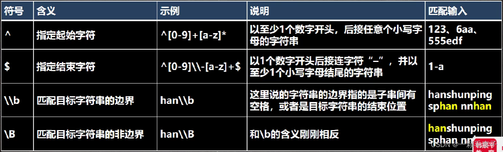

```java
public static void main(String[] args) {
    String content = "hanshunping sphan nnhan";
    // String content = "123-abc";
    // 以至少1个数字开头，后接任意个小写字母的字符串
    // String regStr = "^[0-9]+[a-z]*";
    // 以至少1个数字开头, 必须以至少一个小写字母结束
    // String regStr = "^[0-9]+\\-[a-z]+$";

    // 表示匹配边界的han[这里的边界是指：被匹配的字符串最后,
    // 也可以是空格的子字符串的后面]
    // String regStr = "han\\b";

    // 和\\b的含义刚刚相反
    String regStr = "han\\B";

    Pattern pattern = Pattern.compile(regStr);
    Matcher matcher = pattern.matcher(content);

    while (matcher.find()) {
      System.out.println("找到=" + matcher.group(0));
    }

  }
```

## 三个常用类

### Pattern类

#### Pattern.matches方法

用于整体匹配，在验证输入的字符串是否满足条件时使用，其底层调用的是matcher.matches。与matcher（按序列匹配）区分。

```java
public static void main(String[] args) {
    String content = "hello abc hello, 韩顺平教育";
    //matches匹配时自带^$
    // String regStr = "hello";
    String regStr = "hello.*";

    boolean matches = Pattern.matches(regStr, content);
    System.out.println("整体匹配= " + matches);
  }
```

### Matcher类

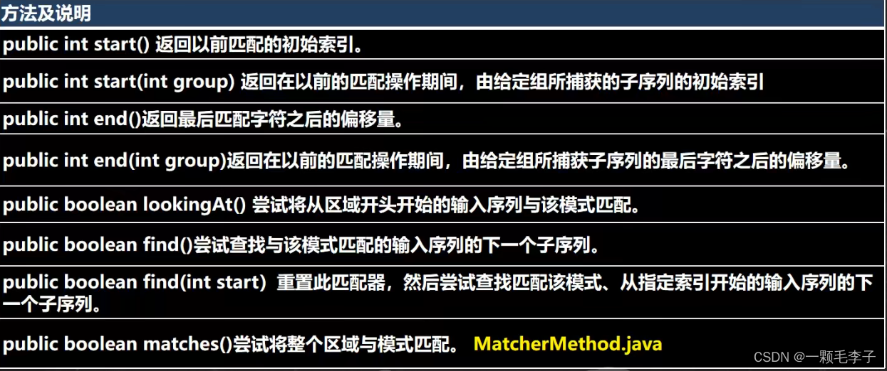

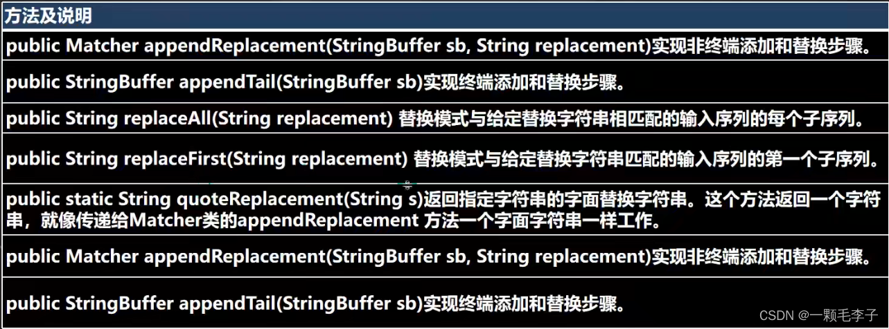

```java
public static void main(String[] args) {
    String content = "hello edu jack hspedutom hello smith hello hspedu hspedu";
    String regStr = "hello";

    Pattern pattern = Pattern.compile(regStr);
    Matcher matcher = pattern.matcher(content);
    while (matcher.find()) {
      System.out.println("=================");
      System.out.println(matcher.start());
      System.out.println(matcher.end());
      System.out.println("找到: " + content.substring(matcher.start(), matcher.end()));
    }

    // 整体匹配方法，常用于，去校验某个字符串是否满足某个规则
    System.out.println("整体匹配=" + matcher.matches());

    // 完成如果content 有 hspedu 替换成 韩顺平教育
    regStr = "hspedu";
    pattern = Pattern.compile(regStr);
    matcher = pattern.matcher(content);
    // 注意：返回的字符串才是替换后的字符串 原来的 content 不变化
    String newContent = matcher.replaceAll("韩顺平教育");
    System.out.println("newContent=" + newContent);
    System.out.println("content=" + content);
  }
```

### PatternSyntaxException类

## 分组、捕获、反向引用

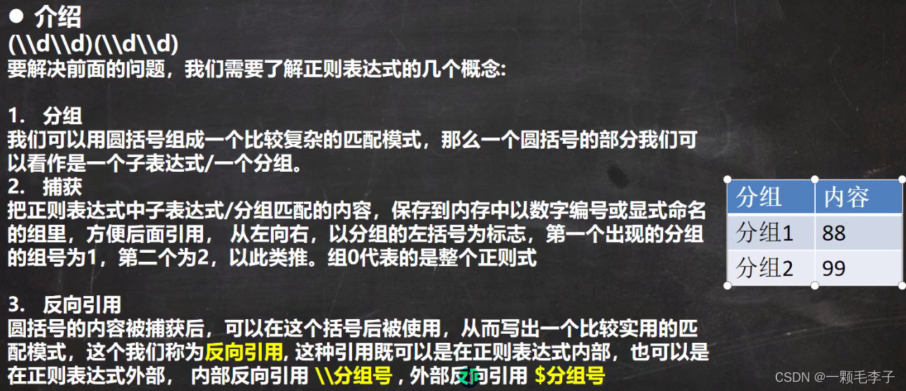

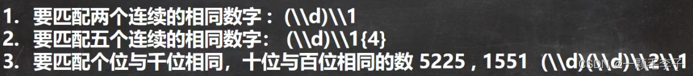

```java
public static void main(String[] args) {
    String content = "h1234el9876lo33333 j12324-333999111a1551ck14 tom11 jack22 yyy12345 xxx";
    // 要匹配两个连续的相同数字 : (\\d)\\1
    // String regStr = "(\\d)\\1";
    // 要匹配五个连续的相同数字： (\\d)\\1{4}
    // String regStr = "(\\d)\\1{4}";
    // 要匹配个位与千位相同，十位与百位相同的数 5225 , 1551 (\\d)(\\d)\\2\\1
    // String regStr = "(\\d)(\\d)\\2\\1";

    /**
     * 请在字符串中检索商品编号,形式如:12321-333999111 这样的号码,
     * 要求满足前面是一个五位数,然后一个-号,然后是一个九位数,连续的每三位要相同
     */
    String regStr = "\\d{5}-(\\d)\\1{2}(\\d)\\2{2}(\\d)\\3{2}";
    Pattern pattern = Pattern.compile(regStr);
    Matcher matcher = pattern.matcher(content);
    while (matcher.find()) {
      System.out.println("找到 " + matcher.group(0));
    }

  }
```

### 结巴去重案例

```java
public static void main(String[] args) {
    String content = "我....我要....学学学学....编程java!";
    Pattern pattern = Pattern.compile("\\.");
    Matcher matcher = pattern.matcher(content);
    String replaceAll = matcher.replaceAll("");
    System.out.println(replaceAll);
    pattern = Pattern.compile("(.)\\1+");
    matcher = pattern.matcher(replaceAll);
    while (matcher.find()) {
      System.out.println(matcher.group(0));
    }
    String replaceAll2 = matcher.replaceAll("$1");
    System.out.println(replaceAll2);

    //一次性搞定
    String replaceAll3 = Pattern.compile("(.)\1+").matcher(content).replaceAll("replaceAll3");
  }
```

## String类使用正则表达式

### 替换功能

```java
     public static void main(String[] args) {
        String content = "2000年5月，JDK1.3、JDK1.4和J2SE1.3相继发布，几周后其" +
                "获得了Apple公司Mac OS X的工业标准的支持。2001年9月24日，J2EE1.3发" +
                "布。" +
                "2002年2月26日，J2SE1.4发布。自此Java的计算能力有了大幅提升";
 
        //使用正则表达式方式，将 JDK1.3 和 JDK1.4 替换成JDK
        content = content.replaceAll("JDK1\\.3|JDK1\\.4", "JDK");
        System.out.println(content);
    }
```

### 判断功能

```java
    public static void main(String[] args) {
        String content = "13888889999";
        if (content.matches("1(38|39)\\d{8}")) {
            System.out.println("验证成功");
        } else {
            System.out.println("验证失败");
        }
 
 
        //要求按照 # 或者 - 或者 ~ 或者 数字 来分割
        System.out.println("===================");
        content = "hello#abc-jack12smith~北京";
        String[] split = content.split("#|-|~|\\d+");
        for (String s : split) {
            System.out.println(s);
        }
 
    }
```

### 分割功能

```java
     public static void main(String[] args) {
        String "hello#abc-jack12smith~北京";
        //要求按照 # 或者 - 或者 ~ 或者 数字 来分割
        System.out.println("===================");
        String[] split = content.split("#|-|~|\\d+");
        for (String s : split) {
            System.out.println(s);
        }
 
    }
```


## 常用正则判断案例

```java
//全是汉字
    String content = "波波带飞";
    String regStr = "^[\u0391-\uffe5]+$";

    //邮政编码 1-9开头
    String content1 = "123879";
    String regStr1 = "^[1-9]\\d{5}$";

    //qq号 1-9 开头 5-10位数
    String regStr2 = "^[1-9]\\d{4,9}$";

    //手机号
    String regStr3 = "^1[3458]\\d{9}$";
    // String regStr3 = "^[1(?:3|4|5|8)]\\d{9}$";

    //url
    String content4 = "https://www.bilibili.com/video/BV1Eq4y1E79W?p=17&spm_id_from=pageDriver&vd_source=e343ec5ba894da27bc56b2a378a29833";
    String regStr4 = "^(https?://)?([\\w-]+\\.)+[\\w-]+(\\/[\\w-?=&/%._#]*)?$";
```
